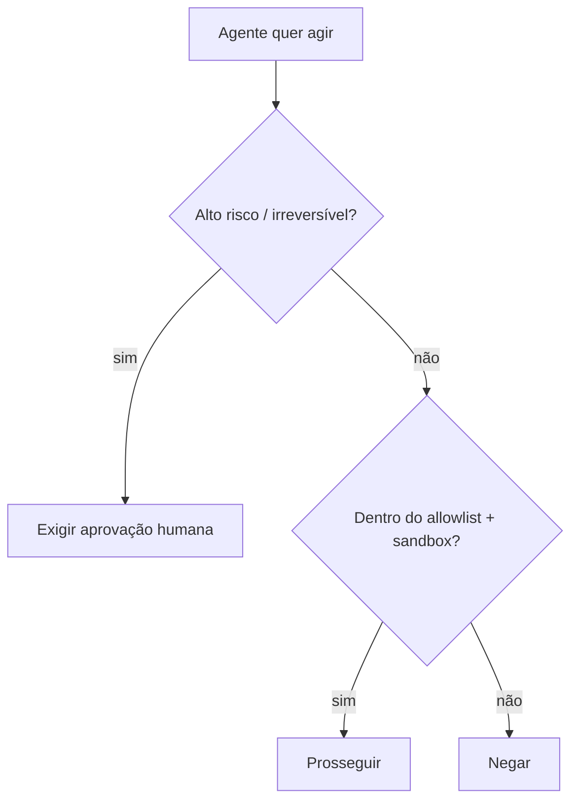

<LevelBadge level="advanced" />

<Callout type="objectives" items={["Aplicar o privilégio mínimo — dar a um agente apenas o acesso que seu trabalho exige", "Reconhecer o problema do delegado confuso: um agente toma emprestada a sua autoridade", "Sobrepor as cinco defesas que reduzem o raio de impacto quando um agente é enganado", "Decidir quais ações exigem um humano no circuito", "Validar as entradas das ferramentas para que um argumento ruim ou manipulado não possa ser executado"]} />

No momento em que uma IA pode **executar ações** (chamar ferramentas, rodar código, acessar APIs), ela herda um modelo de segurança. O objetivo não é tornar o modelo impossível de enganar — é garantir que **mesmo que seja enganado, ele não possa causar muito dano**.

## O princípio central: privilégio mínimo

Dê a um agente o acesso **mínimo** que seu trabalho exige, nada além disso.

- Um resumidor de documentos precisa de **leitura**, não de escrita ou rede.
- Um revisor precisa ler código e postar um comentário — não fazer push ou deploy.
- Delimite ferramentas, chaves de API e acesso a arquivos por tarefa. Um agente com escopo restrito que sofre uma [injeção](/docs/security/prompt-injection) só pode causar dano restrito.

## O problema do delegado confuso

Um agente muitas vezes age **com a sua autoridade** (seus tokens, suas sessões). Se uma entrada controlada por um atacante o direciona, o atacante toma emprestados os seus privilégios — um "delegado confuso". Defesa: não dê ao agente autoridade ambiente da qual ele não precisa e exija credenciais explícitas e com escopo definido para ferramentas sensíveis.

## Camadas de defesa

Empilhe-as — nenhuma isolada é suficiente. Cada camada assume que as acima dela podem falhar.

<Steps items={[
  {title: "Isole em sandbox a execução e o acesso a arquivos", body: "Rode código e operações de arquivo em contêineres ou diretórios efêmeros sem acesso ao sistema mais amplo ou a segredos. Se o agente for enganado, ele brinca dentro de uma caixa."},
  {title: "Coloque em allowlist a superfície perigosa", body: "Decida quais comandos, quais domínios e quais caminhos são permitidos — negue o restante. No Claude Code, isso é permissions (/docs/claude-code/permissions)."},
  {title: "Humano no circuito para casos de alto risco", body: "Exija aprovação explícita para ações irreversíveis ou sensíveis: enviar dinheiro, enviar e-mail, deletar, fazer deploy ou alterar a configuração de produção."},
  {title: "Separe zonas de confiança", body: "Não deixe um único agente segurar segredos, ler conteúdo não confiável e fazer chamadas de saída arbitrárias ao mesmo tempo — essa combinação é o caminho de exfiltração."},
  {title: "Registre e revise as chamadas de ferramentas", body: "Registre quais ferramentas o agente de fato invocou e com quais argumentos, para que você possa auditar o comportamento e detectar desvios."}
]} />

## Coloque um allowlist por escrito

"Colocar em allowlist a superfície perigosa" é fácil de aprovar com a cabeça e fácil de pular. No Claude Code é concreto: um `settings.json` que permite o conjunto restrito de comandos e domínios de que a tarefa precisa e nega o restante. Comece restritivo e amplie apenas quando uma tarefa real ficar bloqueada.

<PromptCard title="Um bloco de permissões de privilégio mínimo do Claude Code">{`{
  "permissions": {
    "allow": [
      "Read",
      "Edit",
      "Bash(npm test:*)",
      "Bash(npm run build:*)",
      "Bash(git status)",
      "Bash(git diff:*)"
    ],
    "deny": [
      "Bash(git push:*)",
      "Bash(rm:*)",
      "Bash(curl:*)",
      "Read(./.env)",
      "Read(./secrets/**)"
    ]
  }
}`}</PromptCard>

A lista `deny` prevalece sobre `allow`, então bloquear `.env` e `secrets/**` se mantém mesmo que um `Read` amplo seja concedido. Consulte [permissions](/docs/claude-code/permissions) para a sintaxe completa das regras e a precedência.

## Ferramentas têm esquemas — valide-os

As entradas de ferramentas que o modelo produz podem estar erradas ou manipuladas. **Valide** os argumentos antes de executar e **retorne erros como resultados** para que o agente se recupere em vez de tentar novamente às cegas.

<Flashcards title="Treine os termos essenciais" cards={[{front: "Privilégio mínimo", back: "Dê a um agente apenas o acesso que seu trabalho específico exige — nada além disso. Um agente com escopo restrito que é enganado só pode causar dano restrito."}, {front: "Delegado confuso", back: "Um agente age com a sua autoridade (seus tokens, suas sessões). Se uma entrada controlada por um atacante o direciona, o atacante toma emprestados os seus privilégios."}, {front: "Sandbox", back: "Rode código e acesso a arquivos em um contêiner isolado ou diretório efêmero sem caminho para o sistema mais amplo ou para segredos, para que um agente enganado permaneça dentro da caixa."}, {front: "Zonas de confiança", back: "Mantenha segredos, conteúdo não confiável e rede de saída em agentes separados. Um único agente segurando os três é um caminho de exfiltração."}, {front: "Humano no circuito", back: "Um portão obrigatório de aprovação humana antes de ações irreversíveis ou sensíveis — enviar dinheiro, deletar, fazer deploy, alterar a configuração de produção."}]} />

<Quiz title="Teste-se" questions={[
  {
    q: "O que o princípio do privilégio mínimo pede que você faça ao configurar um agente?",
    options: ["Dar acesso amplo para que ele nunca fique bloqueado no meio de uma tarefa", "Dar apenas o acesso que seu trabalho específico exige", "Dar as mesmas permissões que o humano que o executa"],
    answer: 1,
    explain: "Privilégio mínimo significa o acesso mínimo de que o trabalho precisa. Um agente com escopo restrito que sofre uma injeção só pode causar dano restrito."
  },
  {
    q: "Por que um agente que age com os seus tokens é um risco de 'delegado confuso'?",
    options: ["Ele confunde qual modelo chamar", "Uma entrada controlada por um atacante pode direcioná-lo a usar os seus privilégios", "Ele delega outros agentes sem pedir"],
    answer: 1,
    explain: "O agente detém a sua autoridade. Se uma entrada controlada por um atacante o direciona, o atacante efetivamente toma emprestados os seus privilégios — o problema do delegado confuso."
  },
  {
    q: "Em um bloco de permissões do Claude Code, qual entrada impede de forma confiável que o agente leia um arquivo de segredos?",
    options: ["Uma entrada allow para Read", "Uma entrada deny para o caminho dos segredos, já que deny prevalece sobre allow", "Remover a ferramenta Bash"],
    answer: 1,
    explain: "Deny tem precedência sobre allow, então um deny em secrets/** se mantém mesmo quando um Read amplo é concedido."
  }
]} />

<Callout type="takeaways" items={["Privilégio mínimo primeiro: delimite ferramentas, chaves e acesso a arquivos por tarefa para que um agente enganado só possa causar dano restrito", "Um agente age com a sua autoridade — não lhe entregue privilégios ambientes de que ele não precisa (o problema do delegado confuso)", "Empilhe as cinco camadas: sandbox, allowlist, humano no circuito, separar zonas de confiança, registrar e revisar", "No Claude Code, as regras deny vencem as regras allow — bloqueie explicitamente os caminhos .env e de segredos", "Valide os argumentos das ferramentas antes de executar e retorne erros como resultados para que o agente se recupere em vez de tentar novamente às cegas"]} />

## A seguir

- [Injeção de Prompt Explicada](/docs/security/prompt-injection)
- [Endurecendo Execuções Autônomas](/docs/security/hardening-autonomous-runs)
- [Revisando Código de Terceiros](/docs/security/reviewing-third-party-code)
