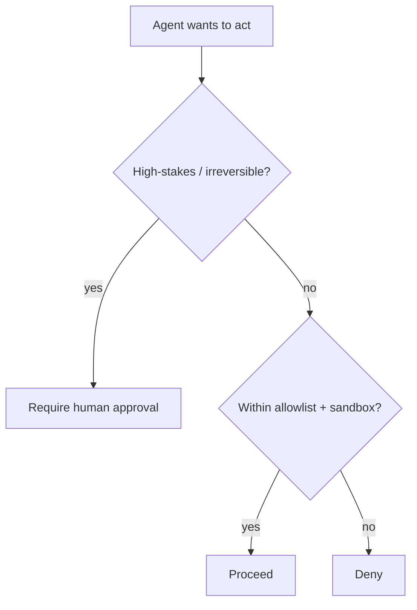

<LevelBadge level="advanced" />

No momento em que uma IA pode **tomar ações** (chamar ferramentas, executar código, acessar APIs), ela herda um modelo de segurança. O objetivo não é tornar o modelo impossível de enganar — é garantir que **mesmo se for enganado, ele não possa causar muito dano**.

## O princípio central: privilégio mínimo

Dê a um agente o acesso **mínimo** que o seu trabalho exige, nada além disso.

- Um resumidor de documentos precisa de **leitura**, não de escrita ou rede.
- Um revisor precisa ler código e postar um comentário — não fazer push ou deploy.
- Restrinja ferramentas, chaves de API e acesso a arquivos por tarefa. Um agente com escopo estreito que é [injetado](/docs/security/prompt-injection) só pode causar dano estreito.

## O problema do agente confuso

Um agente frequentemente age **com a sua autoridade** (seus tokens, suas sessões). Se uma entrada controlada por atacantes o direcionar, o atacante toma emprestados os seus privilégios — um "agente confuso" (confused deputy). Defesa: não entregue ao agente autoridade ambiente de que ele não precisa, e exija credenciais explícitas e com escopo definido para ferramentas sensíveis.

## Camadas de defesa

1. **Sandbox** para execução de código e acesso a arquivos — contêineres, diretórios efêmeros, sem acesso ao sistema mais amplo ou a segredos.
2. **Allowlist** para a superfície perigosa: quais comandos, quais domínios, quais caminhos. Negue o resto. (No Claude Code, isso são as [permissões](/docs/claude-code/permissions).)
3. **Humano no circuito** para ações irreversíveis ou de alto risco: enviar dinheiro, e-mail, deletar, fazer deploy, alterar configuração de produção.
4. **Separe zonas de confiança.** Não deixe um único agente segurar segredos, ler conteúdo não confiável e fazer chamadas de saída arbitrárias ao mesmo tempo.
5. **Registre e revise** quais ferramentas o agente de fato chamou.

## Ferramentas têm schemas — valide-os

As entradas de ferramentas que o modelo produz podem estar erradas ou ser manipuladas. **Valide** os argumentos antes de executar e **retorne erros como resultados** para que o agente se recupere em vez de tentar novamente às cegas.

## Próximos

- [Prompt Injection Explicado](/docs/security/prompt-injection)
- [Blindando Execuções Autônomas](/docs/security/hardening-autonomous-runs)
- [Revisando Código de Terceiros](/docs/security/reviewing-third-party-code)
