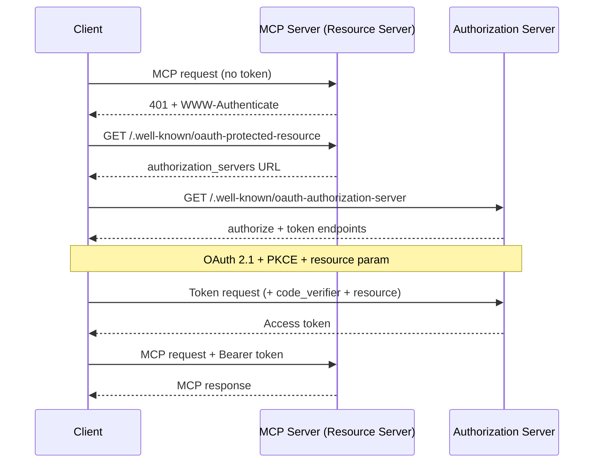
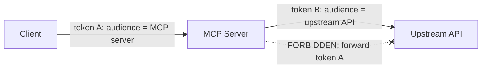

<LevelBadge level="advanced" />

<Callout type="objectives" items={["Entender por que um servidor MCP remoto (HTTP) é um servidor de recursos OAuth 2.1, e não apenas um endpoint com chave de API", "Rastrear o handshake de descoberta: 401 → Protected Resource Metadata → Authorization Server Metadata → token", "Explicar a vinculação de audiência do token (RFC 8707) e por que ela impede que o token de um serviço funcione em outro", "Nomear a armadilha do delegado confuso e a única regra que a fecha: nunca repasse o token de um cliente para uma API upstream", "Aplicar uma breve checklist de hardening antes de expor um servidor MCP à internet"]} />

[MCP](/docs/claude-code/mcp) deixou de ser novidade para se tornar a forma padrão de os agentes acessarem ferramentas — o que significa que os servidores MCP agora ficam na frente de dados reais e ações reais. Um servidor local que você inicia via **STDIO** confia em seu ambiente: ele lê credenciais de variáveis de ambiente e não há fronteira de rede a defender. No momento em que você torna esse mesmo servidor **remoto** (HTTP), qualquer um que consiga alcançar a URL pode tentar chamá-lo. Isso o transforma em um problema de autorização, e a especificação MCP responde com **OAuth 2.1** — e não com um esquema de chave de API improvisado.

Esta página trata do caso remoto. Se o seu servidor for apenas STDIO, a especificação diz explicitamente para *não* seguir o fluxo OAuth — obtenha as credenciais do ambiente e siga em frente.

<VerifyNote lastVerified="2026-07-07" source="https://modelcontextprotocol.io/specification/2025-06-18/basic/authorization" />

## Os três papéis

O OAuth divide o problema entre três partes. O MCP se mapeia nelas de forma limpa:

<Flashcards title="Quem é quem em um fluxo OAuth de MCP" cards={[{front: "Servidor MCP = Servidor de Recursos", back: "A coisa protegida. Ele aceita requisições que carregam um token de acesso, valida o token e retorna dados — ou um 401 se o token estiver ausente ou errado. Ele NÃO faz o login do usuário."}, {front: "Cliente MCP = cliente OAuth", back: "O host do seu agente (Claude Code, o app desktop, seu próprio código). Ele obtém um token em nome do usuário e o anexa a cada requisição como um cabeçalho Bearer."}, {front: "Servidor de Autorização (AS)", back: "A parte que de fato conversa com o usuário, obtém o consentimento e emite tokens. Pode estar hospedado junto com o servidor ou ser um provedor de identidade separado. Seus detalhes internos estão fora do escopo do MCP."}]} />

A mudança mental principal: **o servidor MCP nunca lida com o login em si.** Ele apenas valida tokens que outra pessoa emitiu. Essa separação é o que permite colocar um provedor de identidade pronto na frente de um servidor que você escreveu.

## O handshake de descoberta

Um cliente não deveria precisar ser pré-configurado com o local onde se autenticar. O MCP torna a descoberta automática, guiada por um `401`:

<Steps items={[
  {title: "O cliente chama o servidor sem token", body: "A primeira requisição sai sem nada. O servidor a rejeita com HTTP 401 Unauthorized e um cabeçalho WWW-Authenticate apontando para sua URL de resource-metadata."},
  {title: "O cliente busca o Protected Resource Metadata (RFC 9728)", body: "Ele faz um GET em /.well-known/oauth-protected-resource no servidor. O campo authorization_servers do documento nomeia pelo menos um Servidor de Autorização que o cliente pode usar."},
  {title: "O cliente busca o Authorization Server Metadata (RFC 8414)", body: "Ele faz um GET no /.well-known/oauth-authorization-server do AS para descobrir os endpoints authorize e token e as capacidades suportadas."},
  {title: "Opcional: Dynamic Client Registration (RFC 7591)", body: "Se o cliente não tiver um client ID para esse AS, ele pode fazer um POST em /register para obter um sem intervenção humana — crucial porque um cliente não pode conhecer todos os servidores MCP de antemão."},
  {title: "Autorização OAuth 2.1 com PKCE + resource", body: "O cliente gera um verifier/challenge PKCE, abre o navegador na URL authorize incluindo o parâmetro resource, o usuário consente, e o cliente troca o código retornado (com o verifier) por um token de acesso."},
  {title: "O cliente tenta novamente com o token", body: "Agora cada requisição carrega Authorization: Bearer <token>. O servidor o valida e responde."}
]} />

Repare que **não há nenhuma configuração de autenticação hardcoded** do lado do cliente — o `401` inicializa tudo. Esse é justamente o objetivo: um agente pode se conectar a um servidor que nunca viu e descobrir como se autenticar.

## Vinculação de audiência: a regra que sustenta tudo

Aqui está o modo de falha que a vinculação de audiência existe para evitar. Digamos que um usuário tenha um token emitido para `calendar.example.com`. Um servidor MCP malicioso (ou apenas desleixado) em `evil.example.com` engana o cliente para que envie *aquele* token a ele. Se `evil` o aceitar, ele agora pode se virar e chamar a API do calendário como se fosse o usuário. O token de um serviço funcionou em outro. A fronteira de segurança do OAuth acabou de desmoronar.

A correção são os **Resource Indicators (RFC 8707)**:

<Steps items={[
  {title: "O cliente declara o alvo", body: "Tanto na requisição de autorização quanto na requisição de token, o cliente DEVE incluir um parâmetro resource definido com a URI canônica do servidor MCP que ele pretende chamar — por exemplo, resource=https://mcp.example.com. Ele envia isso mesmo sem ter certeza de que o AS o suporta."},
  {title: "O AS vincula o token àquela audiência", body: "Quando suportado, o AS carimba o token de modo que ele só seja válido para aquele servidor de recursos específico."},
  {title: "O servidor valida a audiência", body: "Antes de fazer qualquer trabalho, o servidor MCP DEVE verificar que o token foi emitido para ELE — checando a claim de audiência (RFC 9068). Um token gerado para qualquer outro recebe um 401, ponto final."}
]} />

<PromptCard title="Parâmetro resource na requisição de autorização (URL-encoded)">{`&resource=https%3A%2F%2Fmcp.example.com`}</PromptCard>

As URIs canônicas são rígidas: `https://mcp.example.com` e `https://mcp.example.com:8443/mcp` são válidas; `mcp.example.com` (sem esquema) e `https://mcp.example.com#frag` (fragmento) não são. Prefira a forma sem barra final para interoperabilidade.

## O delegado confuso: nunca repasse o token

Este é o erro que transforma um servidor MCP bem-intencionado no proxy de um atacante. É o mesmo [problema do delegado confuso](/docs/security/securing-agents#the-confused-deputy-problem) da segurança de agentes, afiado em uma única regra concreta.

Um servidor MCP muitas vezes precisa chamar uma **API upstream** (GitHub, um serviço de banco de dados, outro SaaS). A tentação é pegar o token que o cliente lhe entregou e encaminhá-lo para o upstream. **Não faça isso.** A especificação é direta: o servidor MCP **NÃO DEVE** repassar o token que recebeu do cliente.

Por que é perigoso: o token do cliente foi emitido tendo o *seu* servidor como audiência. Se você o encaminha, a API upstream pode confiar nele como se tivesse vindo de você, ou presumir que você já o validou — e agora um token com escopo para um salto está fazendo trabalho a dois saltos de distância, fora do modelo de consentimento de qualquer um.

<Callout type="warning" items={["Se o seu servidor MCP chama uma API upstream, ele age como um cliente OAuth SEPARADO para essa API e obtém seu PRÓPRIO token do servidor de autorização upstream. Dois tokens independentes, duas audiências independentes. O token do cliente para na sua porta."]} />

## Uma checklist de hardening de pré-voo

Antes que um servidor MCP remoto toque a internet pública:

<Steps items={[
  {title: "Sirva tudo por HTTPS", body: "Todos os endpoints do AS DEVEM ser HTTPS. As redirect URIs DEVEM ser HTTPS ou localhost — nada mais."},
  {title: "Valide a audiência em cada requisição", body: "Rejeite qualquer token que não tenha sido emitido especificamente para este servidor. Essa é a única checagem que impede a reutilização de tokens entre serviços."},
  {title: "Exija PKCE", body: "Os clientes DEVEM usar PKCE para que um código de autorização interceptado seja inútil sem o verifier correspondente."},
  {title: "Fixe redirect URIs exatas", body: "O AS DEVE fazer a correspondência das redirect URIs de forma exata com valores pré-registrados, e os clientes DEVERIAM usar e verificar o parâmetro state — ambos defendem contra phishing por open-redirect."},
  {title: "Tokens de curta duração + rotação de refresh", body: "Emita tokens de acesso de curta duração para limitar o dano de um vazamento; para clientes públicos, faça a rotação dos refresh tokens. Armazene os tokens com segurança e nunca os registre em log."},
  {title: "Nunca coloque tokens na URL", body: "Os tokens vão no cabeçalho Authorization, nunca na query string, onde acabariam em logs e referrers."},
  {title: "Sobreponha o básico de segurança de agentes", body: "A vinculação de audiência é o portão de transporte; ainda assim, aplique menor privilégio, sandboxing e human-in-the-loop de /docs/security/securing-agents. A autenticação diz QUEM — ela não diz que a requisição é segura."}
]} />

## Teste você mesmo

<Quiz title="Teste você mesmo" questions={[
  {
    q: "Um servidor MCP remoto recebe uma requisição sem token de acesso. O que a especificação exige que ele faça primeiro?",
    options: [
      "Solicitar ao usuário um nome de usuário e senha",
      "Retornar HTTP 401 com um cabeçalho WWW-Authenticate apontando para sua URL de resource-metadata",
      "Encaminhar silenciosamente a requisição para sua API upstream",
      "Emitir ele mesmo um token para o cliente"
    ],
    answer: 1,
    explain: "O servidor é um servidor de recursos, não uma página de login. Ele responde a uma requisição sem token com 401 + WWW-Authenticate, o que inicializa a descoberta do servidor de autorização pelo cliente."
  },
  {
    q: "Contra o que a vinculação de audiência do token (RFC 8707) protege?",
    options: [
      "Validação lenta de token",
      "Um token emitido para um serviço ser aceito e reutilizado em um serviço diferente",
      "Usuários esquecendo suas senhas",
      "Janelas de contexto grandes"
    ],
    answer: 1,
    explain: "O parâmetro resource vincula um token ao servidor específico para o qual foi gerado. O servidor então valida a claim de audiência e rejeita qualquer token emitido para outro — fechando a brecha de reutilização entre serviços."
  },
  {
    q: "Seu servidor MCP precisa chamar uma API upstream do GitHub. O que ele deve fazer com o token de acesso que o cliente lhe enviou?",
    options: [
      "Encaminhar esse mesmo token para o GitHub para economizar uma ida e volta",
      "Nada com o GitHub — obter seu próprio token separado como cliente OAuth do GitHub, e nunca repassar o token do cliente",
      "Registrar o token em log para que possa ser reproduzido depois",
      "Colocar o token na URL da requisição ao GitHub"
    ],
    answer: 1,
    explain: "Repassar o token do cliente para o upstream é a armadilha do delegado confuso e é explicitamente proibido. O servidor age como seu próprio cliente OAuth para a API upstream com um token separado, vinculado à audiência dessa API."
  },
  {
    q: "Para um servidor MCP STDIO (local), como a especificação diz que as credenciais devem ser tratadas?",
    options: [
      "Executar o fluxo completo de navegador OAuth 2.1 a cada inicialização",
      "Obtê-las do ambiente — o fluxo de autorização OAuth é para transportes HTTP, não STDIO",
      "Deixá-las hardcoded no cliente",
      "Pular a autenticação por completo em todos os transportes"
    ],
    answer: 1,
    explain: "A especificação diz que os transportes STDIO NÃO DEVERIAM seguir o fluxo de autorização HTTP e, em vez disso, ler as credenciais do ambiente. O OAuth aqui é especificamente para servidores remotos, baseados em HTTP."
  }
]} />

## Fontes e leitura adicional

- [Especificação de autorização do MCP (2025-06-18)](https://modelcontextprotocol.io/specification/2025-06-18/basic/authorization) — o fluxo normativo, os papéis e os requisitos MUST/SHOULD que esta página resume.
- [MCP Security Best Practices](https://modelcontextprotocol.io/specification/2025-06-18/basic/security_best_practices) — repasse de token, delegado confuso e por que são proibidos.
- [RFC 8707 — Resource Indicators for OAuth 2.0](https://www.rfc-editor.org/rfc/rfc8707.html) — o parâmetro `resource` e a vinculação de audiência.
- [RFC 9728 — OAuth 2.0 Protected Resource Metadata](https://datatracker.ietf.org/doc/html/rfc9728) — como um servidor de recursos anuncia seus servidores de autorização.
- [RFC 8414 — OAuth 2.0 Authorization Server Metadata](https://datatracker.ietf.org/doc/html/rfc8414) e [RFC 7591 — Dynamic Client Registration](https://datatracker.ietf.org/doc/html/rfc7591).
- [OAuth 2.1 draft](https://datatracker.ietf.org/doc/html/draft-ietf-oauth-v2-1-13) — PKCE, segurança de comunicação e requisitos de tratamento de tokens.
- Relacionado no AILmanac: [Protegendo Agentes e Ferramentas](/docs/security/securing-agents) · [Prompt Injection](/docs/security/prompt-injection) · [MCP no Claude Code](/docs/claude-code/mcp).
