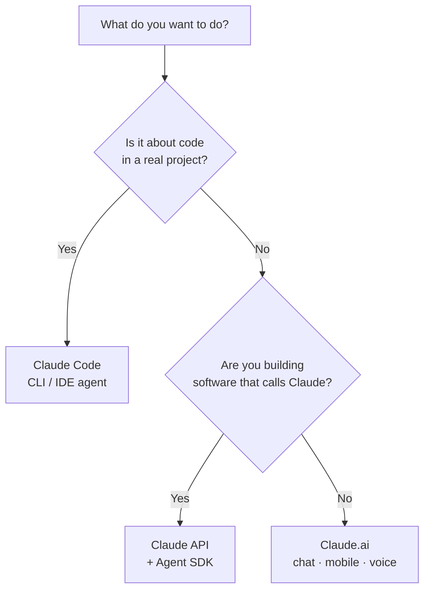

<LevelBadge level="beginner" />

"Claude" vem em algumas versões. Escolha por **o que você está tentando fazer**, não por qual delas você já ouviu falar.

## A decisão em 30 segundos

## Claude.ai — os aplicativos de chat

**Para:** escrita, pesquisa, análise, aprendizado, planejamento, perguntas do dia a dia. **Quem:** todo mundo, sem configuração.

Você também o tem no **celular** ([iOS/Android](/docs/claude-app/mobile)) e por **[voz](/docs/claude-app/voice-mode)** — ótimo para capturar ideias em movimento. Potencialize-o com [Projetos](/docs/claude-app/projects), [instruções personalizadas](/docs/claude-app/custom-instructions) e [Artefatos](/docs/claude-app/artifacts). → Comece em [Primeiros Passos com o Claude.ai](/docs/claude-app/getting-started).

## Claude Code — a ferramenta agêntica de programação

**Para:** trabalhar *dentro de uma base de código* — ler, editar, executar comandos, corrigir testes. **Quem:** desenvolvedores (e os tecnicamente curiosos). Ele atua nos seus arquivos com a sua permissão. → [O que é o Claude Code](/docs/claude-code/what-is-claude-code).

## A API & o Agent SDK — incorpore o Claude ao seu próprio software

**Para:** aplicativos, automações e agentes que chamam o Claude programaticamente. **Quem:** desenvolvedores que estão lançando um produto ou pipeline. → [Sua Primeira Chamada de API](/docs/api/first-call).

## Eles funcionam juntos

Estes não são produtos rivais — a maioria das pessoas evolui por todos eles:

| Você quer… | Use |
|---|---|
| Redigir um e-mail, resumir um PDF, fazer brainstorming | Claude.ai (ou voz/celular) |
| Refatorar um módulo, adicionar testes, corrigir um bug | Claude Code |
| Adicionar um recurso de IA ao *seu* app | A API / Agent SDK |

:::tip Em dúvida? Comece pelo chat
O [Claude.ai](/docs/claude-app/getting-started) não exige nenhuma configuração e ensina você a como o Claude "pensa". As habilidades se transferem para todos os outros lugares.
:::

## A seguir

- [Seus Primeiros 5 Minutos](/docs/start-here/your-first-5-minutes)
- [Trilhas de Aprendizado](/docs/start-here/learning-paths)
- [Escolhendo um Modelo Claude](/docs/api/choosing-a-model) (quando você começar a desenvolver)
