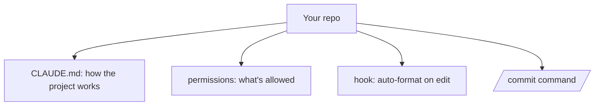

<LevelBadge level="intermediate" />

Vamos transformar um checkout recém-feito em uma configuração do Claude Code que *conhece o seu projeto e respeita as suas regras* — em cerca de 20 minutos. Vamos encadear os recursos principais com a justificativa de cada um.

## O estado final



## Passo 1 — Gere e enxugue o CLAUDE.md

Execute `/init` para esboçar um [CLAUDE.md](/docs/claude-code/claude-md) e, em seguida, **reduza-o** ao que é verdadeiro: stack, como executar/testar/lintar, convenções reais e guardrails ("rode os testes antes de concluir", "não toque em `/generated`"). *Por quê:* é a personalização de maior alavancagem — o Claude o lê a cada sessão.

Pegue um modelo inicial em [Modelos de CLAUDE.md](/docs/templates/claude-md).

## Passo 2 — Defina as permissões

Adicione um `.claude/settings.json` ([referência](/docs/claude-code/settings)) que pré-autoriza comandos seguros e repetitivos e nega os perigosos:

```json
{
  "permissions": {
    "allow": ["Read", "Bash(npm run test:*)", "Bash(npm run lint)", "Bash(git diff:*)"],
    "ask": ["Write", "Bash(npm install:*)"],
    "deny": ["Read(./.env)", "Bash(git push --force:*)"]
  }
}
```

*Por quê:* menos interrupções em ações seguras, barreiras absolutas nas arriscadas. Veja [Permissões](/docs/claude-code/permissions).

## Passo 3 — Adicione um hook de formatação

Formate automaticamente após cada edição ([hooks](/docs/claude-code/hooks)):

```json
{ "hooks": { "PostToolUse": [ { "matcher": "Edit|Write",
  "hooks": [ { "type": "command", "command": "npx prettier --write \"$CLAUDE_FILE_PATH\" 2>/dev/null || true" } ] } ] } }
```

*Por quê:* formatação consistente, garantida — não um "por favor, lembre-se".

## Passo 4 — Adicione um comando `/commit`

Coloque a receita `/commit` da [Biblioteca de Comandos de Barra](/docs/templates/slash-commands) em `.claude/commands/`. *Por quê:* uma só palavra para um fluxo de trabalho repetível.

## Passo 5 — Use o Modo de Planejamento na primeira tarefa real

Dê um objetivo real no [Modo de Planejamento](/docs/claude-code/plan-mode), revise o plano e então deixe-o executar. *Por quê:* construa confiança separando o pensar do fazer.

## Verifique se funcionou

- Nova sessão → o Claude faz referência às suas convenções sem que você peça (o CLAUDE.md funciona).
- Ao editar um arquivo → ele é formatado (o hook funciona).
- Um comando arriscado → ele pergunta ou recusa (as permissões funcionam).
- `/commit` → uma mensagem limpa de Conventional Commit (o comando funciona).

## Próximos passos

- [Escreva o Seu Primeiro Skill](/docs/walkthroughs/first-skill)
- [Receitas de Hooks & settings.json](/docs/templates/hooks-settings)
- [Programação & Desenvolvimento de Software](/docs/playbooks/coding)
