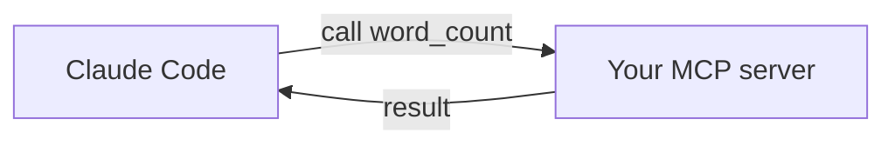

<LevelBadge level="advanced" />

<VerifyNote lastVerified="2026-06-20" source="https://modelcontextprotocol.io">
As APIs do SDK do MCP e a configuração evoluem — confirme na documentação oficial do MCP e na documentação de MCP do Claude Code.
</VerifyNote>

Vamos expor uma ferramenta personalizada ao Claude construindo um pequeno servidor [MCP](/docs/claude-code/mcp) e conectando-o. Vamos mantê-lo minimalista para que a *conexão* fique clara — depois você substitui pela sua lógica real.

## O que vamos construir

Um servidor stdio com uma ferramenta, `word_count`, que o Claude pode chamar. O mesmo padrão escala para "consultar meu banco de dados", "abrir um ticket", etc.



## Passo 1 — O servidor

`server.py` (Python; uma versão em TypeScript está em [scaffolds de MCP](/docs/templates/mcp-config)):

```python
from mcp.server.fastmcp import FastMCP

mcp = FastMCP("text-tools")

@mcp.tool()
def word_count(text: str) -> int:
    """Count the words in a piece of text."""
    return len(text.split())

if __name__ == "__main__":
    mcp.run()  # stdio transport
```

## Passo 2 — Declare-o

Adicione ao `.mcp.json` na raiz do seu repositório:

```json
{ "mcpServers": {
  "text-tools": { "command": "python", "args": ["server.py"] }
} }
```

## Passo 3 — Conecte & teste

Inicie o Claude Code no repositório. Pergunte: *"Use o servidor text-tools para contar as palavras em: 'the quick brown fox'."* O Claude deve chamar `word_count` e reportar `4`. Se ele não conseguir ver a ferramenta, verifique se o servidor inicia corretamente por conta própria e se o caminho no `.mcp.json` está certo.

## Passo 4 — Torne-o real

Substitua `word_count` pela sua capacidade de verdade — uma consulta a banco de dados, uma chamada a uma API interna, uma operação de arquivo. Adicione validação de entrada e retorne erros como resultados.

## Checklist de segurança

:::warning Um servidor é código + acesso
- **Privilégio mínimo** — apenas os dados/ações de que ele precisa ([Protegendo Agentes](/docs/security/securing-agents)).
- **Valide as entradas** que o modelo envia.
- Dados não confiáveis que ele retorna podem carregar [injeção de prompt](/docs/security/prompt-injection).
- **Revise** qualquer servidor de terceiros antes de conectá-lo.
:::

## Próximos passos

- [Servidores MCP no Claude Code](/docs/claude-code/mcp)
- [Configuração de MCP & Scaffolds de Servidor](/docs/templates/mcp-config)
- [Uso de Ferramentas / Function Calling](/docs/api/tool-use)
