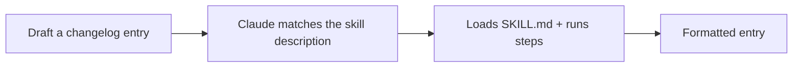

<LevelBadge level="intermediate" />

<VerifyNote lastVerified="2026-06-20" source="https://code.claude.com/docs/en/skills">
A estrutura e a descoberta de Skills podem mudar — confirme na documentação oficial de Skills.
</VerifyNote>

Vamos construir um [Skill](/docs/claude-code/skills) funcional do zero e provar que ele é ativado. Vamos criar um pequeno skill de "entrada de changelog" — genérico e reutilizável.

## Passo 1 — Crie a pasta

```bash
mkdir -p .claude/skills/changelog-entry
```

(Use `~/.claude/skills/…` para um skill pessoal disponível em todos os projetos.)

## Passo 2 — Escreva o SKILL.md

`.claude/skills/changelog-entry/SKILL.md`:

```markdown
---
name: changelog-entry
description: Use when the user wants to turn recent git commits into a Keep a Changelog entry.
---

# Changelog Entry

When asked for a changelog entry:
1. Run `git log --oneline -20` to see recent commits.
2. Group them into Added / Changed / Fixed / Removed (Keep a Changelog style).
3. Write concise, user-facing bullets (not raw commit messages).
4. Output only the formatted entry.
```

A **`description` é o gatilho** — escreva-a como "Use when…" para que o Claude a carregue no momento certo.

## Passo 3 — (Opcional) adicione um script auxiliar

Skills podem incluir scripts. Adicione `scripts/recent.sh` e faça referência a ele no SKILL.md se quiser uma coleta de dados determinística:

```bash
#!/usr/bin/env bash
git log --oneline -20
```

## Passo 4 — Prove que ele dispara

Inicie uma sessão e diga: *"Esboce uma entrada de changelog para o trabalho recente."* O Claude deve reconhecer a intenção, carregar o skill e seguir os passos dele. Se ele não for ativado, sua `description` provavelmente não é específica o suficiente sobre *quando* usá-lo — refine-a.



## Passo 5 — Compartilhe-o

Empacote-o (junto com outros) em um [plugin](/docs/claude-code/plugins-marketplaces) para que sua equipe o instale em um único passo — ou contribua-o para os [pacotes de skills](/docs/templates/skills) do AILmanac.

## Armadilhas

- **Descrição vaga** → nunca dispara (ou dispara sempre). Seja específico.
- **Coisas demais em um skill** → mantenha-o com um único trabalho claro.
- **Segredos em um skill compartilhado** → nunca; veja [Revisando Código de Terceiros](/docs/security/reviewing-third-party-code).

## Próximos passos

- [Skills: Expertise Sob Demanda](/docs/claude-code/skills)
- [Modelos de SKILL.md](/docs/templates/skills)
- [Construa & Conecte o Seu Primeiro Servidor MCP](/docs/walkthroughs/first-mcp-server)
