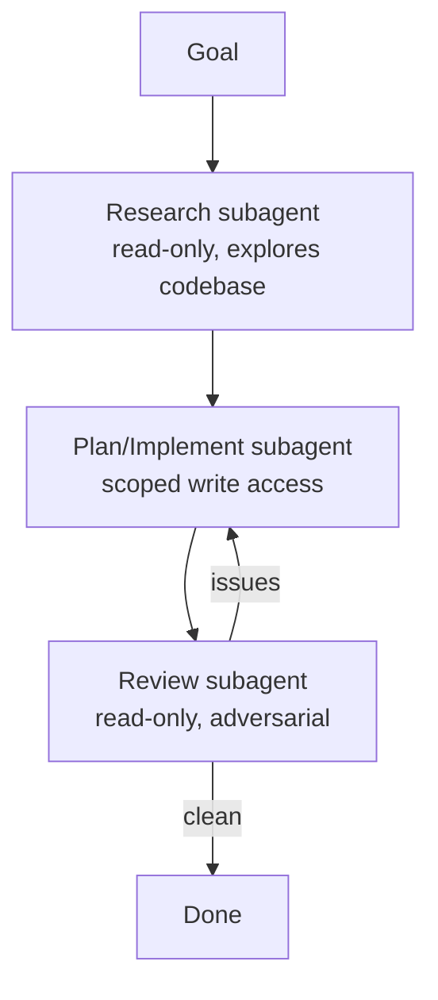

<LevelBadge level="advanced" />

Tarefas grandes saem melhor quando você as divide entre [subagentes](/docs/claude-code/subagents) focados, em vez de espremer tudo em um único contexto. Vamos projetar um pipeline de pesquisa → implementação → revisão.

## O formato

Cada subagente tem o **seu próprio contexto** e um **conjunto de ferramentas sob medida** — e apenas o *resultado* volta para a sessão principal, mantendo-a limpa.

## Passo 1 — Defina os agentes

Por meio da interface `/agents`, defina três, cada um com uma `description` bem definida (para que o agente principal delegue corretamente) e ferramentas com escopo:

- **researcher** — apenas leitura/busca. Mapeia o código relevante e retorna as descobertas.
- **implementer** — pode editar arquivos e rodar testes; recebe as descobertas do researcher como entrada.
- **reviewer** — apenas leitura, adversarial: procura bugs, casos faltantes e violações de convenção.

## Passo 2 — Orquestre com handoffs

A sessão principal passa a saída de cada estágio para o próximo: pesquisa → implementação (usando a pesquisa) → revisão (da implementação). Adicione um **portão de revisão**: se o reviewer encontrar problemas, volte ao implementer antes de concluir.

## Passo 3 — Saiba quando NÃO fazer isso

:::warning Paralelismo/multiagente não sai de graça
- **Dependências sequenciais** (a implementação precisa da pesquisa) permanecem sequenciais — não distribua em paralelo onde a ordem importa.
- **Escritas compartilhadas em arquivos** podem entrar em conflito — isole com [git worktrees](/docs/claude-code/worktrees) ou serialize.
- Para tarefas pequenas, o custo de coordenação supera o benefício. Use isto para trabalho **considerável e decomponível**.
:::

## Passo 4 — Verifique

Uma boa execução multiagente mostra: um contexto principal focado (a leitura pesada aconteceu no researcher), uma implementação que reflete a pesquisa e uma revisão que de fato pegou algo (ou aprovou de forma crível). Se o reviewer for um carimbo automático, torne o prompt dele **adversarial** ("tente encontrar o que está errado").

## Indo além

O mesmo padrão, de forma programática, é [Construindo Agentes na API](/docs/api/building-agents) e superfícies de produto como [Cowork & Times de Agentes](/docs/api/cowork-and-agent-teams).

## Próximos passos

- [Subagentes & Agentes Paralelos](/docs/claude-code/subagents)
- [Git Worktrees](/docs/claude-code/worktrees)
- [Construindo Agentes na API](/docs/api/building-agents)
