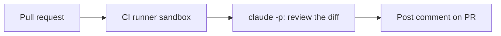

<LevelBadge level="advanced" />

<VerifyNote lastVerified="2026-06-20" source="https://code.claude.com/docs/en/sdk">
As flags do modo headless e os detalhes de integração com CI evoluem — confirme na documentação oficial do Claude Code / Agent SDK.
</VerifyNote>

Uma automação clássica de alto valor: fazer o Claude **revisar todo pull request** e publicar suas descobertas como um comentário — rodando em modo [headless](/docs/claude-code/headless-and-agent-sdk) no CI. Aqui está o formato, com os guardrails que o mantêm seguro.

## O que ele faz

Em cada PR: faz o checkout do diff, pede ao Claude para revisá-lo em busca de bugs/casos extremos/problemas de convenção e publica um comentário. As pessoas ainda decidem; o Claude apenas dá uma primeira passada rápida.



## O workflow (esboço)

```yaml
name: Claude PR review
on: pull_request
permissions:
  contents: read
  pull-requests: write   # to comment — NOT write to code
jobs:
  review:
    runs-on: ubuntu-latest
    steps:
      - uses: actions/checkout@v4
        with: { fetch-depth: 0 }
      - name: Review the diff
        env:
          ANTHROPIC_API_KEY: ${{ secrets.ANTHROPIC_API_KEY }}
        run: |
          git diff origin/${{ github.base_ref }}...HEAD > /tmp/diff.patch
          claude -p "Review this diff for correctness bugs, missing edge cases, and
          security issues. Report ONLY high-confidence findings as a Markdown
          checklist with file:line. Diff:" < /tmp/diff.patch > /tmp/review.md
      # then post /tmp/review.md as a PR comment (e.g. with the gh CLI or an action)
```

(A invocação exata em modo headless pode variar — consulte a documentação. O princípio é: alimentar o diff, capturar o Markdown e publicá-lo.)

## Os guardrails (leia [Reforçando Execuções Autônomas](/docs/security/hardening-autonomous-runs))

:::warning Privilégio mínimo no CI
- **Apenas comentar.** Conceda `pull-requests: write`, **não** `contents: write` — o bot não deve enviar código.
- **Restrinja o escopo do token**; nunca exponha acesso a deploy/segredos a um job que lê conteúdo de PR não confiável.
- **Trate o conteúdo do PR como não confiável** — ele pode carregar [injeção de prompt](/docs/security/prompt-injection); não deixe o job tomar ações de consequência.
- **Limite o custo** — diffs grandes custam [tokens](/docs/api/tokens-and-pricing); considere revisar apenas os arquivos alterados.
:::

## Torne-o útil, não barulhento

- Peça **apenas descobertas de alta confiança** — uma parede de implicâncias é ignorada.
- Mantenha-o como uma **primeira passada**, com as pessoas decidindo o merge.

## Próximos passos

- [Modo Headless & o Agent SDK](/docs/claude-code/headless-and-agent-sdk)
- [Reforçando Execuções Autônomas](/docs/security/hardening-autonomous-runs)
- [Programação & Desenvolvimento de Software](/docs/playbooks/coding)
