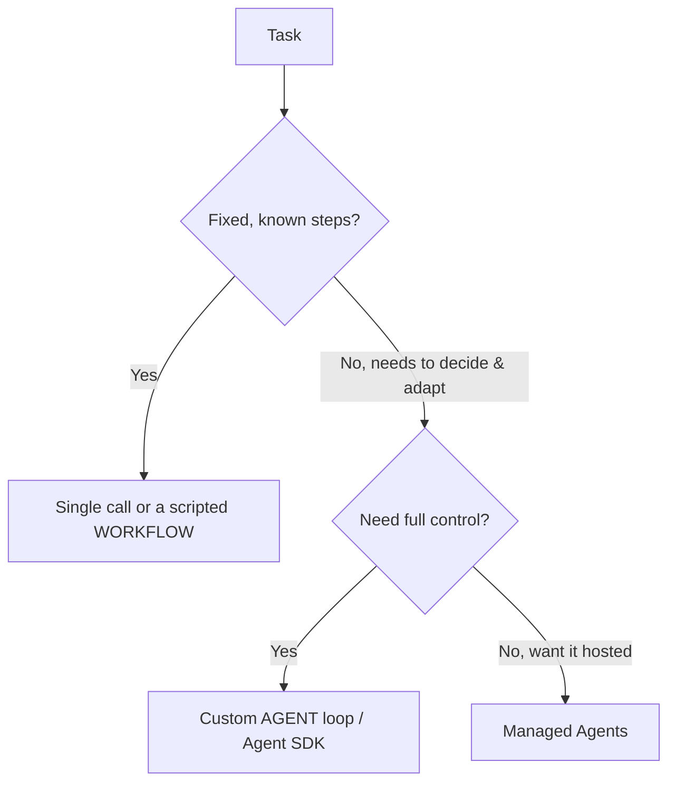

<LevelBadge level="advanced" />

<VerifyNote lastVerified="2026-06-20" source="https://platform.claude.com/docs/en/docs/agents-and-tools">
Инструментарий для агентов (Agent SDK, управляемые варианты) развивается быстро — уточняйте актуальные варианты в официальной документации.
</VerifyNote>

<Callout type="objectives" items={["Определить, что на самом деле представляет собой агент: модель, работающая в цикле", "Применить тест на выбор, чтобы определиться между одним вызовом, рабочим процессом и агентом", "Спроектировать минимальный цикл агента с правильными защитными ограничениями", "Понимать, когда стоит взять Claude Agent SDK вместо написания всего вручную", "Сделать агента устойчивым: ограничьте его, обрабатывайте сбои, ограничьте привилегии, оценивайте его"]} />

**Агент** — это модель, работающая в цикле: она преследует цель, вызывая [инструменты](/docs/api/tool-use), наблюдая за результатами и принимая решение о следующем шаге, пока задача не будет выполнена. Прежде чем создавать его, выберите *самое простое решение, которое работает*.

## Тест на выбор (не усложняйте)

Не каждая задача требует агента. Сначала пройдите по этому дереву — большинство задач останавливается на самом верху.

Три варианта, от самого простого:

- **Один вызов** — на запрос отвечает один промпт. Большинство задач. Самый дешёвый и надёжный вариант.
- **Рабочий процесс** — вы оркестрируете фиксированную последовательность вызовов в коде (детерминированный поток управления). Используйте, когда шаги известны.
- **Агент** — модель сама динамически определяет шаги. Используйте только тогда, когда путь действительно невозможно жёстко задать.

<Callout type="warning">
Прибегайте к агенту, когда адаптивность — это суть, а не потому что это звучит впечатляюще. Контролируемый вами рабочий процесс легче тестировать и отлаживать.
</Callout>

## Проектирование цикла

Минимальный собственный агент — это всего четыре подвижных части. Создавайте их в таком порядке:

<Steps items={[
  {title: "Системный промпт", body: "Сформулируйте цель, ограничения и доступные инструменты. Именно на это модель опирается в рассуждениях на каждом шаге."},
  {title: "Цикл", body: "Отправить сообщения → если ответ — это tool_use, выполнить инструмент, добавить tool_result и повторить → до финального ответа или условия остановки."},
  {title: "Защитные ограничения", body: "Добавьте лимит максимального числа итераций, бюджет на токены/стоимость и валидацию входных данных инструментов до того, как что-либо запустится."},
  {title: "Управление контекстом", body: "Суммируйте или обрезайте историю по мере её роста — та же идея, что рассматривается в Управлении контекстом (/docs/claude-code/context-management)."}
]} />

**[Claude Agent SDK](/docs/claude-code/headless-and-agent-sdk)** даёт вам этот цикл — инструменты, разрешения, обработку контекста — в комплекте, так что вам не приходится писать его вручную.

<Callout type="tip">
Прежде чем писать собственный цикл, задайтесь вопросом, не покрывает ли его уже Agent SDK. Он поставляется с циклом, разрешениями и обработкой контекста, чтобы вы могли сосредоточиться на инструментах и цели.
</Callout>

## Сделайте его устойчивым

Цикл, который может вызывать инструменты, также может вести себя некорректно. Четыре привычки помогают сохранить агента надёжным:

- **Ограничивайте всё**: итерации, время, стоимость. Агенты могут зацикливаться.
- **Корректно обрабатывайте сбои инструментов** (возвращайте ошибку как результат).
- **Минимум привилегий + человек в цикле** для рискованных действий — см. [Защита агентов](/docs/security/securing-agents).
- **Оценивайте** его на реальных кейсах, прежде чем доверять ему — см. [Оценки](/docs/foundations/evals).

<Callout type="takeaways" items={["Агент — это модель в цикле, вызывающая инструменты для достижения цели — используйте его только тогда, когда путь нельзя жёстко задать", "Порядок выбора: один вызов → рабочий процесс → агент → управляемые агенты; предпочитайте самый простой работающий вариант", "Минимальный цикл = системный промпт + цикл tool_use/tool_result + защитные ограничения + управление контекстом", "Claude Agent SDK поставляется с циклом, инструментами, разрешениями и обработкой контекста за вас", "Устойчивость = ограничение итераций/времени/стоимости, обработка сбоев инструментов, минимум привилегий + человек в цикле и оценка до того, как доверять"]} />

## Проверьте себя

<Quiz title="Проверьте себя" questions={[
  {
    q: "Что лучше всего описывает агента в данном контексте?",
    options: [
      "Один промпт, который возвращает полный ответ",
      "Модель, работающая в цикле, вызывающая инструменты и принимающая решение о следующем шаге, пока задача не выполнена",
      "Фиксированная последовательность вызовов API, которую вы оркестрируете в коде",
      "Размещённый сервис, не требующий конфигурации"
    ],
    answer: 1,
    explain: "Агент — это модель, работающая в цикле: она преследует цель, вызывая инструменты, наблюдая за результатами и принимая решение о следующем шаге, пока задача не будет выполнена."
  },
  {
    q: "У задачи фиксированные, известные шаги. Что стоит взять?",
    options: [
      "Собственный цикл агента, для максимального контроля",
      "Управляемые агенты, чтобы это было размещённым",
      "Один вызов или скриптовый рабочий процесс",
      "Команду из нескольких агентов"
    ],
    answer: 2,
    explain: "Когда шаги фиксированы и известны, один вызов или скриптовый рабочий процесс (детерминированный поток управления) — это правильный, самый простой выбор."
  },
  {
    q: "Когда собственный агент действительно оправдан?",
    options: [
      "Всякий раз, когда это звучит впечатляюще, чем рабочий процесс",
      "Когда адаптивность — это суть и путь действительно нельзя жёстко задать",
      "Для каждой задачи, которая вызывает более одного инструмента",
      "Только когда вы не можете использовать Agent SDK"
    ],
    answer: 1,
    explain: "Прибегайте к агенту, когда адаптивность — это суть, а не потому что это звучит впечатляюще. Контролируемый вами рабочий процесс легче тестировать и отлаживать."
  },
  {
    q: "Что происходит в цикле, когда модель отвечает с tool_use?",
    options: [
      "Вы останавливаете цикл и возвращаете частичный ответ",
      "Вы выполняете инструмент, добавляете tool_result и повторяете",
      "Вы отбрасываете сообщение и заново отправляете системный промпт",
      "Вы немедленно суммируете историю"
    ],
    answer: 1,
    explain: "Цикл: отправить сообщения → если tool_use, выполнить инструмент, добавить tool_result, повторить → до финального ответа или условия остановки."
  },
  {
    q: "Что НЕ является одним из защитных ограничений для устойчивости агента?",
    options: [
      "Лимит максимального числа итераций и бюджет на токены/стоимость",
      "Обработка сбоев инструментов путём возврата ошибки как результата",
      "Предоставление агенту полных привилегий, чтобы он никогда не блокировался",
      "Минимум привилегий плюс человек в цикле для рискованных действий"
    ],
    answer: 2,
    explain: "Устойчивые агенты используют минимум привилегий плюс человека в цикле для рискованных действий — противоположность предоставлению полных привилегий. Вы также ограничиваете итерации/время/стоимость, корректно обрабатываете сбои инструментов и оцениваете до того, как доверять."
  }
]} />

## Далее

- [Использование инструментов](/docs/api/tool-use) · [Headless и Agent SDK](/docs/claude-code/headless-and-agent-sdk)
- [Управляемые агенты](/docs/api/managed-agents) · [Cowork и команды агентов](/docs/api/cowork-and-agent-teams)
- [Защита агентов и инструментов](/docs/security/securing-agents)
