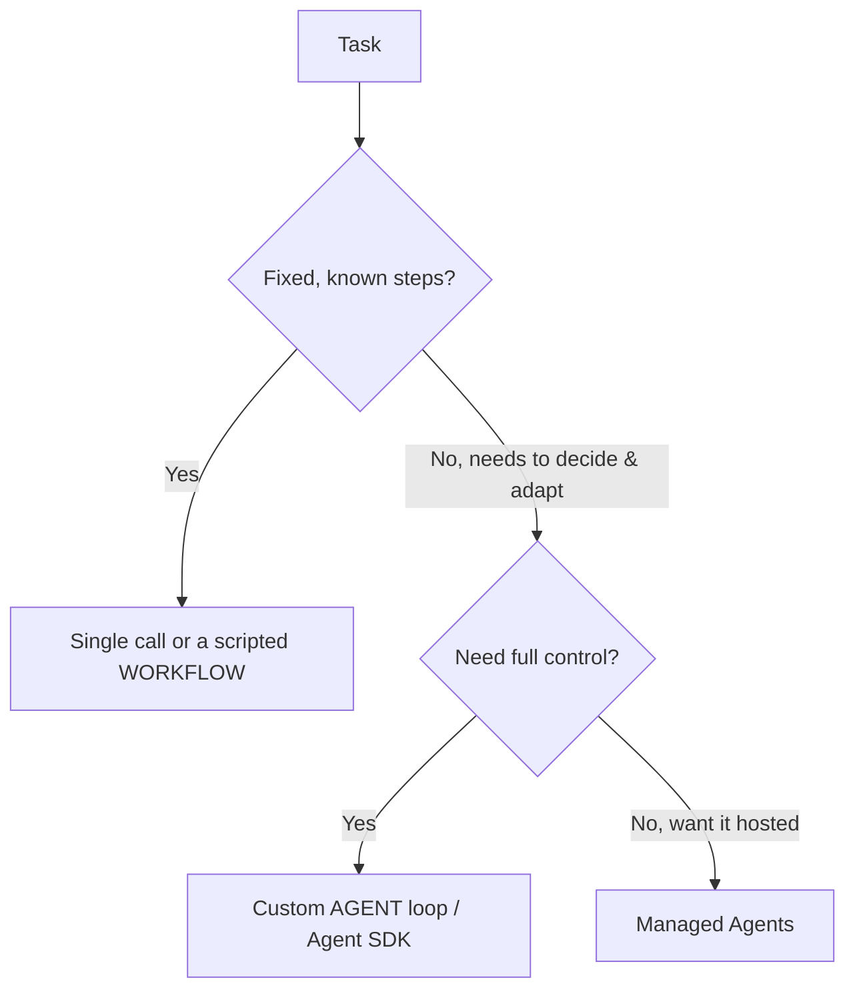

<LevelBadge level="advanced" />

<VerifyNote lastVerified="2026-06-20" source="https://docs.anthropic.com/en/docs/agents-and-tools">
Инструментарий для агентов (Agent SDK, управляемые варианты) развивается быстро — уточняйте актуальные варианты в официальной документации.
</VerifyNote>

**Агент** — это модель, работающая в цикле: она преследует цель, вызывая [инструменты](/docs/api/tool-use), наблюдая за результатами и принимая решение о следующем шаге, пока задача не будет выполнена. Прежде чем создавать его, выберите *самое простое решение, которое работает*.

## Тест на выбор (не усложняйте)

- **Один вызов** — на запрос отвечает один промпт. Большинство задач. Самый дешёвый и надёжный вариант.
- **Рабочий процесс** — вы оркестрируете фиксированную последовательность вызовов в коде (детерминированный поток управления). Используйте, когда шаги известны.
- **Агент** — модель сама динамически определяет шаги. Используйте только тогда, когда путь действительно невозможно жёстко задать.

> Прибегайте к агенту, когда адаптивность — это суть, а не потому что это звучит впечатляюще. Контролируемый вами рабочий процесс легче тестировать и отлаживать.

## Проектирование цикла

Минимальный собственный агент:

1. **Системный промпт**: цель, ограничения и доступные инструменты.
2. **Цикл**: отправить сообщения → если `tool_use`, выполнить инструмент, добавить `tool_result`, повторить → до финального ответа или условия остановки.
3. **Защитные ограничения**: лимит максимального числа итераций, бюджет на токены/стоимость и валидация входных данных инструментов.
4. **Управление контекстом**: суммируйте/обрезайте историю по мере её роста (та же идея, что и в [Управлении контекстом](/docs/claude-code/context-management)).

**[Claude Agent SDK](/docs/claude-code/headless-and-agent-sdk)** даёт вам этот цикл — инструменты, разрешения, обработку контекста — в комплекте, так что вам не приходится писать всё вручную.

## Сделайте его устойчивым

- **Ограничивайте всё**: итерации, время, стоимость. Агенты могут зацикливаться.
- **Корректно обрабатывайте сбои инструментов** (возвращайте ошибку как результат).
- **Минимум привилегий + человек в цикле** для рискованных действий — см. [Защита агентов](/docs/security/securing-agents).
- **Оценивайте** его на реальных кейсах, прежде чем доверять ему — см. [Оценки](/docs/foundations/evals).

## Далее

- [Использование инструментов](/docs/api/tool-use) · [Headless и Agent SDK](/docs/claude-code/headless-and-agent-sdk)
- [Управляемые агенты](/docs/api/managed-agents) · [Cowork и команды агентов](/docs/api/cowork-and-agent-teams)
- [Защита агентов и инструментов](/docs/security/securing-agents)
