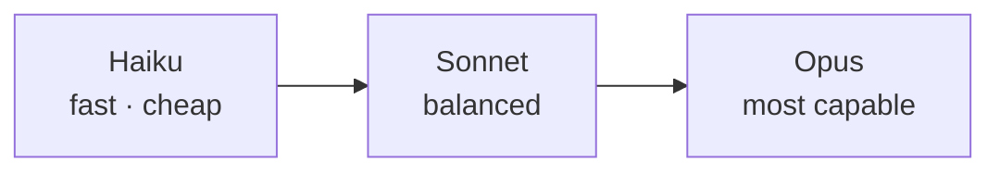

<LevelBadge level="beginner" />

Anthropic предлагает семейство моделей с разным сочетанием возможностей, стоимости и скорости. Правильный выбор в основном сводится к подбору модели под задачу — и к тому, чтобы не переплачивать за возможности, которые вам не нужны.

## Текущие модели

<ModelTable />

## Попробуйте: какая модель подойдёт?

Ответьте на три вопроса и получите отправную рекомендацию:

<ModelPicker />

## Ментальная модель: лестница возможностей

- **Начните с Sonnet.** Это рабочая лошадка по умолчанию — сильные рассуждения и программирование при разумной стоимости. Большинство задач стоит начинать здесь.
- **Поднимайтесь до Opus** только тогда, когда Sonnet не справляется и качество важнее стоимости (сложные рассуждения, хитрые агенты, запутанный код).
- **Опускайтесь до Haiku** для объёмной, чувствительной к задержкам или простой работы (классификация, извлечение, маршрутизация, дешёвые субагенты).

## Как на самом деле выбирать

1. **По умолчанию берите Sonnet** и выпускайте продукт.
2. **Упёрлись в потолок качества?** Попробуйте Opus только на сложном подмножестве.
3. **Стоимость или задержка мешают?** Проверьте, достаточно ли Haiku для этого шага.
4. **Смешивайте модели.** Используйте Haiku для дешёвой пред-/постобработки, а Sonnet/Opus — для сложного ядра. Это «уровневое распределение моделей» — один из самых мощных рычагов снижения стоимости; см. [Стоимость и задержка](/docs/foundations/cost-and-latency).

:::tip Не выбирайте только по бенчмаркам
Публичные бенчмарки — это отправная подсказка, а не приговор для *вашей* задачи. Прогоните крошечную [оценку](/docs/foundations/evals) на горстке ваших реальных входных данных по двум моделям — это занимает минуты и лучше любых догадок.
:::

## Как узнать точный ID модели

Всегда передавайте актуальный ID модели API (например, в вашем вызове `messages.create`). Возьмите его из [таблицы моделей выше](/docs/whats-new/models-and-pricing) или с официальной страницы моделей — и предпочтите читать его из конфигурации, а не жёстко прописывать во многих местах, чтобы обновление модели было изменением в одну строку.

## Далее

- [Токены, контекст и стоимость](/docs/api/tokens-and-pricing)
- [Ваш первый вызов API](/docs/api/first-call)
- [Текущие модели и стоимость](/docs/whats-new/models-and-pricing)
