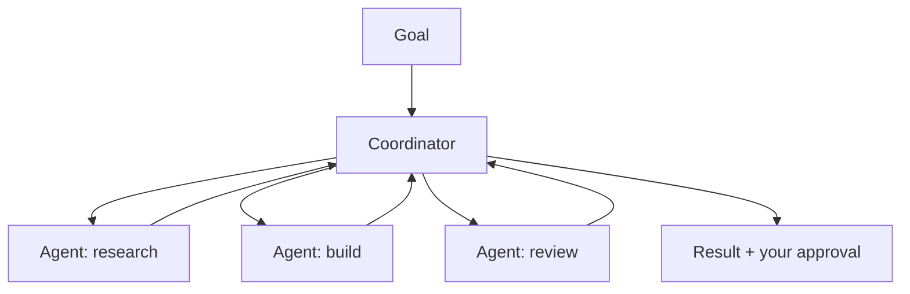

<LevelBadge level="advanced" />

<VerifyNote lastVerified="2026-06-20" source="https://docs.anthropic.com">
Cowork и Agent Teams — это быстро меняющиеся поверхности 2026 года: названия, доступность и возможности часто меняются. Уточняйте актуальные детали в официальной документации и анонсах Anthropic.
</VerifyNote>

Помимо одиночного агента, Anthropic выпускает поверхности **продуктового уровня**, позволяющие агентам выполнять длительную совместную работу: **Cowork** (агентное настольное рабочее пространство) и **Agent Teams** (несколько агентов, работающих вместе). Эта страница — высокоуровневая карта; уточняйте конкретику по официальной документации, поскольку всё это быстро развивается.

## Claude Cowork

Представьте это как **рабочее пространство, где агент выполняет настоящую многошаговую работу** рядом с вами — оперируя файлами и инструментами на более длинном горизонте, чем один ход чата, под вашим надзором. Это потребительский/профессиональный родственник создания агента на API: цикл уже предоставлен, а вы задаёте цели.

## Agent Teams

Когда одного агента недостаточно, **несколько агентов работают вместе** — разделяя цель, каждый со своей ролью и инструментами, координируясь ради результата. Концептуально это отражает [субагентов](/docs/claude-code/subagents) Claude Code, но как продуктовую поверхность для длительного многоагентного сотрудничества, а не как одну делегированную подзадачу.

## Как это связано с остальной частью сайта

- Создаёте сами, программно → [Создание агентов](/docs/api/building-agents) + [Agent SDK](/docs/claude-code/headless-and-agent-sdk).
- Делегирование внутри сессии программирования → [Субагенты](/docs/claude-code/subagents).
- Размещённый цикл/состояние/планирование → [Управляемые агенты](/docs/api/managed-agents).

## Постоянная величина: надзор

:::warning Больше автономии — больше осторожности
Многоагентная работа на длинном горизонте усиливает как ценность, *так и* риск. Держите людей в цикле при значимых действиях, узко ограничивайте доступ инструментов и проверяйте результаты — см. [Ответственное использование](/docs/security/responsible-use) и [Защита агентов](/docs/security/securing-agents).
:::

## Далее

- [Субагенты и параллельные агенты](/docs/claude-code/subagents)
- [Управляемые агенты](/docs/api/managed-agents)
- [Ответственное использование, этика и верификация](/docs/security/responsible-use)
