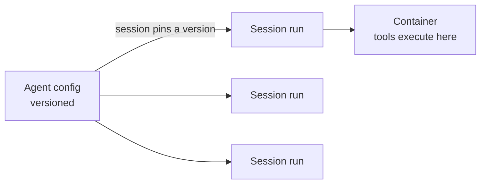

<LevelBadge level="advanced" />

<VerifyNote lastVerified="2026-06-26" source="https://platform.claude.com/docs/en/docs/agents-and-tools">
Возможности и доступность управляемых агентов меняются — API находится в стадии бета. Перед тем как строить на нём что-либо, сверьте эндпоинты, имена полей и доступ в официальной документации.
</VerifyNote>

<Callout type="objectives" items={["Понять, что именно берёт на себя управляемый (размещённый Anthropic) цикл агента", "Разделить два ключевых объекта: версионируемый Agent против посессионной Session", "Безопасно внедрять секреты с помощью хранилищ (Vaults) — так, чтобы модель их никогда не видела", "Поставить агента на расписание cron с помощью запланированных развёртываний — без планировщика, который нужно размещать", "Знать, когда управляемый вариант лучше собственного цикла, и какие ограничения всё равно действуют"]} />

Если [построение собственного цикла агента](/docs/api/building-agents) — это больше инфраструктуры, чем вы хотите поддерживать, **управляемый** (размещённый Anthropic) агент запускает цикл за вас — чтобы вы сосредоточились на *задаче* агента, а не на сессионной обвязке, повторных попытках, состоянии и планировании.

## Два объекта: Agent против Session

Это та ментальная модель, на которой держится всё остальное. Они разделены намеренно.

- **Agent** — это *сохранённая, версионируемая конфигурация*: модель, системный промпт, инструменты, MCP-серверы и навыки. Вы создаёте его один раз. Каждое обновление создаёт новую неизменяемую версию.
- **Session** — это *экземпляр времени выполнения*: один запуск, который указывает на агента по ID. Конфигурация живёт на агенте, а не на сессии.

<Callout type="tip">
Сессии **закрепляются** (pin) за той версией агента, с которой были созданы: выполняющиеся сессии сохраняют свою версию, новые сессии получают последнюю. Именно так вы выкатываете изменения конфигурации, не ломая работу, которая уже идёт.
</Callout>

## Что даёт «управляемый» режим

Вместо того чтобы вручную собирать и размещать цикл, вы получаете размещённые строительные блоки:

- **Sessions** — постоянные запуски, которые вы создаёте на каждое выполнение и возобновляете; стримят события через SSE.
- **Environments** — контейнерная инфраструктура, либо `cloud` (размещённая Anthropic), либо `self_hosted` (инструменты выполняются в вашем собственном VPC). Один контейнер на сессию — это рабочее пространство агента.
- **Memory stores** — постоянное состояние между сессиями, с версионированием и редактированием (redaction), без необходимости подключать базу данных.
- **Vaults** — секреты для аутентификации MCP и других сервисов.
- **Scheduled deployments** — агенты, которые запускаются по расписанию cron без участия человека.

<PromptCard title="Создайте агента (версионируемая конфигурация), затем запустите против него сессию">{`# 1. Create the agent once
POST /v1/agents        -> returns $AGENT_ID
# 2. Each execution is a session pinned to that agent
POST /v1/sessions      { "agent": "$AGENT_ID" }`}</PromptCard>

## Vaults: секреты, которые модель никогда не видит

Автономному агенту часто нужен API-ключ — но *модель* никогда не должна его читать. Учётные данные хранилища (`mcp_oauth`, `static_bearer`, `environment_variable`) подставляются на выходе (egress): учётные данные `environment_variable` внедряются в песочницу во время выполнения и *никогда не видны* модели.

<Callout type="warning">
Это безопасный паттерн для предоставления агенту мощного доступа. Не вставляйте ключи в системный промпт или сообщение — они становятся частью контекста, который видят модель (и ваши логи). Положите их в хранилище.
</Callout>

## Запланированные развёртывания: агент на cron

**Развёртывание** (deployment) привязывает расписание cron к агенту. Когда расписание срабатывает, оно запускает свежую сессию и выполняет свою задачу — никакого планировщика, который вам нужно собирать или размещать. Подходит для ночной синхронизации данных, еженедельной проверки соответствия требованиям или ежедневного дайджеста.

<Steps items={[
  {title: "Определите расписание", body: "POST /v1/deployments с agent, environment_id, initial_events (должно включать user.message) и schedule: POSIX cron-выражение плюс IANA-часовой пояс."},
  {title: "Каждое срабатывание = запуск", body: "Каждая попытка триггера создаёт запись о запуске (префикс drun_). Успех несёт session_id; неудача несёт error.type (например, environment_archived, session_rate_limited). Список запусков через GET /v1/deployment_runs?deployment_id=..."},
  {title: "Управляйте жизненным циклом", body: "Пауза подавляет будущие триггеры (ручные запуски всё ещё работают); снятие паузы возобновляет работу со следующего срабатывания и НЕ восполняет пропущенные триггеры; архивирование терминально."},
  {title: "Запускайте по требованию", body: "POST /v1/deployments/{id}/run немедленно запускает сессию — даже на паузе — с trigger_context.type: manual."}
]} />

<PromptCard title="Еженедельная проверка соответствия, по пятницам в 20:00 по времени Нью-Йорка">{`POST /v1/deployments
{
  "name": "Weekly compliance scan",
  "agent": "$AGENT_ID",
  "environment_id": "$ENVIRONMENT_ID",
  "initial_events": [
    {"type": "user.message", "content": [{"type": "text", "text": "Run the compliance scan and summarize findings."}]}
  ],
  "schedule": {"type": "cron", "expression": "0 20 * * 5", "timezone": "America/New_York"}
}`}</PromptCard>

<Callout type="tip">
Cron — это `minute hour day-of-month month day-of-week`, с гранулярностью до минуты. Переход на летнее время использует семантику настенных часов: время, которого не существует при переводе вперёд, пропускается; время, которое случается дважды при переводе назад, срабатывает дважды. Для всего критичного выбирайте часовой пояс и час, которые избегают этих краевых случаев.
</Callout>

## Когда выбирать управляемый вариант, а когда собственный

| Выбирайте **управляемый**, когда… | Выбирайте **собственный цикл / SDK**, когда… |
|---|---|
| Вы хотите, чтобы хостинг, состояние, планирование и секреты были взяты на себя | Вам нужен полный контроль над циклом и инструментами |
| Вы быстро прототипируете | У вас строгие требования к собственной инфраструктуре/комплаенсу |
| Простота эксплуатации важнее контроля | Вы глубоко встраиваетесь в собственный стек |

Это спектр — один вызов → workflow → собственный агент (SDK) → управляемый. Начинайте настолько просто, насколько позволяет задача; поднимайтесь выше только тогда, когда это необходимо.

## Те же ограничения действуют

Управляемый или нет, автономный агент всё равно совершает действия. Сохраняйте **минимум привилегий**, **ограниченную стоимость/число итераций** и **одобрение человеком для рискованных шагов** — см. [Защита агентов](/docs/security/securing-agents) и [Усиление автономных запусков](/docs/security/hardening-autonomous-runs).

<Callout type="takeaways" items={["Управляемые агенты берут на себя цикл, сессии, окружения, память, хранилища секретов и планирование, чтобы вы сосредоточились на задаче", "Agent — это версионируемая конфигурация; Session — это один запуск, который закрепляется за версией; конфигурация живёт на агенте, а не на сессии", "Учётные данные хранилища типа environment_variable внедряются во время выполнения и никогда не видны модели — безопасный способ дать агенту секреты", "Запланированное развёртывание — это cron-выражение + IANA-часовой пояс; каждое срабатывание создаёт запуск, а снятие паузы не восполняет пропущенные триггеры", "Управляемый вариант находится на размещённом конце спектра: один вызов -> workflow -> собственный -> управляемый; ограничения для автономности всё равно действуют"]} />

## Проверьте себя

<Quiz title="Проверьте себя" questions={[
  {
    q: "В чём разница между Agent и Session?",
    options: [
      "Это два названия одного и того же объекта",
      "Agent — это версионируемая конфигурация; Session — это одно выполнение времени исполнения, которое закрепляется за версией агента",
      "Session содержит модель и системный промпт; Agent — это просто ID",
      "Agent запускает инструменты; Session хранит секреты"
    ],
    answer: 1,
    explain: "Agent — это сохранённая, версионируемая конфигурация (модель, промпт, инструменты, MCP, навыки). Session — это посессионный экземпляр, который ссылается на агента и закрепляется за его версией при создании."
  },
  {
    q: "Как следует давать управляемому агенту нужный ему API-ключ?",
    options: [
      "Поместить его в системный промпт, чтобы агент мог его прочитать",
      "Передать его в первом пользовательском сообщении сессии",
      "Хранить его как учётные данные хранилища, внедряемые во время выполнения и никогда не видимые модели",
      "Жёстко прописать его в определении инструмента"
    ],
    answer: 2,
    explain: "Учётные данные хранилища (например, тип environment_variable) подставляются на выходе и никогда не видны модели — ключи в промпте или сообщении становятся частью видимого контекста."
  },
  {
    q: "Запланированное развёртывание было поставлено на паузу на два дня, а затем снято с паузы. Что происходит с триггерами, которые сработали бы во время паузы?",
    options: [
      "Они восполняются — каждый пропущенный запуск выполняется при снятии паузы",
      "Они не восполняются; развёртывание просто возобновляется со следующего запланированного срабатывания",
      "Развёртывание автоматически архивируется",
      "Все пропущенные запуски ставятся в очередь и запускаются с интервалом в одну минуту"
    ],
    answer: 1,
    explain: "Снятие паузы возобновляет работу со следующего срабатывания и не восполняет пропущенные триггеры. (Вы по-прежнему можете в любой момент принудительно запустить сессию ручным триггером, даже на паузе.)"
  }
]} />

## Далее

- [Построение агентов на API](/docs/api/building-agents)
- [Cowork и команды агентов](/docs/api/cowork-and-agent-teams)
- [Безголовый режим и Agent SDK](/docs/claude-code/headless-and-agent-sdk)
- [Защита агентов](/docs/security/securing-agents)
