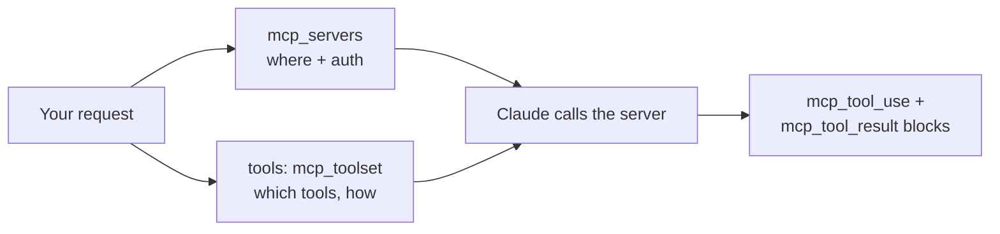

<LevelBadge level="advanced" />

**Model Context Protocol (MCP)** — это открытый стандарт для подключения ИИ к внешним инструментам и данным. В API вам вообще не нужно запускать MCP-клиент: **MCP-коннектор** позволяет указать удалённый сервер в вашем запросе, и Claude вызывает его инструменты внутри обычного цикла агента. Два поля запроса заменяют целый слой интеграции.

<Callout type="objectives" items={[
  "Когда MCP-коннектор превосходит ручное определение инструментов — а когда нет",
  "Точная форма запроса: mcp_servers для соединения, mcp_toolset для политики",
  "Списки разрешений, запретов и конфигурация для каждого инструмента — как объединяются три уровня конфигурации",
  "Блоки ответа, которые вы должны обработать: mcp_tool_use и mcp_tool_result",
  "Реальные ограничения: только HTTPS, только инструменты, пробелы по платформам и отсутствие поддержки ZDR",
]} />

<VerifyNote lastVerified="2026-07-20" source="https://platform.claude.com/docs/en/agents-and-tools/mcp-connector">
Коннектор находится в бета-режиме, и заголовок уже менялся один раз: текущая версия — `mcp-client-2025-11-20`, а `mcp-client-2025-04-04` **устарел**. Имена полей, доступность на платформах и статус беты меняются — сверяйтесь с официальной страницей и [modelcontextprotocol.io](https://modelcontextprotocol.io) перед выпуском.
</VerifyNote>

## MCP против инструментов, определённых вручную

| | [Использование инструментов](/docs/api/tool-use) (пользовательское) | MCP-коннектор |
|---|---|---|
| Что вы определяете | Схему каждого инструмента и сами его выполняете | Соединение с сервером, который *публикует* инструменты |
| Кто запускает инструмент | Ваш код, в вашем цикле | Сторона Anthropic вызывает удалённый сервер |
| Лучше всего подходит для | Нескольких индивидуальных функций в вашем приложении | Переиспользования готовых интеграций (GitHub, БД, браузеры, SaaS) |
| Аутентификация | Ваш код | OAuth bearer-токен, который вы предоставляете для каждого сервера |

Они сосуществуют. Определяйте специфичные для приложения инструменты напрямую, а готовые возможности подтягивайте через MCP.



## Форма запроса

Две части, и они намеренно разделены: **`mcp_servers`** говорит *где находится сервер и как аутентифицироваться*; запись **`mcp_toolset`** в массиве `tools` говорит *какие из его инструментов вы готовы предоставить и как*.

<Steps items={[
  {title: "Отправьте бета-заголовок", body: "anthropic-beta: mcp-client-2025-11-20 — без него поле mcp_servers не принимается. В SDK это список betas в вызове beta.messages.create."},
  {title: "Объявите сервер в mcp_servers", body: "Задайте тип url, https-адрес и уникальное имя. Добавьте authorization_token, если сервер требует OAuth — вы сами запускаете OAuth-поток и передаёте полученный access token."},
  {title: "Добавьте соответствующий mcp_toolset в tools", body: "Установите mcp_server_name на имя, которое вы только что использовали. Без дополнительной конфигурации каждый инструмент этого сервера включается с настройками по умолчанию."},
  {title: "Обработайте новые блоки ответа", body: "Ответ Claude может содержать блоки контента mcp_tool_use и mcp_tool_result. Отображайте или логируйте их как блоки инструментов — не считайте, что ответ является простым текстом."},
]} />

<PromptCard title="Минимальный вызов MCP-коннектора (cURL)">{`curl https://api.anthropic.com/v1/messages \\
  -H "Content-Type: application/json" \\
  -H "X-API-Key: $ANTHROPIC_API_KEY" \\
  -H "anthropic-version: 2023-06-01" \\
  -H "anthropic-beta: mcp-client-2025-11-20" \\
  -d '{
    "model": "MODEL_ID",
    "max_tokens": 1000,
    "messages": [{"role": "user", "content": "What tools do you have available?"}],
    "mcp_servers": [
      {"type": "url", "url": "https://example.com/sse", "name": "example-mcp", "authorization_token": "YOUR_TOKEN"}
    ],
    "tools": [
      {"type": "mcp_toolset", "mcp_server_name": "example-mcp"}
    ]
  }'`}</PromptCard>

:::tip Никогда не задавайте модель жёстко
`MODEL_ID` выше — специально плейсхолдер. Читайте актуальный ID из [Текущих моделей и цен](/docs/whats-new/models-and-pricing) и держите его в конфиге, чтобы обновление модели было изменением в одну строку.
:::

API соблюдает строгое соответствие: каждый сервер в `mcp_servers` должен быть связан **ровно с одним** toolset, а `mcp_server_name` каждого toolset должен соответствовать объявленному серверу. Несоответствия — это ошибки валидации, а не тихое отсутствие действия.

## Выбирайте, что Claude может реально делать

Именно на этом чаще всего спотыкаются интеграции. Toolset принимает `default_config`, применяемый к каждому инструменту, плюс `configs` с переопределениями для каждого отдельного инструмента. Приоритет, от наивысшего: **`configs` для каждого инструмента → `default_config` уровня набора → системные настройки по умолчанию**.

**Список запретов** — включите всё, затем отключите опасные. Разумно, когда вам нужна широта, но без разрушительных операций записи:

```json
{
  "type": "mcp_toolset",
  "mcp_server_name": "calendar-mcp",
  "configs": {
    "delete_all_events": { "enabled": false },
    "share_calendar_publicly": { "enabled": false }
  }
}
```

**Список разрешений** — отключить по умолчанию, затем перечислить выживших. Это позиция минимальных привилегий, и та, к которой стоит обращаться по умолчанию:

```json
{
  "type": "mcp_toolset",
  "mcp_server_name": "calendar-mcp",
  "default_config": { "enabled": false },
  "configs": {
    "search_events": { "enabled": true },
    "create_event": { "enabled": true }
  }
}
```

:::warning Список запретов блокирует только то, о чём вы подумали
Серверы могут добавлять инструменты. Список запретов молча предоставляет каждый инструмент, добавленный после того, как вы его написали; список разрешений молча *игнорирует* их. Для всего, что касается данных клиентов или денег, используйте список разрешений. Также обратите внимание: указание в `configs` инструмента, которого нет на сервере, регистрирует бэкенд-предупреждение, но **не** выдаёт ошибку — так что опечатка в списке разрешений тихо отключает инструмент, который вы собирались включить. Сверяйтесь с актуальным списком инструментов сервера.
:::

## Держите схемы вне вашего контекста

Описание каждого включённого инструмента отправляется вместе с запросом, так что толстый каталог облагает налогом каждый ход. Ответ коннектора — `defer_loading: true`: описание остаётся вне начального контекста, и Claude подтягивает его по запросу через Tool Search Tool.

```json
{
  "type": "mcp_toolset",
  "mcp_server_name": "calendar-mcp",
  "default_config": { "defer_loading": true },
  "configs": {
    "search_events": { "defer_loading": false }
  }
}
```

Читайте это как: *отложить всё, кроме одного инструмента, с которого начинается эта задача*. Toolset также принимает `cache_control`, так что стабильный каталог может располагаться за точкой останова [prompt caching](/docs/api/prompt-caching), а не тарифицироваться заново каждый ход. Цифры за этим — и почему отсрочка инструментов *повысила* точность выбора, а не снизила её — смотрите в [Налог на токены MCP](/docs/claude-code/mcp-token-cost). Когда именно *результаты*, а не определения, заполоняют ваш контекст, обратитесь к [Programmatic Tool Calling](/docs/api/programmatic-tool-calling).

## Что приходит в ответ

Два типа блоков контента, которые вы должны обработать:

```json
{ "type": "mcp_tool_use", "id": "mcptoolu_...", "name": "echo",
  "server_name": "example-mcp", "input": { "param1": "value1" } }

{ "type": "mcp_tool_result", "tool_use_id": "mcptoolu_...", "is_error": false,
  "content": [ { "type": "text", "text": "Hello" } ] }
```

Обратите внимание на `server_name` в блоке use: при подключении нескольких серверов именно так вы атрибутируете вызов — это существенно для логирования и для отладки того, какая интеграция повела себя неправильно. А `is_error` — это поле, а не исключение: сбойный MCP-инструмент возвращается как *результат*, так что ваш цикл должен его проверять, а не полагаться на успех.

## Ограничения, которые кусаются

<Callout type="warning" items={[
  "Только инструменты. Из спецификации MCP коннектор в настоящее время поддерживает вызовы инструментов — но не prompts или resources. Нужны они? Запустите собственный клиент и вместо этого используйте SDK MCP helpers.",
  "Только удалённый HTTPS. Сервер должен быть публично доступен по HTTP (транспорты Streamable HTTP или SSE). Локальный stdio-сервер нельзя подключить таким образом — так делают Claude Code и настольные приложения.",
  "Пробелы по платформам. Доступно в Claude API, Claude Platform на AWS и Microsoft Foundry (развёртывания Hosted-on-Anthropic). В настоящее время недоступно в Amazon Bedrock или Google Cloud.",
  "Нет нулевого хранения данных. Данные, которыми обмениваются с MCP-серверами — определения инструментов и результаты выполнения — подпадают под стандартное хранение, а не под ZDR.",
  "OAuth — ваша забота. API принимает authorization_token; получение и обновление его до истечения — ваша задача.",
]} />

## Один стандарт, три поверхности

- **API** (эта страница) — удалённые серверы по URL, через коннектор.
- **[Claude Code](/docs/claude-code/mcp)** — локальные и удалённые серверы в ваших сессиях разработки.
- **[Приложения](/docs/claude-app/connectors)** — MCP питает Connectors.

Изучите протокол один раз; он переносится. Отличается только проводка.

## Доверие

:::warning MCP-сервер — это код плюс доступ
Подключайте только серверы, которым вы доверяете, ограничивайте их наименьшими привилегиями с помощью списка разрешений и помните: контент, возвращаемый сервером, — это недоверенный ввод, который может нести [prompt injection](/docs/security/prompt-injection). Проверяйте сторонние серверы перед подключением — [Проверка стороннего кода](/docs/security/reviewing-third-party-code) и [Защита MCP-серверов](/docs/security/securing-mcp-servers).
:::

<Flashcards title="Словарь MCP-коннектора" cards={[
  {front: "MCP-коннектор", back: "Вызов удалённого MCP-сервера напрямую из Messages API, без вашего собственного MCP-клиента."},
  {front: "mcp_servers", back: "Поле запроса, содержащее соединение: type, https url, уникальное name, опциональный authorization_token."},
  {front: "mcp_toolset", back: "Запись в массиве tools, которая говорит, какие инструменты сервера включены и как. Указывает на сервер через mcp_server_name."},
  {front: "default_config против configs", back: "Настройки по умолчанию для набора против переопределений для каждого инструмента. configs побеждает default_config, который побеждает системные настройки по умолчанию."},
  {front: "defer_loading", back: "Держит описание инструмента вне начального контекста, пока Claude не выполнит по нему поиск — исправление для раздутого каталога инструментов."},
  {front: "is_error в результате инструмента", back: "Сбойный MCP-инструмент возвращает блок result с is_error true — а не исключение. Проверяйте его в вашем цикле."},
]} />

<Quiz title="Проверьте себя" questions={[
  {q: "Вы хотите, чтобы Claude использовал только search_events и create_event с сервера календаря. Какова правильная форма toolset?", options: ["Перечислить их в массиве allowed_tools в определении сервера", "Установить default_config.enabled в false, затем включить эти два в configs", "Установить defer_loading true на каждом другом инструменте"], answer: 1, explain: "allowed_tools относится к устаревшему заголовку mcp-client-2025-04-04. В текущей версии список разрешений формируется отключением по умолчанию в default_config и включением конкретных инструментов в configs. defer_loading влияет на стоимость контекста, а не на разрешение."},
  {q: "Вызов MCP-инструмента завершается сбоем. Где это отобразится?", options: ["Как HTTP-ошибка на запрос Messages", "Как блок контента mcp_tool_result с is_error, установленным в true", "Ответ молча пропускает вызов инструмента"], answer: 1, explain: "Сбои возвращаются внутри ответа как блок result с is_error true. Код, который предполагает успех, с радостью отобразит сбойный вызов как факт."},
  {q: "Вам нужно, чтобы Claude читал MCP resources с локального stdio-сервера. Может ли коннектор это сделать?", options: ["Да — установите type в stdio в mcp_servers", "Нет — коннектор работает только с удалённым HTTPS и только с вызовами инструментов; запустите собственный клиент с SDK MCP helpers", "Да, но только на Bedrock"], answer: 1, explain: "Коннектор поддерживает вызовы инструментов к публично доступным HTTPS-серверам. Локальные stdio-серверы, MCP prompts и MCP resources требуют собственного клиента, для которого SDK предоставляют helpers."},
  {q: "Ваш каталог инструментов охватывает четыре сервера и доминирует в контекстном окне каждый ход. Самый дешёвый первый ход?", options: ["Перейти на модель с большим контекстом", "Установить default_config.defer_loading true и не откладывать только инструменты, с которых начинается задача", "Разбить работу на четыре отдельных запроса"], answer: 1, explain: "Отложенная загрузка держит описания вне контекста, пока Claude не выполнит по ним поиск. Она сокращает налог на схемы за ход, не отбрасывая ни одной возможности — и обычно улучшает выбор инструментов, потому что меньше инструментов теснится в контексте."},
]} />

<Callout type="takeaways" items={[
  "Коннектор заменяет MCP-клиент двумя полями запроса — но только для удалённых HTTPS-серверов и только для вызовов инструментов.",
  "mcp_servers — это соединение; mcp_toolset в tools — это политика. Каждый сервер должен быть связан ровно с одним toolset.",
  "Список разрешений (default_config.enabled false, плюс явные configs) побеждает список запретов: инструменты, добавленные на сервер позже, игнорируются, а не предоставляются.",
  "defer_loading и cache_control — ваши рычаги, когда схемы инструментов начинают съедать контекстное окно.",
  "Обрабатывайте блоки mcp_tool_use и mcp_tool_result — включая is_error, который является полем, а не исключением.",
  "Проверьте бета-заголовок перед выпуском: mcp-client-2025-11-20 актуален, mcp-client-2025-04-04 устарел.",
]} />

## Источники и дополнительное чтение

- [MCP connector — документация Anthropic](https://platform.claude.com/docs/en/agents-and-tools/mcp-connector) — авторитетная справка по полям и руководство по миграции.
- [Спецификация Model Context Protocol](https://modelcontextprotocol.io) — сам открытый стандарт, включая авторизацию.

## Далее

- [Использование инструментов / Вызов функций](/docs/api/tool-use)
- [Построение агентов на API](/docs/api/building-agents)
- [Налог на токены MCP](/docs/claude-code/mcp-token-cost)
- [Соберите и подключите ваш первый MCP-сервер](/docs/walkthroughs/first-mcp-server)
- [Конструктор конфигурации MCP](/docs/tools/mcp-config-builder)
