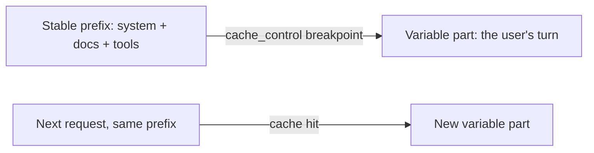

<LevelBadge level="advanced" />

<VerifyNote lastVerified="2026-06-20" source="https://docs.anthropic.com/en/docs/build-with-claude/prompt-caching">
Механика кэша, право на кэширование и стоимость кэшированных и свежих токенов меняются — уточняйте в официальной документации по кэшированию промптов.
</VerifyNote>

Если многие из ваших запросов содержат общий большой неизменный фрагмент — длинный системный промпт, большой документ, каталог инструментов — **кэширование промптов** позволяет API переиспользовать обработанный префикс вместо того, чтобы перечитывать его при каждом вызове. Это снижает как **стоимость**, так и **задержку** на кэшированной части.

## Как это работает (ментальная модель)

Вы отмечаете **точку разрыва кэша** после стабильного префикса. При первом вызове он обрабатывается и кэшируется; последующие вызовы с **тем же самым префиксом** попадают в кэш и платят за него гораздо меньше.

## Инвариант, от которого всё зависит

:::warning Кэширование точно по префиксу
Попадание в кэш требует, чтобы кэшированный префикс был **байт в байт идентичен**. Самая частая ошибка: *скрытый инвалидатор* в начале промпта — временная метка, меняющееся имя пользователя, переупорядоченный список инструментов — который изменяет префикс и тихо обнуляет вашу долю попаданий.
:::

**Помещайте всё стабильное в начало, всё переменное — в конец** и держите префикс действительно постоянным.

## Где это окупается больше всего

- Длинные **системные промпты**, переиспользуемые между пользователями.
- **RAG / Q&A по документам**, где один и тот же исходный текст запрашивается многократно.
- **Агенты** с фиксированным каталогом инструментов и инструкциями на протяжении многих ходов.

Сочетайте кэширование с **пакетной обработкой** для офлайн-нагрузок и с правильным подбором размера модели ([Выбор модели](/docs/api/choosing-a-model)) для наибольшей совокупной экономии — см. [Стоимость и задержка](/docs/foundations/cost-and-latency).

## Далее

- [Токены, контекст и стоимость](/docs/api/tokens-and-pricing)
- [Стриминг и многоходовые диалоги](/docs/api/streaming)
- [Создание агентов на API](/docs/api/building-agents)
