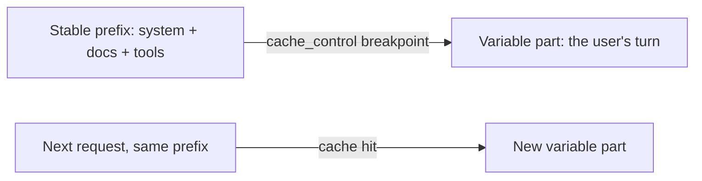

import Tabs from '@theme/Tabs';
import TabItem from '@theme/TabItem';

<LevelBadge level="advanced" />

<VerifyNote lastVerified="2026-06-21" source="https://platform.claude.com/docs/en/docs/build-with-claude/prompt-caching">
Механика кэша, условия его применимости и стоимость кэшированных против свежих токенов меняются — сверяйтесь с официальной документацией по prompt-caching.
</VerifyNote>

Если многие из ваших запросов используют один и тот же большой неизменный фрагмент — длинный системный промпт, объёмный документ, каталог инструментов, — **кэширование промптов** позволяет API повторно использовать уже обработанный префикс вместо того, чтобы перечитывать его при каждом вызове. Это снижает как **затраты**, так и **задержку** на кэшированной части.

<Callout type="objectives" items={["Ментальная модель: точка разрыва кэша после стабильного префикса, переиспользуемого между вызовами","Как пометить точку разрыва в Python и TypeScript с помощью cache_control","Единственный инвариант, который всё решает, — префикс должен быть побайтово идентичным","Как читать поля usage, чтобы убедиться, что вы действительно попадаете в кэш","Где кэширование окупается больше всего и как сочетать его с пакетной обработкой и подбором размера модели"]} />

## Как это работает (ментальная модель)

Вы помечаете **точку разрыва кэша** (cache breakpoint) после стабильного префикса. При первом вызове он обрабатывается и кэшируется; последующие вызовы, использующие **тот же самый префикс**, попадают в кэш и платят за него значительно меньше.



<Flashcards title="Словарь кэширования" cards={[{front:"Точка разрыва кэша",back:"Маркер cache_control, помещаемый после стабильного префикса. Кэшируется всё вплоть до помеченного блока включительно."},{front:"Запись в кэш",back:"Небольшая надбавка при первом вызове для заполнения кэша."},{front:"Чтение из кэша",back:"Каждый последующий вызов с тем же префиксом считывает его обратно за долю цены входных токенов."},{front:"Незаметный инвалидатор",back:"Меняющееся значение в начале промпта (метка времени, имя пользователя, переупорядоченный список инструментов), которое изменяет префикс и тихо обнуляет долю попаданий в кэш."}]} />

## Пометьте точку разрыва (copy-paste)

Добавьте `cache_control` к **последнему стабильному блоку** — здесь это большой системный промпт. Реплика пользователя идёт после него и свободно меняется; кэшируется всё вплоть до помеченного блока включительно.

<Steps items={[{title: "Определите стабильный префикс", body: "Найдите большой неизменный фрагмент — длинный системный промпт, объёмный документ или каталог инструментов, переиспользуемый во многих запросах."},{title: "Привяжите cache_control к его последнему блоку", body: "Пометьте последний стабильный блок при помощи cache_control типа ephemeral, чтобы префикс вплоть до него включительно кэшировался."},{title: "Поместите переменную часть следом", body: "Разместите реплику пользователя после помеченного блока — она свободно меняется при каждом вызове и тарифицируется по полной цене."},{title: "Подтвердите попадание", body: "Прочитайте cache_read_input_tokens из поля usage в ответе. Значение больше нуля означает, что вы попали в кэш."}]} />

<Tabs groupId="lang">
<TabItem value="python" label="Python">

```python
import anthropic

client = anthropic.Anthropic()

message = client.messages.create(
    model="claude-sonnet-4-6",
    max_tokens=1024,
    system=[
        {
            "type": "text",
            "text": LARGE_STABLE_PROMPT,  # long, unchanging — the cached prefix
            "cache_control": {"type": "ephemeral"},
        }
    ],
    messages=[{"role": "user", "content": "Summarize the key points."}],  # varies per call
)

print(message.usage.cache_read_input_tokens)  # > 0 means you got a hit
```

</TabItem>
<TabItem value="ts" label="TypeScript">

```ts
import Anthropic from "@anthropic-ai/sdk";

const client = new Anthropic();

const message = await client.messages.create({
  model: "claude-sonnet-4-6",
  max_tokens: 1024,
  system: [
    {
      type: "text",
      text: LARGE_STABLE_PROMPT, // long, unchanging — the cached prefix
      cache_control: { type: "ephemeral" },
    },
  ],
  messages: [{ role: "user", content: "Summarize the key points." }], // varies per call
});

console.log(message.usage.cache_read_input_tokens); // > 0 means you got a hit
```

</TabItem>
</Tabs>

Первый вызов платит небольшую надбавку за **запись** в кэш, чтобы его заполнить; каждый последующий вызов с тем же префиксом считывает его обратно за долю цены входных токенов. Префикс должен быть достаточно длинным, чтобы соответствовать условиям, — несколько тысяч токенов, в зависимости от модели, — иначе он молча не закэшируется.

## Инвариант, который всё решает

:::warning Кэширование требует точного совпадения префикса
Попадание в кэш требует, чтобы кэшированный префикс был **побайтово идентичным**. Самая частая ошибка — *незаметный инвалидатор* в начале промпта: метка времени, меняющееся имя пользователя, переупорядоченный список инструментов, — который изменяет префикс и тихо обнуляет вашу долю попаданий в кэш.
:::

**Размещайте всё стабильное в начале, а всё переменное — в конце,** и держите префикс действительно постоянным.

## Убедитесь, что это действительно работает

Не полагайтесь на предположения — считайте данные обратно из поля `usage` в ответе:

- **`cache_creation_input_tokens`** — токены, записанные в кэш в этом вызове (первый запрос).
- **`cache_read_input_tokens`** — токены, отданные из кэша (ваша экономия).
- **`input_tokens`** — некэшированный остаток, тарифицируемый по полной цене.

Если `cache_read_input_tokens` остаётся **нулевым** на повторяющихся запросах, которые должны использовать общий префикс, значит, работает незаметный инвалидатор — сравните байты отрендеренного промпта между двумя вызовами, чтобы его найти.

## Где это окупается больше всего

- Длинные **системные промпты**, переиспользуемые между пользователями.
- **RAG / вопросы-ответы по документам**, где один и тот же исходный текст запрашивается многократно.
- **Агенты** с фиксированным каталогом инструментов и инструкциями на протяжении многих ходов.

Сочетайте кэширование с **пакетной обработкой** (batching) для офлайн-нагрузок и с подбором подходящего размера модели ([Выбор модели](/docs/api/choosing-a-model)) для максимальной совокупной экономии — см. [Затраты и задержка](/docs/foundations/cost-and-latency).

<Quiz title="Проверьте себя" questions={[{q:"Что требуется от кэшированного префикса для попадания в кэш?",options:["Он должен быть длиной хотя бы в один токен","Он должен быть побайтово идентичен предыдущему префиксу","Он должен идти после реплики пользователя"],answer:1,explain:"Попадание в кэш требует, чтобы кэшированный префикс был побайтово идентичным. Любое изменение — метка времени, переупорядоченный список инструментов — обнуляет его."},{q:"Какое поле usage сообщает, что токены были отданы из кэша (ваша экономия)?",options:["input_tokens","cache_creation_input_tokens","cache_read_input_tokens"],answer:2,explain:"cache_read_input_tokens — это токены, отданные из кэша. cache_creation_input_tokens — то, что было записано при первом вызове; input_tokens — некэшированный остаток, тарифицируемый по полной цене."},{q:"Где должно располагаться переменное содержимое каждого вызова относительно точки разрыва кэша?",options:["Перед стабильным префиксом","В конце — после помеченного блока","Чередуясь по всему системному промпту"],answer:1,explain:"Размещайте всё стабильное в начале, а всё переменное — в конце. Реплика пользователя идёт после помеченного блока и свободно меняется при каждом вызове."}]} />

<Callout type="takeaways" items={["Помечайте точку разрыва кэша после стабильного префикса; первый вызов записывает его, последующие считывают его обратно дёшево.","Для попадания в кэш нужен побайтово идентичный префикс — держите стабильное содержимое в начале, а переменное — в конце.","Незаметные инвалидаторы в начале промпта (метки времени, имена, переупорядоченные инструменты) тихо обнуляют долю попаданий.","Проверяйте через usage: cache_read_input_tokens > 0 означает попадание; ноль на повторяющихся запросах означает, что работает инвалидатор.","Кэширование окупается больше всего на переиспользуемых системных промптах, RAG и агентах; сочетайте его с пакетной обработкой и подбором размера модели."]} />

## Далее

- [Токены, контекст и цены](/docs/api/tokens-and-pricing)
- [Стриминг и многоходовые диалоги](/docs/api/streaming)
- [Создание агентов на API](/docs/api/building-agents)
