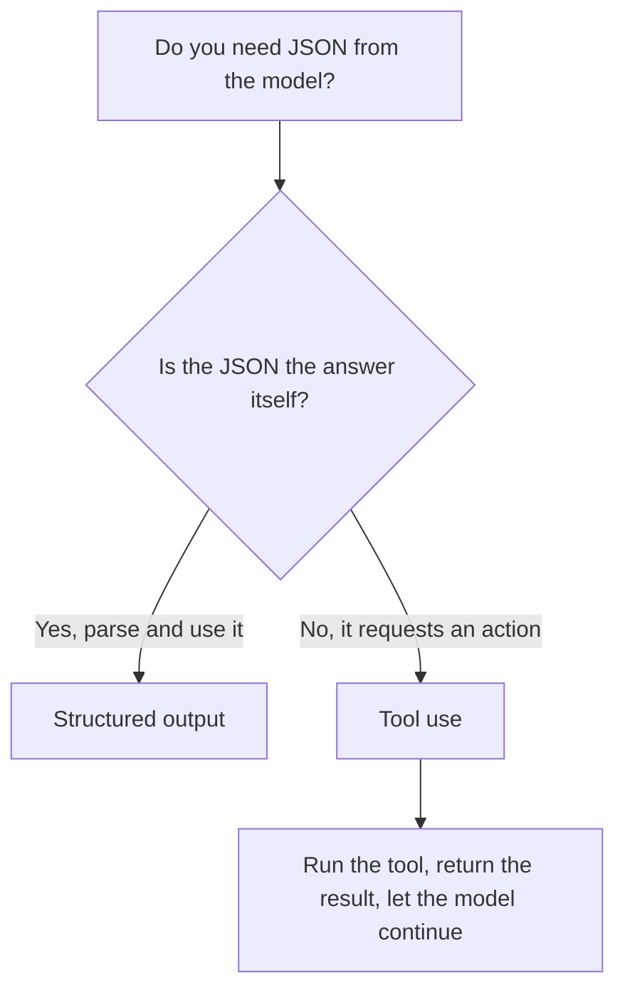

<LevelBadge level="intermediate" />

<VerifyNote lastVerified="2026-06-20" source="https://docs.anthropic.com/en/docs/build-with-claude/structured-outputs">
Точный механизм принудительного применения схемы развивается — уточняйте текущий подход (конфигурация вывода / помощники парсинга) в официальной документации.
</VerifyNote>

Когда вывод Claude поступает в другое ПО, вам нужна **надёжная структура** — валидный JSON, соответствующий известной форме, каждый раз. Не полагайтесь на «ответь в JSON» и надежду; используйте поддержку структурированного вывода платформы.

## Надёжный способ

Предоставьте **JSON Schema** для вывода и позвольте API/SDK принудительно применить её, затем распарсите в типизированный объект (например, Pydantic в Python, Zod в TypeScript). Помощники парсинга SDK выдают вам типизированный результат вместо строки, которую вам пришлось бы `JSON.parse` и валидировать самостоятельно.

```python
# Conceptual shape — see the official docs for the current API surface.
from pydantic import BaseModel

class Ticket(BaseModel):
    title: str
    priority: str   # "low" | "medium" | "high"
    tags: list[str]

# Request the model to return data conforming to Ticket's JSON schema,
# then parse the response into a Ticket instance.
```

## Почему не просто попросить JSON в промпте?

Вы *можете* попросить JSON в промпте, и для простых случаев это работает — но он может «уплывать»: лишняя проза, висячая запятая, отсутствующее поле. Вывод с принудительной схемой устраняет этот класс ошибок, что важно с того момента, как от него начинает зависеть нижестоящая система.

## Структурированный вывод vs. использование инструментов

Обе функции передают модели **JSON Schema**, поэтому они выглядят похоже — и люди выбирают не ту. Разница в *намерении*, а не в механизме:

| | **Структурированный вывод** | **[Использование инструментов](/docs/api/tool-use)** |
|---|---|---|
| Что вам нужно | **Окончательный ответ** в фиксированной форме | Чтобы модель **задействовала возможность** (вызвала функцию, получила данные, выполнила действие) |
| Кто это потребляет | Ваш код, напрямую | Ваш код выполняет инструмент, затем возвращает результат модели |
| Форма хода | Один ответ, готово | Цикл: модель спрашивает, вы выполняете, модель продолжает |
| Типичное применение | Извлечение, классификация, парсинг | Агенты, живые запросы, побочные эффекты |

Быстрое практическое правило:



Если JSON *и есть* конечный результат, используйте структурированный вывод. Если JSON — это модель, просящая ваш код *что-то сделать*, это использование инструментов. Агенты часто используют оба: инструменты — чтобы действовать, структурированный вывод — чтобы вернуть чистый окончательный результат.

## Советы

- **Держите схемы плотными.** Используйте перечисления для фиксированных вариантов; помечайте обязательные поля.
- **Описывайте поля.** Описания полей направляют модель как мини-промпты.
- **Всё равно валидируйте** на границе — оборонительный парсинг — это дешёвая страховка.
- Для задач **извлечения** структурированный вывод + ясная схема каждый раз превосходят свободную форму.

## Далее

- [Использование инструментов / вызов функций](/docs/api/tool-use) — инструменты тоже используют JSON-схемы
- [Ваш первый вызов API](/docs/api/first-call)
- [Переиспользуемые шаблоны промптов](/docs/templates/prompts)
