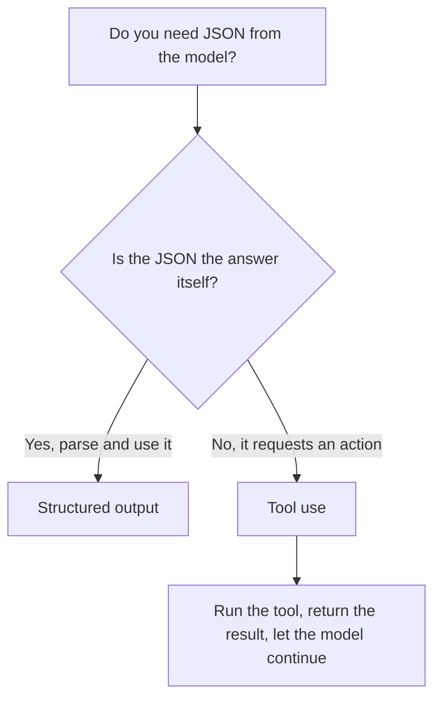

<LevelBadge level="intermediate" />

<VerifyNote lastVerified="2026-06-20" source="https://platform.claude.com/docs/en/docs/build-with-claude/structured-outputs">
Точный механизм принудительного применения схемы развивается — уточняйте текущий подход (конфигурация вывода / помощники парсинга) в официальной документации.
</VerifyNote>

<Callout type="objectives" items={["Объяснить, почему вывод с принудительной схемой превосходит промпт «попроси JSON и надейся»", "Предоставить JSON Schema и распарсить ответ в типизированный объект (Pydantic / Zod)", "Отличать структурированный вывод от использования инструментов по намерению, а не по механизму", "Применять четыре совета для плотных, надёжных схем", "Выбирать правильный инструмент по правилу одного вопроса"]} />

Когда вывод Claude поступает в другое ПО, вам нужна **надёжная структура** — валидный JSON, соответствующий известной форме, каждый раз. Не полагайтесь на «ответь в JSON» и надежду; используйте поддержку структурированного вывода платформы.

Этот урок проведёт вас от *почему «промпт и молись» не работает* к *как принудительно применить схему и распарсить её в типизированный объект* — а также как отличить структурированный вывод от использования инструментов, когда они выглядят одинаково. Проработайте его сверху вниз, затем проверьте себя в тесте ближе к концу.

## Надёжный способ

Предоставьте **JSON Schema** для вывода и позвольте API/SDK принудительно применить её, затем распарсите в типизированный объект (например, Pydantic в Python, Zod в TypeScript). Помощники парсинга SDK выдают вам типизированный результат вместо строки, которую вам пришлось бы `JSON.parse` и валидировать самостоятельно.

<Steps items={[
  {title: "Определите форму", body: "Смоделируйте нужный вам вывод как JSON Schema — в Python через Pydantic BaseModel, в TypeScript через схему Zod."},
  {title: "Запросите вывод, соответствующий схеме", body: "Попросите модель вернуть данные, соответствующие этой схеме, чтобы API/SDK принудительно её применил, а не оставлял это на волю случая."},
  {title: "Распарсите в типизированный объект", body: "Используйте помощники парсинга SDK, чтобы получить типизированный результат напрямую — без ручного JSON.parse и самописной валидации."}
]} />

```python
# Conceptual shape — see the official docs for the current API surface.
from pydantic import BaseModel

class Ticket(BaseModel):
    title: str
    priority: str   # "low" | "medium" | "high"
    tags: list[str]

# Request the model to return data conforming to Ticket's JSON schema,
# then parse the response into a Ticket instance.
```

Хотите конкретный запрос для адаптации? Вот форма того, что вы передаёте модели — замените модель своей собственной схемой.

<PromptCard title="Запросите вывод, соответствующий схеме">{`Return the data conforming to this JSON Schema:

{
  "title": "string",
  "priority": "low | medium | high",
  "tags": ["string"]
}

Do not include any prose outside the JSON.`}</PromptCard>

## Почему не просто попросить JSON в промпте?

Вы *можете* попросить JSON в промпте, и для простых случаев это работает — но он может «уплывать»: лишняя проза, висячая запятая, отсутствующее поле. Вывод с принудительной схемой устраняет этот класс ошибок, что важно с того момента, как от него начинает зависеть нижестоящая система.

<Callout type="warning" items={["JSON по промпту работает в демонстрациях и ломается в продакшене: сбой проявляется только тогда, когда нижестоящая система его парсит.", "Три классических «уплывания», за которыми надо следить: лишняя проза вокруг JSON, висячая запятая и отсутствующее обязательное поле."]} />

## Структурированный вывод vs. использование инструментов

Обе функции передают модели **JSON Schema**, поэтому они выглядят похоже — и люди выбирают не ту. Разница в *намерении*, а не в механизме:

| | **Структурированный вывод** | **[Использование инструментов](/docs/api/tool-use)** |
|---|---|---|
| Что вам нужно | **Окончательный ответ** в фиксированной форме | Чтобы модель **задействовала возможность** (вызвала функцию, получила данные, выполнила действие) |
| Кто это потребляет | Ваш код, напрямую | Ваш код выполняет инструмент, затем возвращает результат модели |
| Форма хода | Один ответ, готово | Цикл: модель спрашивает, вы выполняете, модель продолжает |
| Типичное применение | Извлечение, классификация, парсинг | Агенты, живые запросы, побочные эффекты |

Быстрое практическое правило:



Если JSON *и есть* конечный результат, используйте структурированный вывод. Если JSON — это модель, просящая ваш код *что-то сделать*, это использование инструментов. Агенты часто используют оба: инструменты — чтобы действовать, структурированный вывод — чтобы вернуть чистый окончательный результат.

## Советы

<Callout type="tip" items={["Держите схемы плотными — используйте перечисления для фиксированных вариантов; помечайте обязательные поля.", "Описывайте поля — описания полей направляют модель как мини-промпты.", "Всё равно валидируйте на границе — оборонительный парсинг — это дешёвая страховка.", "Для задач извлечения структурированный вывод + ясная схема каждый раз превосходят свободную форму."]} />

<Callout type="takeaways" items={["Передавайте API/SDK JSON Schema и парсите в типизированный объект — не «промпт и молись».", "JSON по промпту может «уплыть» (лишняя проза, висячая запятая, отсутствующее поле); принудительная схема устраняет этот класс ошибок.", "Структурированный вывод vs. использование инструментов различаются по намерению: JSON ЕСТЬ ответ против JSON запрашивает действие.", "Плотные схемы, описанные поля и валидация на границе делают извлечение и классификацию надёжными."]} />

## Закрепите термины

<Flashcards cards={[
  {front: "Структурированный вывод", back: "Вы передаёте API/SDK JSON Schema для окончательного ответа и парсите ответ в типизированный объект (Pydantic / Zod). JSON ЕСТЬ конечный результат."},
  {front: "Использование инструментов", back: "Вы передаёте модели JSON Schema, чтобы она могла задействовать возможность. Ваш код выполняет инструмент, затем возвращает результат — цикл, а не одноразовый ответ."},
  {front: "JSON Schema", back: "Форма, на которую опираются обе функции. В Python вы моделируете её через Pydantic BaseModel; в TypeScript — через схему Zod."},
  {front: "Помощники парсинга", back: "Помощники SDK, которые возвращают типизированный результат напрямую, чтобы вы пропустили ручной JSON.parse и самописную валидацию."},
  {front: "Правило одного вопроса", back: "Является ли JSON ответом сам по себе? Да → структурированный вывод. Нет, он запрашивает действие → использование инструментов."}
]} />

<Quiz title="Проверь себя" questions={[
  {
    q: "Каков надёжный способ получить структурированный JSON от Claude?",
    options: [
      "Попросить «ответь в JSON» в промпте и повторять при сбоях",
      "Предоставить JSON Schema, позволить API/SDK принудительно её применить, затем распарсить в типизированный объект",
      "Сгенерировать свободный текст и написать регулярное выражение для извлечения полей"
    ],
    answer: 1,
    explain: "Предоставьте JSON Schema и позвольте API/SDK принудительно её применить, затем распарсите в типизированный объект вроде Pydantic (Python) или Zod (TypeScript)."
  },
  {
    q: "Почему запрашивать JSON в промпте рискованно, как только от него начинает зависеть нижестоящая система?",
    options: [
      "Это медленнее, чем принудительное применение схемы",
      "Он может «уплыть» — лишняя проза, висячая запятая или отсутствующее поле",
      "Это стоит больше токенов, чем использование инструментов"
    ],
    answer: 1,
    explain: "JSON по промпту работает для простых случаев, но может «уплывать»; вывод с принудительной схемой устраняет этот класс ошибок."
  },
  {
    q: "Что на самом деле отличает структурированный вывод от использования инструментов?",
    options: [
      "Структурированный вывод использует JSON Schema; использование инструментов — нет",
      "Намерение: структурированный вывод — это окончательный ответ в фиксированной форме, использование инструментов задействует возможность",
      "Использование инструментов — для Python, а структурированный вывод — для TypeScript"
    ],
    answer: 1,
    explain: "Обе функции передают модели JSON Schema, поэтому они выглядят похоже. Разница в намерении, а не в механизме — окончательный ответ против задействования возможности."
  },
  {
    q: "Какой совет по проектированию схем разумен?",
    options: [
      "Оставлять поля необязательными и пропускать перечисления ради гибкости",
      "Использовать перечисления для фиксированных вариантов, помечать обязательные поля и всё равно валидировать на границе",
      "Доверять схеме и никогда не валидировать распарсенный вывод"
    ],
    answer: 1,
    explain: "Держите схемы плотными (перечисления, обязательные поля), описывайте поля как мини-промпты и всё равно валидируйте на границе как дешёвую страховку."
  }
]} />

## Далее

- [Использование инструментов / вызов функций](/docs/api/tool-use) — инструменты тоже используют JSON-схемы
- [Ваш первый вызов API](/docs/api/first-call)
- [Переиспользуемые шаблоны промптов](/docs/templates/prompts)
