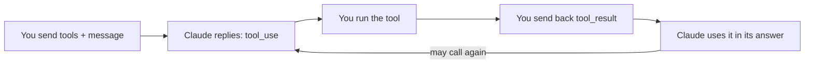

import Tabs from '@theme/Tabs';
import TabItem from '@theme/TabItem';

<LevelBadge level="intermediate" />

<VerifyNote lastVerified="2026-06-20" source="https://docs.anthropic.com/en/docs/build-with-claude/tool-use">
Формы запросов/ответов при использовании инструментов стабильны, но развиваются — уточняйте поля в официальной документации по использованию инструментов.
</VerifyNote>

**Использование инструментов** позволяет Claude вызывать функции, которые определяете *вы* — поиск, калькулятор, вашу базу данных, любой API — и использовать результаты. Это фундамент любого [агента](/docs/api/building-agents).

## Цикл



1. Вы включаете список **определений инструментов** (имя, описание, ввод по JSON-Schema).
2. Если Claude решает воспользоваться одним из них, он возвращает блок `tool_use` (с аргументами) и останавливается.
3. **Вы выполняете** инструмент и отправляете вывод обратно как `tool_result`.
4. Claude продолжает, возможно вызывая ещё инструменты, пока не ответит.

## Определение инструмента (Python)

```python
tools = [{
    "name": "get_weather",
    "description": "Get current weather for a city.",
    "input_schema": {
        "type": "object",
        "properties": {"city": {"type": "string"}},
        "required": ["city"],
    },
}]

msg = client.messages.create(
    model="claude-sonnet-4-6", max_tokens=1024,
    tools=tools,
    messages=[{"role": "user", "content": "What's the weather in Rome?"}],
)
# If msg.stop_reason == "tool_use": run the tool, then send a tool_result back.
```

## Советы

- **Описания — это промпты.** Ясное `description` инструмента и документация параметров сильно улучшают то, когда/как Claude его вызывает.
- **Валидируйте получаемый ввод** перед выполнением — никогда не доверяйте ему вслепую.
- **Возвращайте ошибки как результаты.** Если инструмент даёт сбой, отправьте `tool_result` с описанием ошибки, чтобы Claude мог восстановиться.
- **Серверные инструменты.** Anthropic также предлагает встроенные инструменты (например, веб-поиск, выполнение кода, использование компьютера) — смотрите актуальный набор в документации.

:::warning Инструменты = действия = риск
Инструмент, совершающий реальные действия, наследует модель безопасности. Применяйте минимум привилегий и держите человека в цикле для рискованных вызовов — см. [Защита агентов и инструментов](/docs/security/securing-agents).
:::

## Далее

- [Создание агентов на API](/docs/api/building-agents)
- [Структурированный вывод](/docs/api/structured-output)
- [MCP и подключение к инструментам](/docs/api/mcp)
