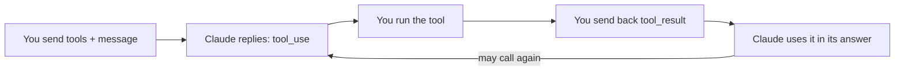

import Tabs from '@theme/Tabs';
import TabItem from '@theme/TabItem';

<LevelBadge level="intermediate" />

<VerifyNote lastVerified="2026-06-20" source="https://platform.claude.com/docs/en/build-with-claude/tool-use">
Формы запросов/ответов при использовании инструментов стабильны, но развиваются — уточняйте поля в официальной документации по использованию инструментов.
</VerifyNote>

**Использование инструментов** позволяет Claude вызывать функции, которые определяете *вы* — поиск, калькулятор, вашу базу данных, любой API — и использовать результаты. Это фундамент любого [агента](/docs/api/building-agents).

<Callout type="objectives" items={["Как работает четырёхшаговый агентный цикл, от определений инструментов до финального ответа","Как определить инструмент на Python с именем, описанием и вводом по JSON-Schema","Почему описания инструментов работают как промпты, формирующие то, когда и как Claude их вызывает","Как валидировать ввод, возвращать ошибки как результаты и безопасно использовать серверные инструменты"]} />

## Цикл

Использование инструментов — это диалог, а не одиночный вызов. Вы передаёте Claude меню инструментов; Claude выбирает один и приостанавливается; вы выполняете его и отчитываетесь; Claude встраивает результат в свой ответ — повторяя по мере необходимости.

<Steps items={[{title: "Отправьте меню", body: "Вы включаете список определений инструментов — каждое с именем, описанием и вводом по JSON-Schema."}, {title: "Claude выбирает инструмент", body: "Если Claude решает воспользоваться одним из них, он возвращает блок tool_use с аргументами и останавливается."}, {title: "Вы выполняете", body: "Вы сами выполняете инструмент и отправляете вывод обратно как tool_result."}, {title: "Claude продолжает", body: "Claude продолжает, возможно вызывая ещё инструменты, пока не ответит."}]} />

## Определение инструмента (Python)

Определение инструмента — это просто имя, описание на естественном языке и JSON-Schema для ввода. Передайте его в `tools`, затем проверяйте `stop_reason`, чтобы понять, когда Claude хочет действовать.

<PromptCard title="Инструмент get_weather + первый вызов">{`tools = [{
    "name": "get_weather",
    "description": "Get current weather for a city.",
    "input_schema": {
        "type": "object",
        "properties": {"city": {"type": "string"}},
        "required": ["city"],
    },
}]

msg = client.messages.create(
    model="claude-sonnet-5", max_tokens=1024,
    tools=tools,
    messages=[{"role": "user", "content": "What's the weather in Rome?"}],
)
# If msg.stop_reason == "tool_use": run the tool, then send a tool_result back.`}</PromptCard>

## Советы

Мелкие решения о том, как вы определяете и обрабатываете инструменты, сильно влияют на надёжность.

- **Описания — это промпты.** Ясное `description` инструмента и документация параметров сильно улучшают то, когда/как Claude его вызывает.
- **Валидируйте получаемый ввод** перед выполнением — никогда не доверяйте ему вслепую.
- **Возвращайте ошибки как результаты.** Если инструмент даёт сбой, отправьте `tool_result` с описанием ошибки, чтобы Claude мог восстановиться.
- **Серверные инструменты.** Anthropic также предлагает встроенные инструменты (например, веб-поиск, выполнение кода, использование компьютера) — смотрите актуальный набор в документации.

:::warning Инструменты = действия = риск
Инструмент, совершающий реальные действия, наследует модель безопасности. Применяйте минимум привилегий и держите человека в цикле для рискованных вызовов — см. [Защита агентов и инструментов](/docs/security/securing-agents).
:::

<Flashcards title="Словарь использования инструментов" cards={[{front: "блок tool_use", back: "То, что Claude возвращает, когда решает вызвать инструмент — включает аргументы — после чего останавливается и ждёт вас."}, {front: "tool_result", back: "Сообщение, которое вы отправляете обратно, несущее вывод инструмента (или описание ошибки, чтобы Claude мог восстановиться)."}, {front: "input_schema", back: "JSON-Schema, описывающая ввод инструмента: типы, свойства и какие поля обязательны."}, {front: "Серверные инструменты", back: "Встроенные инструменты, которые предлагает Anthropic, например веб-поиск, выполнение кода, использование компьютера — смотрите актуальный набор в документации."}]} />

<Quiz title="Проверь себя" questions={[{q: "После того как Claude возвращает блок tool_use, кто выполняет инструмент?", options: ["Claude выполняет его автоматически на серверах Anthropic", "Вы выполняете его и отправляете вывод обратно как tool_result", "JSON-Schema выполняет его"], answer: 1, explain: "Claude возвращает блок tool_use и останавливается; вы выполняете инструмент и отправляете результат обратно как tool_result."}, {q: "Определённый вами инструмент даёт сбой во время выполнения. Какое действие рекомендуется?", options: ["Молча повторять, пока не получится", "Отправить tool_result с описанием ошибки, чтобы Claude мог восстановиться", "Остановить диалог"], answer: 1, explain: "Возвращайте ошибки как результаты — tool_result с описанием сбоя позволяет Claude восстановиться."}, {q: "Почему ясное описание инструмента так важно?", options: ["Оно только для документации, и Claude его игнорирует", "Описания — это промпты: они формируют то, когда и как Claude вызывает инструмент", "Оно меняет правила валидации JSON-Schema"], answer: 1, explain: "Описания — это промпты: ясное описание и документация параметров сильно улучшают то, когда и как Claude вызывает инструмент."}]} />

<Callout type="takeaways" items={["Использование инструментов — это цикл: отправьте определения инструментов, Claude возвращает блок tool_use и останавливается, вы выполняете и возвращаете tool_result, Claude продолжает, пока не ответит.","Определение инструмента — это имя, описание и ввод по JSON-Schema — передайте его в tools и проверяйте stop_reason == tool_use.","Описания — это промпты; валидируйте ввод перед выполнением; возвращайте сбои как ошибки tool_result, чтобы Claude мог восстановиться.","Anthropic также предлагает серверные инструменты, и любому инструменту, совершающему реальные действия, нужны минимум привилегий плюс человек в цикле."]} />

## Далее

- [Создание агентов на API](/docs/api/building-agents)
- [Структурированный вывод](/docs/api/structured-output)
- [MCP и подключение к инструментам](/docs/api/mcp)
