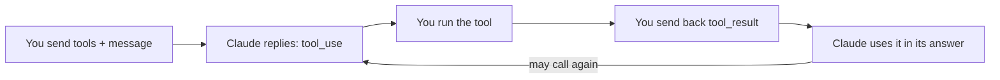

<LevelBadge level="intermediate" />

**Использование инструментов** позволяет Claude вызывать функции, которые определяете *вы* — поиск, калькулятор, вашу базу данных, любой API — и использовать результаты. Это фундамент любого [агента](/docs/api/building-agents).

Большинство руководств по использованию инструментов заканчиваются на четырёхшаговом цикле. Цикл — это простая часть. То, что на самом деле ломает продакшен-интеграции, гораздо конкретнее и обсуждается гораздо реже: формы сообщений, возвращающие `400`, поле ошибки, которое позволяет Claude восстановиться вместо извинений, и тот факт, что **принудительный вызов инструмента больше не работает на новейших моделях Claude**. Эта страница покрывает всё это.

<Callout type="objectives" items={["Как работает четырёхшаговый агентный цикл, от определений инструментов до финального ответа","Как написать определение инструмента — и описания, которые действительно направляют то, когда Claude его вызывает","Три правила формы сообщений, которые возвращают 400, и текст ошибки, сообщающий, какое из них вы нарушили","Почему tool_choice \"any\" и \"tool\" теперь падают на новейших моделях, и две замены для них","Как гарантировать соответствие ввода инструмента схеме с помощью strict: true","Почему результаты инструментов — самое вероятное место, через которое prompt injection добирается до вашего агента"]} />

<VerifyNote lastVerified="2026-09-29" source="https://platform.claude.com/docs/en/agents-and-tools/tool-use/define-tools">
Поля определения инструмента, матрица поддержки `tool_choice`, правила форматирования `tool_result`,
поведение `is_error` и семантика `strict: true` проверены 29 сентября 2026 года по страницам Anthropic
"Define tools", "Handle tool calls" и "Strict tool use". Поддержка принудительного вызова инструментов
меняется с каждым релизом — перепроверьте матрицу поддержки на странице Define tools, прежде чем на неё
опираться, и смотрите [Текущие модели и цены](/docs/whats-new/models-and-pricing) для актуального состава линейки.
</VerifyNote>

## Цикл

Использование инструментов — это диалог, а не одиночный вызов. Вы передаёте Claude меню инструментов; Claude выбирает один и приостанавливается; вы выполняете его и отчитываетесь; Claude встраивает результат в свой ответ — повторяя по мере необходимости.


```mermaid
flowchart LR
  A[You send tools + message] --> B[Claude replies: tool_use]
  B --> C[You run the tool]
  C --> D[You send back tool_result]
  D --> E[Claude uses it in its answer]
  E -->|may call again| B
```

<Steps items={[{title: "Отправьте меню", body: "Вы включаете список определений инструментов — каждое с именем, описанием и вводом по JSON-Schema."}, {title: "Claude выбирает инструмент", body: "Если Claude решает воспользоваться одним из них, ответ приходит со stop_reason \"tool_use\" и одним или несколькими блоками tool_use, каждый из которых несёт id, name и объект input."}, {title: "Вы выполняете", body: "Вы сами выполняете инструмент и отправляете вывод обратно как tool_result, который ссылается на id блока tool_use."}, {title: "Claude продолжает", body: "Claude продолжает, возможно вызывая ещё инструменты, пока не ответит с обычным stop_reason."}]} />

Обратите внимание на множественное число в шаге 2: Claude может вернуть **несколько блоков `tool_use` в одном ответе**. Выполняйте диспетчеризацию по полю `type` каждого блока, а не исходите из того, что это `content[0]` — ответ обычно начинается с блока `text`, а на новейших моделях может начинаться и с блоков `thinking`.

## Определение инструмента

Определение инструмента — это имя, описание на естественном языке и JSON Schema для ввода.

| Поле | Обязательное | Примечания |
| --- | --- | --- |
| `name` | да | Должно соответствовать регулярному выражению `^[a-zA-Z0-9_-]{1,128}$` |
| `description` | да | Что он делает, когда его использовать, когда *не* использовать. Стремитесь минимум к 3–4 предложениям |
| `input_schema` | да | Объект JSON Schema, описывающий параметры |
| `input_examples` | нет | Массив примеров объектов ввода, каждый из которых валиден по схеме |
| `strict` | нет | Установите `true`, чтобы принудить соответствие ввода схеме — см. ниже |
| `cache_control` | нет | Кэшировать определение между ходами (см. [Кэширование промптов и оптимизация затрат](/docs/api/prompt-caching)) |

<PromptCard title="Инструмент get_weather + первый вызов (Python)">{`tools = [{
    "name": "get_weather",
    "description": (
        "Get the current weather for a city. Use this when the user asks about "
        "present conditions or temperature in a named place. Returns temperature "
        "in the requested unit plus a one-word sky condition. It does NOT return "
        "forecasts — use get_forecast for anything in the future."
    ),
    "input_schema": {
        "type": "object",
        "properties": {
            "city": {"type": "string", "description": "City and region, e.g. 'Rome, IT'"},
            "unit": {"type": "string", "enum": ["celsius", "fahrenheit"]},
        },
        "required": ["city"],
        "additionalProperties": False,
    },
}]

msg = client.messages.create(
    model="claude-opus-5-5", max_tokens=1024,
    tools=tools,
    messages=[{"role": "user", "content": "What's the weather in Rome?"}],
)

if msg.stop_reason == "tool_use":
    for block in msg.content:            # iterate — never index content[0]
        if block.type == "tool_use":
            result = run_tool(block.name, block.input)
            # send back a tool_result carrying block.id`}</PromptCard>

### Описания — это промпты

Поле `description` — безусловно самый сильный рычаг влияния на качество использования инструментов: его читает модель, а не ваши коллеги. Собственное руководство Anthropic однозначно говорит о том, что отличает хорошее описание:

- **Скажите, когда его *не* использовать.** Большинство ошибок выбора — это вызов инструмента для задачи, которой владеет соседний инструмент.
- **Консолидируйте, а не размножайте.** Вместо `create_pr`, `review_pr`, `merge_pr` выпустите один инструмент с параметром `action`. Меньшее количество более широких инструментов снижает неоднозначность выбора.
- **Используйте пространства имён между сервисами.** `github_list_prs` и `slack_send_message` лучше, чем `list_prs` и `send_message`, когда ваша поверхность инструментов разрастается.
- **Возвращайте результаты с высоким уровнем сигнала.** Стабильные, семантические идентификаторы (slug'и, UUID) и только те поля, которые нужны Claude, чтобы выбрать следующий шаг. Раздутый вывод инструмента сжигает контекст и погребает сигнал.
- **Для мудрёных вводов добавьте `input_examples`.** Примеры, валидированные по схеме, стоят примерно 20–50 токенов каждый для простых объектов и 100–200 для сложных вложенных, а невалидный пример возвращает 400.

## Обработка ответа: три правила, которые возвращают 400

Именно здесь обычно ломается работающий код. `tool_result` — это обычное сообщение с ролью `user`, но API принудительно применяет три правила размещения.

<Steps items={[{title: "Результаты должны идти непосредственно за своим tool_use", body: "Между сообщением ассистента с tool_use и вашим сообщением с tool_result не может стоять никакое другое сообщение. Нарушьте это, и API сообщит: tool_use ids were found without tool_result blocks immediately after."}, {title: "Блоки tool_result идут ПЕРВЫМИ в массиве content", body: "Любой текст, который вы добавляете, должен идти ПОСЛЕ всех блоков tool_result. Текстовый блок перед tool_result — это 400."}, {title: "Если вызов серверного инструмента ещё не завершён, отправляйте ТОЛЬКО блоки tool_result", body: "Когда тот же ход ассистента также вызвал серверный инструмент, у которого ещё нет результата, добавление завершающего текста преждевременно заканчивает ход, и запрос падает с 400, в котором назван незавершённый серверный инструмент."}]} />

```json
// ❌ 400 — text before tool_result
{"role": "user", "content": [
  {"type": "text", "text": "Here are the results:"},
  {"type": "tool_result", "tool_use_id": "toolu_01", "content": "15 degrees"}
]}

// ✅ correct — results first, text after (client tools only)
{"role": "user", "content": [
  {"type": "tool_result", "tool_use_id": "toolu_01", "content": "15 degrees"},
  {"type": "text", "text": "What should I do next?"}
]}
```

`content` у `tool_result` может быть обычной строкой либо списком блоков `text`, `image`, `document` или `search_result`. Его также можно полностью опустить для инструмента, который ничего не возвращает.

### Возвращайте сбои как результаты, а не как исключения

Когда инструмент выбрасывает исключение, не прерывайте цикл — передайте сбой обратно с помощью `is_error`:

```json
{"role": "user", "content": [{
  "type": "tool_result",
  "tool_use_id": "toolu_01A09q90qw90lq917835lq9",
  "content": "Rate limit exceeded. Retry after 60 seconds.",
  "is_error": true
}]}
```

Пишите сообщение для читателя, которому нужно решить, что делать дальше. `"failed"` не говорит Claude ничего; `"Rate limit exceeded. Retry after 60 seconds."` говорит ему подождать, а не повторять попытку немедленно. Когда вызов инструмента невалиден или в нём не хватает параметра, Claude обычно повторяет попытку два-три раза с исправлениями, прежде чем сдаться и извиниться перед пользователем — так что поучительное сообщение об ошибке часто определяет разницу между восстановлением и тупиком.

## Гарантия соответствия ввода схеме: `strict: true`

Установка `strict: true` в определении инструмента ограничивает сэмплирование токенов модели выводом, валидным по схеме (сэмплирование с ограничением по грамматике). Тогда `input` в каждом блоке `tool_use` доказуемо соответствует вашей `input_schema`, а `name` всегда является реальным инструментом — никаких `"2"` там, где вам нужна `2`, никаких пропущенных обязательных полей, никакого слоя «проверь и повтори».

<PromptCard title="Строгое определение инструмента">{`{
  "name": "search_flights",
  "description": "Search bookable flights for a route and date.",
  "strict": true,
  "input_schema": {
    "type": "object",
    "properties": {
      "destination": {"type": "string"},
      "departure_date": {"type": "string", "format": "date"},
      "passengers": {"type": "integer", "enum": [1, 2, 3, 4, 5, 6]}
    },
    "required": ["destination", "departure_date"],
    "additionalProperties": false
  }
}`}</PromptCard>

Три оговорки, которые стоит знать, прежде чем включать это повсюду:

- Схема должна оставаться внутри поддерживаемого подмножества JSON Schema — того же, которое использует [Структурированный вывод](/docs/api/structured-output).
- Записи **toolset** для computer use и browser use отвергают `strict: true`; запрос, который устанавливает его для любого из них, отклоняется.
- Скомпилированные схемы кэшируются отдельно от содержимого сообщений на срок до 24 часов. Руководство Anthropic на этот счёт однозначно: **не помещайте защищённую медицинскую информацию в схемы** — ни в имена свойств, ни в значения `enum`, ни в значения `const`, ни в регулярные выражения `pattern`. PHI место в содержимом сообщений, которое несёт гарантии HIPAA, отсутствующие у кэшированных схем.

## `tool_choice` — и почему принудительный вызов инструмента теперь падает

`tool_choice` управляет тем, *может ли* Claude, *обязан ли* он или *не может* вызывать инструмент. Поле принимает четыре значения:

| Значение | Смысл |
| --- | --- |
| `auto` | Claude решает сам. Значение по умолчанию, когда присутствует `tools` |
| `any` | Claude обязан вызвать один из ваших инструментов, но выбирает какой сам |
| `tool` | Claude обязан вызвать названный инструмент |
| `none` | Claude не может вызывать никакие инструменты. Значение по умолчанию, когда `tools` отсутствует |

Вот та часть, которую сейчас упускают все остальные руководства по использованию инструментов. **`any` и `tool` поддерживаются не повсеместно, а на новейших моделях они возвращают 400.**

| Модель или настройка | Ограничение | Используйте вместо этого |
| --- | --- | --- |
| Ручное расширенное мышление (`thinking` типа `enabled`) | `any` и `tool` выдают ошибку | `auto` или `none`. Адаптивное мышление само по себе *не* блокирует принудительный вызов инструментов |
| Claude Opus 5.5, Sonnet 5.5, Fable 5.1, Mythos 5.1 | `any` и `tool` возвращают 400 независимо от настроек мышления | `auto` плюс `strict: true` или [Структурированный вывод](/docs/api/structured-output). `none` по-прежнему работает |

Ошибка выглядит явно:

```text
tool_choice: type "tool" and "any" are not supported for this model.
```

Та же валидация применяется к эндпоинту подсчёта токенов, так что запрос, прошедший подсчёт токенов, не удивит вас позже.

### Что делать вместо этого

Если разделить две мотивации, миграция становится очевидной, потому что принудительный вызов инструментов выполнял две не связанные между собой задачи:

- **«Мне нужен JSON, валидный по схеме.»** Это никогда по-настоящему не было про принуждение к вызову. Оставьте `tool_choice` на `auto` и установите `strict: true` — или перенесите схему в [Структурированный вывод](/docs/api/structured-output), если вам нужен ответ, а не вызов.
- **«Мне нужно, чтобы он вызвал инструмент, а не болтал со мной.»** Так и скажите в промпте. Указание того, когда инструмент применим — «Используй `get_weather` для любого вопроса о текущих условиях» — по-прежнему направляет выбор инструмента при `auto`.

Есть и бонус в отказе от принудительного вызова инструментов: `any` и `tool` работали через предзаполнение сообщения ассистента, что подавляло любую естественно-языковую преамбулу перед блоками `tool_use`. При `auto` Claude может объяснить, что он собирается сделать — а это обычно именно то, чего вы хотите в агенте, обращённом к пользователю.

:::tip Подвох с кэшированием
Изменение `tool_choice` посреди диалога **инвалидирует кэшированные блоки сообщений**. Определения инструментов и системные промпты остаются в кэше, но содержимое сообщений придётся обрабатывать заново. Если вы переключали `tool_choice` на каждом ходу, это тихо стоило вам денег — см. [Кэширование промптов и оптимизация затрат](/docs/api/prompt-caching).
:::

## Клиентские инструменты против серверных

Не каждому инструменту нужен обработчик в вашей кодовой базе.

- **Клиентские инструменты** — ваши. Вы определяете схему, вы выполняете, вы возвращаете `tool_result`. Цикл, описанный выше.
- **Клиентские инструменты со схемой Anthropic** — bash, текстовый редактор, память. Схема предопределена, но выполняет их всё равно *ваше* приложение.
- **Серверные инструменты** — веб-поиск, веб-запрос, выполнение кода, поиск инструментов. Они работают на инфраструктуре Anthropic без обработчика на вашей стороне, а ошибки обрабатываются прозрачно: вы никогда не возвращаете `is_error` для серверного инструмента.
- **Клиентские toolset'ы** — computer use и browser use представлены единой записью без `name`, которая объявляет фиксированный набор входящих в неё инструментов. Их блоки `tool_use` несут дополнительное поле `toolset_name` (`"computer"` или `"browser"`), а `name` — это вызываемый участник набора, например `screenshot` или `navigate`. **Выполняйте диспетчеризацию по обоим полям** и возвращайте `toolset_name` обратно в результате — результат участника набора без него отклоняется.

## Частые ошибки

- **Индексирование `content[0]`** вместо итерации и ветвления по `type`. Ответы часто начинаются с блока `text`, а на новейших моделях — с блоков `thinking`.
- **Обработка только одного `tool_use` на ответ.** Claude может вызвать несколько инструментов за один ход; цикл, который отвечает на первый и отбрасывает остальные, оставляет id блоков `tool_use` без результатов, а это 400 на следующем запросе.
- **Размещение вашего комментария перед результатами.** Блоки `tool_result` идут первыми, всегда.
- **Проглатывание исключений инструмента.** Исключение в вашем обработчике завершает цикл; результат с `is_error` позволяет Claude адаптироваться.
- **Обращение к `tool_choice: "any"` по привычке.** На текущих флагманских моделях это 400 — а `strict: true` и так был лучшим ответом.
- **Отношение к выводу инструмента как к доверенному.** См. ниже.

:::warning Результаты инструментов — крупнейшая поверхность для инъекций в вашем агенте
Результаты инструментов регулярно несут содержимое, которое вы не контролируете: веб-страницы, входящую почту, загрузки пользователей, сторонние API. Атакующий, способный повлиять на любое из них, может встроить туда инструкции, нацеленные на вашу модель — это косвенный prompt injection. Держите недоверенное содержимое **внутри блоков `tool_result`**, никогда не вклеивайте его в `system`-промпт или обычный пользовательский блок `text`, и прочитайте [Объяснение Prompt Injection](/docs/security/prompt-injection) и [Защиту агентов и инструментов](/docs/security/securing-agents). Инструмент, совершающий реальные действия, также наследует модель безопасности: минимум привилегий и человек в цикле для всего необратимого.
:::

<Flashcards title="Словарь использования инструментов" cards={[{front: "блок tool_use", back: "То, что Claude возвращает, когда решает вызвать инструмент — несёт id, name и input — после чего он останавливается и ждёт вас. Один ответ может содержать несколько таких блоков."}, {front: "tool_result", back: "Блок в пользовательском сообщении, несущий вывод инструмента и привязанный к id блока tool_use. Должен идти первым в массиве content, непосредственно после сообщения ассистента с tool_use."}, {front: "is_error", back: "Необязательное булево поле у tool_result, помечающее вызов как неудавшийся. Claude читает сообщение и адаптируется — обычно повторяя попытку два-три раза, прежде чем извиниться."}, {front: "strict: true", back: "Сэмплирование с ограничением по грамматике в определении инструмента: ввод инструмента доказуемо соответствует вашей input_schema. Требует additionalProperties false; отвергается на записях toolset computer/browser; не держите PHI в схеме."}, {front: "tool_choice", back: "auto | any | tool | none. auto — значение по умолчанию при наличии tools; none — при их отсутствии. any и tool возвращают 400 на Opus 5.5, Sonnet 5.5, Fable 5.1 и Mythos 5.1."}, {front: "toolset_name", back: "Дополнительное поле в блоках участников computer use и browser use (\"computer\" или \"browser\"). Выполняйте диспетчеризацию по нему вместе с name и возвращайте его обратно в результате, иначе результат будет отклонён."}]} />

<Quiz title="Проверь себя" questions={[{q: "Вы устанавливаете tool_choice в {\"type\": \"tool\", \"name\": \"get_weather\"} на claude-opus-5-5. Что происходит?", options: ["Claude принудительно вызывает get_weather", "Запрос возвращает 400 — принудительный вызов инструментов не поддерживается на этой модели", "Claude игнорирует tool_choice и отвечает текстом"], answer: 1, explain: "На Opus 5.5, Sonnet 5.5, Fable 5.1 и Mythos 5.1 типы tool_choice \"any\" и \"tool\" возвращают 400 независимо от настроек мышления. Используйте auto со strict: true либо структурированный вывод."}, {q: "Ваше пользовательское сообщение содержит текстовый блок с объяснением результатов, за которым следуют два блока tool_result. Что сделает API?", options: ["Примет его — порядок не имеет значения", "Вернёт 400: блоки tool_result должны идти первыми, текст — после", "Молча отбросит текстовый блок"], answer: 1, explain: "Блоки tool_result должны идти ПЕРВЫМИ в массиве content; любой текст должен идти после всех них."}, {q: "Определённый вами инструмент выбрасывает ошибку соединения во время выполнения. Какое действие рекомендуется?", options: ["Поднять исключение и завершить диалог", "Молча повторять, пока не получится", "Отправить tool_result с is_error true и поучительным сообщением вроде 'Rate limit exceeded. Retry after 60 seconds.'"], answer: 2, explain: "Возвращайте сбой как tool_result с is_error true. Поучительное сообщение подсказывает Claude, что делать дальше; общее 'failed' не говорит ему ничего."}, {q: "Почему недоверенное веб-содержимое должно оставаться внутри блока tool_result, а не вставляться в системный промпт?", options: ["Блоки tool_result дешевле по токенам", "Это ограничивает косвенный prompt injection — содержимое в tool_result оформлено как данные, а не как инструкции", "У системного промпта есть ограничение по длине"], answer: 1, explain: "Результаты инструментов несут содержимое, которое вы не контролируете. Держать его в блоках tool_result, а не в системном промпте или обычном пользовательском тексте — рекомендованный Anthropic способ изоляции косвенного prompt injection."}]} />

<Callout type="takeaways" items={["Использование инструментов — это цикл: отправьте определения инструментов, Claude возвращает один или несколько блоков tool_use и останавливается, вы выполняете и возвращаете tool_result, Claude продолжает. Итерируйте по блокам content, ветвясь по type — никогда не индексируйте content[0].","Три правила размещения вызывают большинство ошибок 400: результаты должны идти непосредственно за своим tool_use, блоки tool_result идут первыми в массиве content, а незавершённый вызов серверного инструмента означает «только результаты».","Принудительный вызов инструментов исчез на новейших моделях: tool_choice \"any\" и \"tool\" возвращают 400 на Opus 5.5, Sonnet 5.5, Fable 5.1 и Mythos 5.1. Используйте auto со strict: true или структурированный вывод, а выбор инструмента направляйте из промпта.","strict: true гарантирует соответствие ввода схеме через сэмплирование с ограничением по грамматике — но не держите PHI в схемах и не устанавливайте его на записях toolset computer/browser.","Возвращайте сбои как tool_result с is_error и поучительным сообщением, чтобы Claude мог адаптироваться вместо извинений.","Результаты инструментов — самый вероятный путь, по которому косвенный prompt injection добирается до вашего агента: держите недоверенное содержимое внутри них, применяйте минимум привилегий и ставьте человека в цикл для необратимых действий."]} />

## Далее

- [Программный вызов инструментов](/docs/api/programmatic-tool-calling) — позвольте Claude вызывать те же самые инструменты из Python внутри песочницы, сокращая количество обменов и удерживая промежуточные результаты вне контекста
- [Структурированный вывод](/docs/api/structured-output) — вторая половина замены принудительного вызова инструментов, когда вам нужен JSON-ответ, а не вызов
- [Создание агентов на API](/docs/api/building-agents) — оберните цикл в настоящего агента
- [Claude Opus 5.5: практическое руководство](/docs/models/opus-5-5-field-guide) — полная история миграции, стоящая за удалением принудительного вызова инструментов
- [MCP и подключение к инструментам](/docs/api/mcp) — получайте инструменты с сервера вместо того, чтобы определять их самостоятельно
