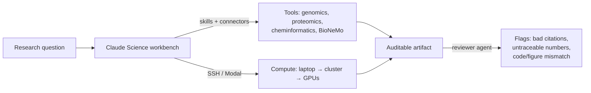

<LevelBadge level="advanced" />

<VerifyNote lastVerified="2026-07-13" source="https://www.anthropic.com/news/claude-science-ai-workbench">
Claude Science находится в бета-версии. Встроенные навыки, подключённые модели, варианты вычислений и доступность по тарифам меняются быстро — проверьте актуальные детали в приложении и в официальном анонсе, прежде чем полагаться на них.
</VerifyNote>

<Callout type="objectives" items={["Понять, что такое Claude Science — и какую конкретную задачу он решает, с которой не справляется окно чата", "Изучить его три опоры: интегрированные инструменты, аудируемые артефакты и управляемые вычисления", "Увидеть, как агент-ревьюер автоматически ловит непрослеживаемые числа и несоответствия в изображениях", "Знать, когда обращаться к Claude Science, а когда — к обычному Claude или Claude Code", "Разместить его в более широком ландшафте AI-для-науки, не переоценивая то, что модель способна проверить"]} />

Большинство научных задач с общим чат-ботом ломаются в одном и том же месте: модель рассуждает хорошо, но *инструменты, данные и вычисления* находятся где-то ещё — в кластере, в блокноте, в геномном браузере, в модели фолдинга. Вы вручную копируете результаты туда-сюда, и никто позже не может точно воспроизвести, как именно был получен рисунок. **Claude Science** (бета, запущен **30 июня 2026 года**) — это попытка Anthropic закрыть этот шов: AI-*верстак*, где рассуждения, инструменты, вычисления и происхождение данных живут в одном месте.

Это отдельное приложение, а не промпт, который вы вставляете в чат. Считайте его [Claude Code](/docs/claude-code/what-is-claude-code), направленным на рабочие процессы мокрой лаборатории и вычислительной биологии вместо программных репозиториев.

## Проблема, на которую он нацелен

Исследователь, запускающий, скажем, конвейер single-cell RNA, жонглирует: источником данных, инструментом QC, библиотекой для построения графиков, моделью фолдинга на GPU и менеджером цитирований — плюс умственная нагрузка от необходимости помнить, какая версия какого скрипта три недели назад создала какой рисунок. Общие ассистенты помогают с *одним* шагом и теряют нить на остальном.

<Callout type="tip">
Единица ценности в науке — это не хороший ответ, а **воспроизводимый** ответ. Claude Science построен вокруг этого: его результаты сконструированы так, чтобы ревьюер (человек или агент) мог проследить каждое число до кода и окружения, которые его произвели.
</Callout>

## Три опоры

### 1. Интегрированные инструменты — среда приходит преднастроенной

Claude Science поставляется с **более чем 60 курируемыми навыками и коннекторами**, преднастроенными для геномики, single-cell, протеомики, структурной биологии и хемоинформатики. Что важно, он нативно подключается к моделям **NVIDIA BioNeMo** — включая **Evo 2** (геномная фундаментальная модель), **Boltz-2** (предсказание структуры/аффинности) и **OpenFold3** (фолдинг белков) — так что фолдинг или предсказание аффинности становится шагом вашего рабочего процесса, а не отдельным порталом.

Это тот же механизм [навыков-и-коннекторов](/docs/claude-code/skills), который вы, возможно, знаете по Claude Code, курируемый для научного стека вместо программного.

### 2. Аудируемые артефакты — происхождение по умолчанию, а не задним числом

Каждый вывод несёт свою полную родословную:

- **точный код и окружение**, которые его произвели,
- **описание на естественном языке** того, как он был создан, и
- **полную историю сообщений** за ним.

Помимо этого, **агент-ревьюер** автоматически помечает **некорректные цитирования, непрослеживаемые числа и рисунки, не соответствующие своему исходному коду**. Последнее — неочевидная страховка: правдоподобно выглядящий график, чьи данные на самом деле не берутся из кода в артефакте, будет пойман.

<Callout type="warning">
Агент-ревьюер уменьшает класс ошибок — он не делает выводы *правильными*. Он помечает цитирования, которые не может проверить, и числа, которые не может проследить; он не может поручиться за экспериментальный дизайн, биологическую валидность или за то, что был задан правильный вопрос. Происхождение ≠ истина. Наука по-прежнему на вас.
</Callout>

### 3. Управляемые вычисления — от вашего ноутбука до сотен GPU

Claude Science **управляет вычислениями на вашем ноутбуке, вашем кластере или GPU по требованию**, масштабируясь **от одного GPU до сотен по мере необходимости**. Он работает с существующей инфраструктурой — HPC-кластеры через **SSH** или аккаунты **Modal** — так что тяжёлые задачи выполняются там, где уже находятся ваши данные и квоты, без ручного написания оркестрации.

## Нативная научная визуализация

Результаты отображаются **в интерфейсе**, а не как файлы, которые вы скачиваете и открываете где-то ещё: **3D-структуры белков, треки геномного браузера и химические структуры** отображаются нативно. Вы исследуете фолд или локус там же, где о нём рассуждали, — идея [артефакта](/docs/claude-app/artifacts), расширенная на научные объекты.

## Типичный рабочий процесс

<Steps items={[{title: "Сформулируйте вопрос", body: "Сформулируйте биологический вопрос и укажите Claude Science ваш источник данных через коннектор."}, {title: "Позвольте ему собрать конвейер", body: "Он выбирает навыки (QC, выравнивание, фолдинг) и предлагает шаги — просмотрите их до запуска тяжёлых вычислений."}, {title: "Выполняйте там, где живут данные", body: "Перенесите дорогой шаг на ваш HPC-кластер через SSH или на GPU по требованию; лёгкие шаги остаются локальными."}, {title: "Исследуйте нативно", body: "Смотрите 3D-структуру, геномный трек или химическую структуру встроенно, вместо того чтобы сначала экспортировать."}, {title: "Отправьте аудируемый артефакт", body: "Вывод объединяет код, окружение, метод на естественном языке и историю сообщений — а агент-ревьюер помечает всё непрослеживаемое."}]} />

<PromptCard title="Первый конкретный запрос внутри Claude Science">{`Load the connected single-cell dataset, run standard QC (filter low-count cells and high-mito), and show a UMAP colored by cluster. Keep every step in an auditable artifact I can hand to a reviewer.`}</PromptCard>

<PromptCard title="Перенесите тяжёлый шаг на реальные вычисления">{`Predict the structure of this sequence with the connected folding model, run it on my HPC cluster over SSH, and render the 3D structure inline when it finishes.`}</PromptCard>

## Когда использовать (а когда нет)

| Используйте Claude Science, когда… | Обратитесь к чему-то другому, когда… |
|---|---|
| Вам нужны воспроизводимые, проверяемые научные выводы | Вам нужен быстрый разовый ответ → обычный [Claude](/docs/claude-app/getting-started) |
| Ваша работа охватывает инструменты геномики / протеомики / хемоинформатики | Вы разрабатываете софт → [Claude Code](/docs/claude-code/what-is-claude-code) |
| Тяжёлые вычисления должны выполняться на вашем кластере или GPU по требованию | У вас нет коннекторов данных или вычислений для подключения |
| Происхождение (код + окружение + история) реально важно для ревью | Вы на Free-тарифе или на Windows (см. доступность) |

## Доступность и ограничения

- **Тарифы:** Бета для пользователей **Claude Pro, Max, Team и Enterprise**. (Без Free-тарифа.)
- **Платформы:** **macOS и Linux** — обратите внимание, что на запуске нет Windows-клиента.
- **Статус:** Бета — ожидайте изменений в списке встроенных навыков, подключённых моделях и вариантах вычислений.

<Callout type="tip">
Claude Science специфичен для Claude, но *паттерн* — общеотраслевой: ассистенты обзаводятся слоями интеграции инструментов, происхождения и вычислений, чтобы выполнять реальную работу, а не только описывать её. Ждите аналогичных ходов с «верстаком» от других AI-лабораторий — планка воспроизводимости, которую задаёт Claude Science, — хорошая мерка для их оценки.
</Callout>

<Flashcards title="Словарь Claude Science" cards={[{front: "Claude Science", back: "Бета-версия AI-верстака от Anthropic для учёных: интегрированные исследовательские инструменты, аудируемые артефакты, нативная визуализация и управляемые вычисления в одном приложении."}, {front: "Аудируемый артефакт", back: "Вывод, объединённый с точным кодом, его окружением, методом на естественном языке и полной историей сообщений — так что любой результат можно проследить до того, как он был сделан."}, {front: "Агент-ревьюер", back: "Автоматическая проверка, которая помечает некорректные цитирования, непрослеживаемые числа и рисунки, не соответствующие исходному коду. Уменьшает ошибки; не гарантирует правильность."}, {front: "BioNeMo", back: "Коллекция биологических фундаментальных моделей от NVIDIA. Claude Science нативно подключается к Evo 2, Boltz-2 и OpenFold3."}, {front: "Управляемые вычисления", back: "Claude Science запускает задачи на вашем ноутбуке, HPC-кластере (через SSH) или GPU по требованию (например, Modal), масштабируясь от одного GPU до сотен."}, {front: "Хемоинформатика", back: "Вычислительный анализ химических структур и свойств — одна из областей, для которой Claude Science заранее настраивает навыки, наряду с геномикой, single-cell, протеомикой и структурной биологией."}]} />

<Quiz title="Проверьте себя" questions={[{q: "Какова единственная самая отличительная цель дизайна Claude Science по сравнению с общим чат-ботом?", options: ["Более быстрые ответы", "Воспроизводимость — каждый результат прослеживается до кода и окружения, которые его произвели", "Более крупное контекстное окно"], answer: 1, explain: "Его выводы — это аудируемые артефакты (код + окружение + метод на естественном языке + история сообщений), построенные так, чтобы ревьюер мог проследить каждое число. Этот дизайн, ставящий происхождение во главу угла, — ключевое отличие."}, {q: "Агент-ревьюер помечает рисунок, числа которого не соответствуют коду в артефакте. Что он доказал?", options: ["Что наука неверна", "Что результат правильный", "Что рисунок непрослеживаем — проблема происхождения, а не вердикт о биологии"], answer: 2, explain: "Ревьюер ловит непрослеживаемые числа, плохие цитирования и несоответствия код/рисунок. Он уменьшает класс ошибок, но не может подтвердить, что лежащая в основе наука валидна — происхождение не есть истина."}, {q: "Вам нужно свернуть белок на HPC-квоте вашей лаборатории изнутри верстака. Claude Science может…", options: ["Работать только на облаке Anthropic", "Запустить задачу на вашем кластере через SSH (или на GPU по требованию), масштабируясь по мере необходимости", "Совсем не выполнять вычисления"], answer: 1, explain: "Claude Science управляет вычислениями на вашем ноутбуке, кластере (через SSH) или GPU по требованию (например, Modal), от одного GPU до сотен."}, {q: "Какой пользователь не может использовать Claude Science на запуске?", options: ["Пользователь Max на macOS", "Пользователь Enterprise на Linux", "Пользователь Free-тарифа на Windows"], answer: 2, explain: "Это бета для Pro, Max, Team и Enterprise (без Free-тарифа), и поставляется только на macOS и Linux — так что пользователь Free/Windows исключён сразу по двум причинам."}]} />

<Callout type="takeaways" items={["Claude Science — отдельное бета-приложение — AI-верстак для учёных, а не промпт, который вы вставляете в чат.", "Его три опоры: преднастроенные инструменты (60+ навыков, нативный BioNeMo — Evo 2, Boltz-2, OpenFold3), аудируемые артефакты и управляемые вычисления.", "Аудируемые артефакты объединяют код + окружение + метод + историю сообщений; агент-ревьюер помечает непрослеживаемые числа, плохие цитирования и несоответствия код/рисунок.", "Вычисления выполняются там, где живут ваши данные: ноутбук, HPC через SSH или GPU по требованию, масштабируясь от одного до сотен.", "Бета для Pro/Max/Team/Enterprise только на macOS и Linux; происхождение уменьшает ошибки, но никогда не удостоверяет, что наука правильная."]} />

## Источники и дополнительное чтение

- [Claude Science, AI-верстак для учёных — Anthropic](https://www.anthropic.com/news/claude-science-ai-workbench) — анонс запуска (30 июня 2026 года); источник для 60+ навыков, подключений BioNeMo, структуры аудируемых артефактов, агента-ревьюера, вариантов вычислений и доступности.
- [NVIDIA BioNeMo](https://www.nvidia.com/en-us/clara/bionemo/) — платформа биологических фундаментальных моделей, стоящая за Evo 2, Boltz-2 и OpenFold3.
- [Modal](https://modal.com/) — один из бэкендов вычислений по требованию, которые может использовать Claude Science.
- Связанное на AILmanac: [Claude Code](/docs/claude-code/what-is-claude-code), [Skills](/docs/claude-code/skills), [Artifacts](/docs/claude-app/artifacts) и [Managed Agents](/docs/api/managed-agents).
