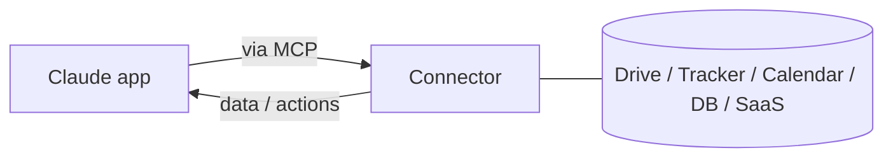

<LevelBadge level="intermediate" />

<VerifyNote lastVerified="2026-06-20" source="https://docs.anthropic.com">
Перечень доступных коннекторов и их доступность по планам часто меняются — уточняйте актуальные варианты в приложении/центре помощи.
</VerifyNote>

**Коннекторы** позволяют приложениям Claude выходить **за пределы чата** — к вашим инструментам и данным (диски, трекеры задач, календари, базы данных и многое другое) — чтобы Claude мог отвечать на основе реальных систем и действовать в них. Под капотом они работают на открытом **[Model Context Protocol (MCP)](/docs/claude-code/mcp)**.

## Что они делают

Без коннекторов Claude знает только то, что есть в разговоре. С коннектором он может (с вашего разрешения) подтянуть релевантную информацию из подключённого сервиса — например, найти документ, прочитать недавние задачи, проверить календарь — и использовать её в ответе.

## Один стандарт, везде

Коннекторы — это **обращённая к приложениям** форма MCP. Тот же самый протокол лежит в основе [MCP в Claude Code](/docs/claude-code/mcp) и [в API](/docs/api/mcp). Изучите концепцию один раз — она применима на всех поверхностях.

## Настройка и использование

1. **Подключите** сервис (авторизуйтесь через OAuth, где это поддерживается).
2. **Выдайте минимум привилегий** — только тот доступ, который нужен для задачи.
3. **Спрашивайте естественно** — «найди мой документ с планированием на Q3 и резюмируй риски».

## Безопасность

:::warning Коннектор — это доступ и (иногда) действия
- Авторизуйте только те сервисы и области доступа, которым доверяете.
- Контент, подтянутый из внешних источников, может нести [инъекцию промптов](/docs/security/prompt-injection) — будьте осторожны, когда коннектор читает недоверенный материал.
- Проверьте, что может делать сторонний коннектор, прежде чем включать его ([Проверка стороннего кода](/docs/security/reviewing-third-party-code)).
:::

## Дальше

- [MCP-серверы в Claude Code](/docs/claude-code/mcp)
- [MCP и подключение к инструментам (API)](/docs/api/mcp)
- [ИИ в ваших привычных инструментах](/docs/claude-app/ai-in-your-tools)
