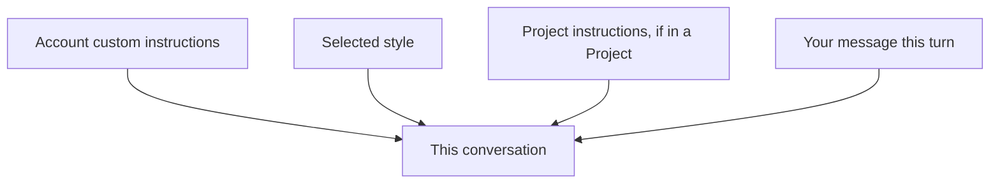

<LevelBadge level="beginner" />

<VerifyNote lastVerified="2026-06-20" source="https://www.anthropic.com">
Точные названия и расположение пользовательских инструкций и стилей в приложениях Claude меняются — уточняйте в приложении/центре помощи.
</VerifyNote>

Устали каждый раз повторять «будь кратким» или «я медсестра, объясняй соответственно»? **Пользовательские инструкции** и **стили** позволяют один раз задать значения по умолчанию и применять их повсюду.

## Пользовательские инструкции = ваш личный системный промпт

Задайте постоянные факты и предпочтения — кто вы, чем занимаетесь, как любите получать ответы — и Claude будет применять их во всех разговорах. Это потребительская версия [системного промпта](/docs/foundations/roles) (и «двоюродный брат» [CLAUDE.md](/docs/claude-code/claude-md) для разработчиков).

Что хорошо включить:
- **Контекст о вас** («у меня небольшая пекарня»; «я пишу на Python»).
- **Предпочтения по выводу** («по умолчанию отвечай короткими пунктами»; «всегда показывай ход рассуждений»).
- **Жёсткие правила** («никогда не используй эмодзи»; «метрические единицы»).

## Стили = пресеты подачи

**Стили** меняют тон/формат (краткий, формальный, объясняющий и т. д.) и могут переключаться для каждого разговора. Используйте стиль, когда хотите *другой голос для этого чата*, не переписывая постоянные инструкции.

## Как они складываются

При конфликте обычно побеждает более конкретный/более поздний контекст — поэтому инструкции [Проекта](/docs/claude-app/projects) или явная просьба в вашем сообщении могут переопределить ваши глобальные значения по умолчанию. Держите их согласованными, чтобы избежать сюрпризов.

## Советы

- **Держите инструкции короткими и правдивыми** — как и в CLAUDE.md, раздутость и устаревшие правила вредят.
- **Не помещайте секреты** в пользовательские инструкции.
- **Пересматривайте их** время от времени по мере изменения ваших потребностей.

## Дальше

- [Роли System, User и Assistant](/docs/foundations/roles)
- [Проекты: постоянные рабочие пространства](/docs/claude-app/projects)
- [CLAUDE.md и файлы памяти](/docs/claude-code/claude-md)
