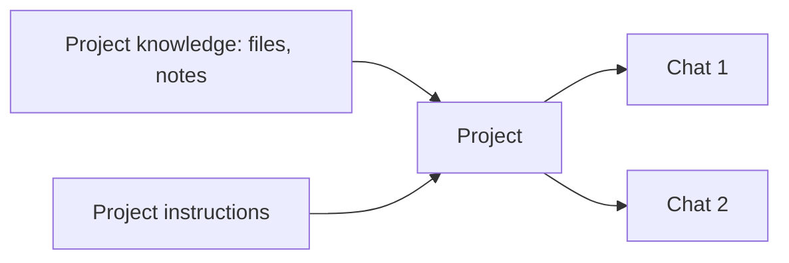

<LevelBadge level="beginner" />

<VerifyNote lastVerified="2026-06-20" source="https://www.anthropic.com">
Возможности и лимиты проектов зависят от плана и меняются — уточняйте актуальное поведение в приложении/центре помощи.
</VerifyNote>

**Проект** — это выделенное рабочее пространство в Claude.ai, которое объединяет **собственные файлы, знания и инструкции**. Вместо того чтобы заново загружать одни и те же документы и заново объяснять контекст в каждом чате, вы настраиваете его один раз — и каждый разговор в Проекте начинается уже информированным.

## Зачем использовать Проект

- **Обоснованные ответы.** Добавьте свои документы (справочник, спецификации, заметки), и Claude отвечает *на их основе* — встроенный вариант [RAG](/docs/foundations/rag) без написания кода.
- **Постоянный контекст.** Инструкции проекта работают как ограниченный рамками [системный промпт](/docs/foundations/roles) для всего, что внутри него.
- **Организованность.** Все чаты по одной теме/клиенту/инициативе живут вместе.

## Настройте его

1. **Создайте Проект** и дайте ему чёткое назначение.
2. **Добавьте знания** — файлы/тексты, которые он должен всегда знать.
3. **Напишите инструкции проекта** — роль, соглашения, что делать/избегать.
4. **Начните общаться** — каждый разговор наследует знания + инструкции.

## Отличные сценарии использования

- Рабочее пространство **клиента/аккаунта** (их документы + ваши заметки).
- База знаний по **кодовой базе или продукту** для вопросов и ответов.
- **Писательский проект** с вашим руководством по стилю и прошлыми работами (чтобы черновики соответствовали вашему голосу).
- **Учёба** по курсу, с загруженными программой и материалами.

## Советы

- **Курируйте знания** — релевантные, актуальные файлы лучше, чем сваливать всё подряд (шум вредит поиску).
- **Держите инструкции краткими и правдивыми** (то же правило, что и для [пользовательских инструкций](/docs/claude-app/custom-instructions)).
- **Не добавляйте чувствительные данные**, которые вам некомфортно хранить — см. [Конфиденциальность](/docs/foundations/privacy).

## Дальше

- [Пользовательские инструкции и стили](/docs/claude-app/custom-instructions)
- [Память между чатами](/docs/claude-app/memory)
- [Генерация с дополнением через поиск (RAG)](/docs/foundations/rag)
