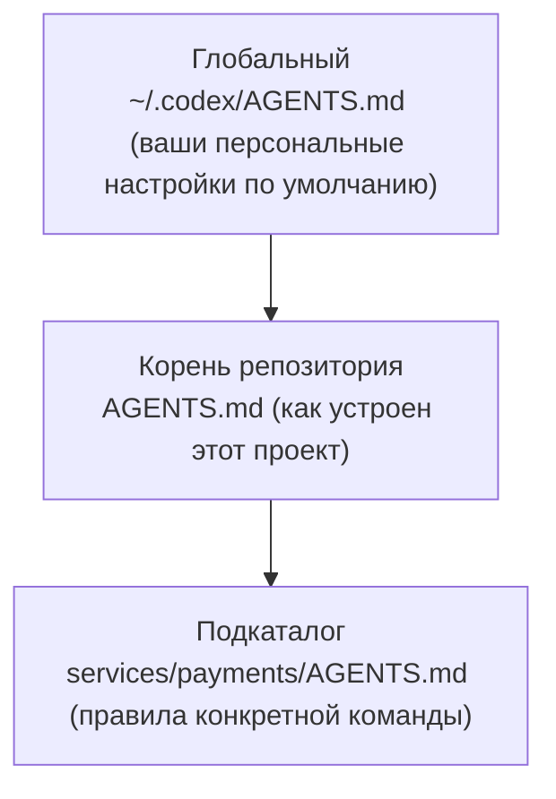

<LevelBadge level="intermediate" />

<VerifyNote lastVerified="2026-06-27" source="https://agents.md/">
Список тех, кто принял AGENTS.md, и поведение Claude Code в части импорта/символьных ссылок быстро меняются — сверяйте детали с официальным сайтом AGENTS.md и документацией Claude Code по памяти.
</VerifyNote>

Вы уже знаете [CLAUDE.md](/docs/claude-code/claude-md) — проектный брифинг Claude Code. Но к вашему репозиторию, скорее всего, прикасается *больше* одного агента: коллега запускает Codex, CI использует кодинг-бота, кто-то открывает репозиторий в Cursor. `AGENTS.md` — это открытый стандарт, который эти инструменты договорились читать, поэтому вы пишете инструкции проекта **один раз**, вместо того чтобы вести отдельный файл под каждый инструмент.

<Callout type="objectives" items={["Что такое AGENTS.md и кто им управляет", "Почему Claude Code читает CLAUDE.md, а не AGENTS.md", "Три надёжных способа держать единый источник истины во всех инструментах", "Как объединяются вложенные и глобальные файлы AGENTS.md", "Что должно быть в файле — и что туда не стоит класть"]} />

## Что такое AGENTS.md

`AGENTS.md` — это обычный Markdown-файл в корне вашего репозитория; считайте его **README, написанным для агентов, а не для людей**. Он рассказывает кодинг-агенту, как собирать, тестировать проект и вносить в него вклад. У формата нет обязательных полей: агенты просто читают текст.

Это открытый стандарт, которым управляет **Agentic AI Foundation (AAIF) под эгидой Linux Foundation**, и по состоянию на середину 2026 года он используется в 60 тыс.+ опенсорсных проектах и читается 30+ инструментами — включая OpenAI Codex, Jules и Gemini CLI от Google, Cursor, Windsurf, Devin, Zed, Warp, Aider, goose, Amp и кодинг-агента GitHub Copilot.

<Callout type="info" items={["AGENTS.md — это соглашение, а не среда выполнения: каждый инструмент сам решает, как он находит, объединяет и внедряет файл.", "Никакая схема не навязывается — понятный текст лучше жёсткой структуры.", "Он дополняет ваш README; он его не заменяет."]} />

## Подвох с Claude Code

Вот на чём люди спотыкаются: **Claude Code читает `CLAUDE.md`, а не `AGENTS.md`.** Если в вашем репозитории есть только `AGENTS.md`, Claude Code по умолчанию его игнорирует. Это не баг — он появился раньше стандарта — но это значит, что мультиинструментальному репозиторию нужна продуманная стратегия синхронизации, иначе ваши инструкции тихо разойдутся.

<Callout type="warning" items={["Не думайте, что Claude Code откатывается к AGENTS.md — он не читает его автоматически.", "Два вручную поддерживаемых файла (CLAUDE.md и AGENTS.md) разойдутся. Выберите один источник истины.", "Перед тем как полагаться на любое заявление о резервном чтении, проверьте текущее поведение в официальной документации по памяти."]} />

## Держите единый источник истины

Три подхода держат CLAUDE.md и AGENTS.md в синхронизации без дублирования содержимого. Выбирайте по платформе вашей команды.

<Steps items={[{title: "Символьная ссылка (проще всего)", body: "Сделайте CLAUDE.md символьной ссылкой на AGENTS.md. Claude Code следует по символьным ссылкам и читает цель байт в байт — один реальный файл, ноль логики слияния. Оговорка: в Windows для создания символьной ссылки нужен режим разработчика или права администратора, поэтому кросс-платформенные команды могут предпочесть метод импорта."}, {title: "@import (кросс-платформенно)", body: "Держите крошечный CLAUDE.md, единственная задача которого — подтянуть стандартный файл через импорт @AGENTS.md. Claude Code раскрывает импортированный файл в контекст при запуске, так что AGENTS.md остаётся единственным источником и нет символьной ссылки, которая могла бы сломаться в Windows."}, {title: "/init (миграция)", body: "Запускаете Claude Code в репозитории, где уже есть AGENTS.md (или .cursorrules / .windsurfrules)? Запустите /init — он читает эти файлы и встраивает релевантные части в сгенерированный CLAUDE.md."}]} />

<PromptCard title="Сделать CLAUDE.md символьной ссылкой на общий стандарт (macOS / Linux)">{`ln -s AGENTS.md CLAUDE.md`}</PromptCard>

<PromptCard title="Или держать однострочный CLAUDE.md, который его импортирует">{`@AGENTS.md`}</PromptCard>

<Callout type="tip" items={["Символьная ссылка — когда вся команда на macOS/Linux: поддерживать нужно меньше всего.", "Используйте @import, когда среди участников есть пользователи Windows.", "Закоммитьте то, что выберете, чтобы вся команда получила одинаковое поведение."]} />

## Как объединяются вложенные и глобальные файлы

Более продвинутые агенты обращаются с AGENTS.md иерархически — та же ментальная модель, что и у [иерархии памяти CLAUDE.md](/docs/claude-code/claude-md). Codex, например, идёт от глобального файла в вашем домашнем каталоге вниз через корень Git до текущей папки, конкатенируя по пути:

Файлы, которые ближе к работе, побеждают, потому что они конкатенируются **последними** и переопределяют более ранние указания. Так `services/payments/AGENTS.md` наследует инструкции корня репозитория и добавляет правила, которые применяются только внутри этого сервиса — кладите специализированные указания как можно ближе к специализированному коду.

<Flashcards title="Совместимость с одного взгляда" cards={[{front: "Кто читает AGENTS.md?", back: "30+ инструментов — Codex, Cursor, Windsurf, Devin, Zed, Gemini CLI, кодинг-агент Copilot и другие. По умолчанию — не Claude Code."}, {front: "Кто читает CLAUDE.md?", back: "Claude Code — и только Claude Code. Он не читает AGENTS.md автоматически."}, {front: "Лучшая синхронизация для команды на Mac/Linux", back: "Символьная ссылка CLAUDE.md → AGENTS.md. Один реальный файл, без расхождений."}, {front: "Лучшая синхронизация с участниками на Windows", back: "Однострочный CLAUDE.md, содержащий @AGENTS.md — символьная ссылка не нужна."}, {front: "Порядок слияния для вложенных файлов", back: "Глобальный → корень репозитория → подкаталог. Файлы ближе к работе переопределяют, потому что конкатенируются последними."}]} />

## Что туда класть

Та же дисциплина, что и для хорошего CLAUDE.md — стандарт лишь предлагает несколько типичных разделов:

- **Обзор проекта** — что это, в двух предложениях.
- **Команды сборки и тестов** — как запускать, тестировать и линтить.
- **Стиль кода** — соглашения, которые агент не может вывести сам.
- **Инструкции по тестированию** — что значит «готово».
- **Соображения безопасности** — чего никогда нельзя трогать или коммитить.
- **Правила коммитов / PR** — формат сообщений, правила веток.

<Callout type="warning" items={["Агенты следуют файлу буквально — устаревшие или желаемые инструкции активно вредят, ровно как в CLAUDE.md.", "Держите его коротким и правдивым; описывайте, как проект работает сегодня.", "Никогда не коммитьте секреты; ссылайтесь на большие документы вместо того, чтобы вставлять их."]} />

## Проверьте себя

<Quiz title="Проверьте себя" questions={[{q: "Читает ли Claude Code AGENTS.md автоматически?", options: ["Да, он откатывается к AGENTS.md", "Нет — он читает только CLAUDE.md", "Только в Windows"], answer: 1, explain: "Claude Code читает CLAUDE.md и по умолчанию игнорирует отдельный AGENTS.md, так что мультиинструментальным репозиториям нужна продуманная стратегия синхронизации."}, {q: "Ваша команда полностью на macOS и Linux. Какой способ требует меньше всего обслуживания, чтобы один файл инструкций работал и в Claude Code, и в Codex?", options: ["Вести CLAUDE.md и AGENTS.md вручную", "Сделать CLAUDE.md символьной ссылкой на AGENTS.md", "Вставить AGENTS.md в комментарий"], answer: 1, explain: "Символьная ссылка CLAUDE.md → AGENTS.md даёт вам один реальный файл; Claude Code следует по ссылке и читает цель байт в байт."}, {q: "Когда агенты объединяют глобальный, корневой и подкаталожный AGENTS.md, какой из них побеждает при конфликтах?", options: ["Глобальный файл", "Файл в корне репозитория", "Файл в подкаталоге, ближайшем к работе"], answer: 2, explain: "Файлы конкатенируются глобальный → корень → подкаталог, так что файл ближе всего к работе идёт последним и переопределяет более ранние указания."}]} />

<Callout type="takeaways" items={["AGENTS.md — открытый стандарт под управлением Linux Foundation, который читают 30+ кодинг-агентов, — README для агентов.", "Claude Code читает CLAUDE.md, а не AGENTS.md, поэтому мультиинструментальные репозитории должны держать их в синхронизации.", "Сделайте CLAUDE.md символьной ссылкой → AGENTS.md на Mac/Linux или используйте однострочный импорт @AGENTS.md для кросс-платформенных команд.", "Вложенные файлы объединяются глобальный → корень → подкаталог, побеждает ближайший файл.", "Заполняйте его как отличный CLAUDE.md: обзор, команды сборки/тестов, соглашения, безопасность и ограничители — коротко и правдиво."]} />

## Дальше

- [CLAUDE.md и файлы памяти](/docs/claude-code/claude-md) — сторона Claude Code в той же идее
- [Шаблоны CLAUDE.md](/docs/templates/claude-md) — готовые заготовки, которые можно повторно использовать как AGENTS.md
- [Слэш-команды](/docs/claude-code/slash-commands) — включая /init для миграции существующих файлов инструкций

## Источники и дополнительное чтение

- [AGENTS.md — официальный сайт и спецификация](https://agents.md/)
- [OpenAI Codex — Кастомные инструкции с AGENTS.md](https://developers.openai.com/codex/guides/agents-md)
- [Документация Claude Code по памяти](https://code.claude.com/docs/en/memory)
