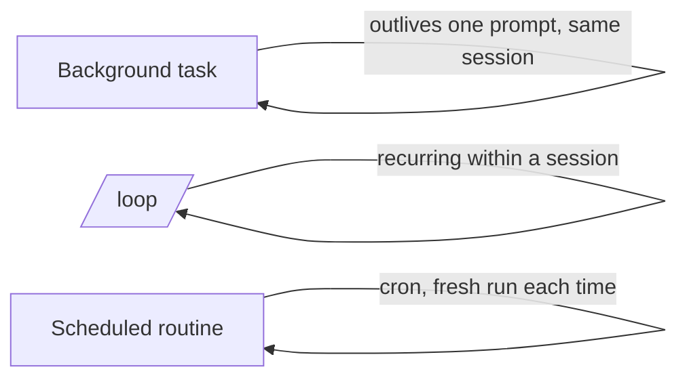

<LevelBadge level="advanced" />

<VerifyNote lastVerified="2026-06-20" source="https://docs.anthropic.com/en/docs/claude-code">
Точные команды и доступность фоновых задач, /loop и планирования меняются от релиза к релизу — сверяйтесь с официальной документацией.
</VerifyNote>

Не всё сводится к быстрой правке. Claude Code может выполнять работу, которая **переживает один запрос**: долгие команды в фоне, повторяющиеся циклы и запланированные запуски.

## Фоновые задачи

Запускайте долго выполняющуюся команду (dev-сервер, watcher тестов, сборку) **не блокируя** сессию. Claude продолжает работать и получает уведомление, когда задача выдаёт вывод или завершается. Используйте это для всего, что вы обычно отправили бы в фон через `&` — но управляемо, чтобы Claude мог прочитать вывод позже.

:::tip Не занимайтесь активным ожиданием
Запустите задачу в фоне и продолжайте; пусть уведомление о завершении вернёт вас к ней, вместо опроса в тесном цикле.
:::

## Повторяющиеся циклы (`/loop`)

`/loop` запускает запрос или команду с **повторяющимся интервалом** внутри сессии — например, «каждые 5 минут проверяй статус деплоя». Задайте интервал или позвольте Claude самому задавать темп. Отлично подходит для присмотра за прогоном CI или опроса внешней задачи, о которой среда иначе не может вас уведомить.

## Запланированные облачные агенты

Для работы, которая должна выполняться **по расписанию, на постоянной основе** — «каждое утро резюмируй новые issues», «каждый час проверяй новости и обновляй документацию» — используйте **запланированные задачи / рутины** (в стиле cron). Каждый запуск начинается с чистого листа, поэтому его инструкции должны быть **самодостаточными**.

## Как выбрать между ними

| Потребность | Что использовать |
|---|---|
| Запустить долгую команду, продолжая работать | Фоновая задача |
| Опрашивать что-то каждые N минут в этой сессии | `/loop` |
| Делать что-то по расписанию, бессрочно | Запланированная рутина |

:::warning Автономности нужны ограничители
Всё, что действует без присмотра по расписанию, должно быть строго ограничено по области и обратимо. Сочетайте это со строгими [разрешениями](/docs/claude-code/permissions) и прочитайте [Усиление защиты автономных запусков](/docs/security/hardening-autonomous-runs).
:::

## Дальше

- [Headless-режим и Agent SDK](/docs/claude-code/headless-and-agent-sdk)
- [Разрешения и режимы](/docs/claude-code/permissions)
- [Усиление защиты автономных запусков](/docs/security/hardening-autonomous-runs)
