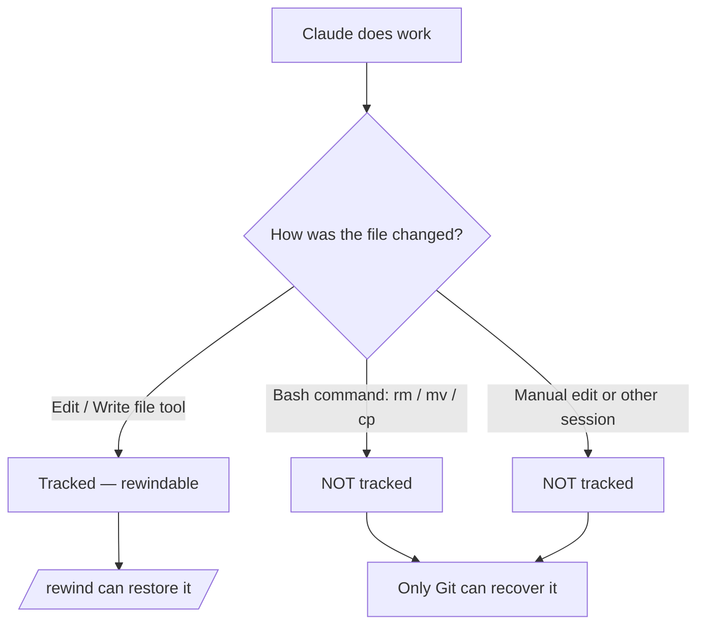

<LevelBadge level="intermediate" />

<Callout type="objectives" items={["Понять, что фиксирует контрольная точка — и что она молча не фиксирует", "Открыть меню отката двумя способами и каждый раз выбирать правильное действие восстановления", "Отличать «восстановить» (откат состояния) от «резюмировать» (сжатие контекста)", "Точно знать, почему контрольные точки дополняют Git, но никогда его не заменяют"]} />

<VerifyNote lastVerified="2026-07-09" source="https://code.claude.com/docs/en/checkpointing">
Поведение контрольных точек, действия меню отката, срок хранения и требования к версии (например, возврат за пределы `/clear` требует Claude Code v2.1.191+) меняются между релизами — сверяйтесь с официальной документацией.
</VerifyNote>

## Главная идея

Когда вы отпускаете Claude на амбициозное, масштабное изменение, самый пугающий вопрос — «а что, если всё пойдёт не так на третьей правке вглубь?» **Контрольные точки** — это ответ: Claude Code автоматически делает снимок вашего кода перед каждой правкой, так что вы можете откатиться к любому более раннему состоянию, а не распутывать вручную наполовину завершённый рефакторинг.

Считайте это **локальной отменой для всей сессии** — страховкой, которая позволяет сказать «да, попробуй смелый подход» без страха.

## Как создаются контрольные точки

Вы не создаёте контрольные точки — они возникают автоматически.

<Steps items={[{title: "Каждый запрос = контрольная точка", body: "Каждый пользовательский запрос фиксирует состояние вашего кода до того, как отработают инструменты редактирования файлов Claude. Никаких команд, никакой настройки, никаких церемоний."}, {title: "Они сохраняются между сессиями", body: "Контрольные точки переживают выход из разговора и его возобновление, так что вы можете откатиться в возобновлённой сессии, а не только в текущей."}, {title: "Они убирают себя сами", body: "Контрольные точки удаляются вместе со своей сессией через 30 дней (настраивается). Это восстановление на уровне сессии, а не архив."}]} />

## Открытие меню отката

Есть два способа войти:

<Steps items={[{title: "Запустите /rewind", body: "Введите слэш-команду в строке запроса. Работает всегда."}, {title: "Нажмите Esc дважды — но только при пустом поле ввода", body: "Двойной Esc открывает меню отката, когда поле запроса пусто. Если в нём есть текст, двойной Esc вместо этого очищает этот текст (очищенный текст сохраняется в историю ввода, так что нажмите Вверх, чтобы вернуть его потом)."}]} />

<PromptCard title="Open the rewind menu">{`/rewind`}</PromptCard>

Меню перечисляет **каждый запрос, отправленный вами в этой сессии**. Выберите точку, с которой хотите работать, затем выберите одно действие.

## Восстановить или резюмировать: ключевое различие

Именно здесь люди путаются. Меню предлагает два *вида* действий:

- Действия **восстановления** меняют состояние на диске и/или в разговоре — они отменяют.
- Действия **резюмирования** никогда не трогают ваши файлы — они сжимают разговор, чтобы освободить место в окне контекста.

<Callout type="warning" items={["Восстановить = отменить (откатывает код, разговор или и то, и другое). Резюмировать = сжать контекст (файлы на диске не трогаются).", "Тянитесь к восстановлению, когда правка что-то сломала. Тянитесь к резюмированию, когда сессия раздута, но код в порядке."]} />

### Действия восстановления

<Steps items={[{title: "Восстановить код и разговор", body: "Откатывает и ваши файлы, и историю чата к выбранной точке — чистая «перемотка времени» к этому моменту."}, {title: "Восстановить разговор", body: "Откатывает чат к тому сообщению, но сохраняет ваш текущий код. Полезно, чтобы переспросить, не теряя правки, которые вы хотите сохранить."}, {title: "Восстановить код", body: "Откатывает изменения файлов, но сохраняет разговор. Отменяет правки, сохраняя обсуждение о них."}]} />

После восстановления разговора (или выбора «Резюмировать отсюда») исходный запрос из выбранного сообщения возвращается в поле ввода, чтобы вы могли отправить его повторно или отредактировать.

### Действия резюмирования

Оба сжимают часть разговора в сгенерированное ИИ резюме — как **точечный `/compact`**, где вы выбираете, какую сторону выбранного сообщения сжать.

<Steps items={[{title: "Резюмировать отсюда", body: "Сообщения ПЕРЕД выбранным сообщением остаются нетронутыми. Выбранное сообщение и всё после него становятся резюме. Используйте это, чтобы отбросить побочное обсуждение, сохранив ранний контекст во всех деталях."}, {title: "Резюмировать до этого места", body: "Сообщения ПЕРЕД выбранным сообщением становятся резюме; выбранное сообщение и всё после него остаются нетронутыми. Вы остаётесь в конце разговора. Используйте это, чтобы сжать раннюю подготовительную болтовню, сохранив недавнюю работу дословно."}]} />

Исходные сообщения в любом случае остаются в стенограмме сессии, так что Claude по-прежнему может ссылаться на детали. Вы можете ввести необязательные инструкции, чтобы направить, на чём фокусируется резюме.

Весь процесс см. в [Управление контекстом](/docs/claude-code/context-management) — действия резюмирования `/rewind` — это скальпель, тогда как `/compact` — широкая кисть.

## Откат за пределы `/clear`

Если вы ранее в том же процессе Claude Code запускали `/clear`, меню отката показывает дополнительную запись вверху: `/resume <session-id> (previous session)`. Выберите её, чтобы вернуться к разговору, который был активен до `/clear`.

<VerifyNote lastVerified="2026-07-09" source="https://code.claude.com/docs/en/checkpointing">
Возврат за пределы `/clear` из меню отката требует Claude Code v2.1.191 или новее. В более ранних версиях запустите `/resume` и выберите предыдущую сессию из списка.
</VerifyNote>

## Где контрольные точки останавливаются — ограничения, которые кусаются

Контрольные точки кажутся волшебными, пока не перестают. Три пробела имеют значение:

<Steps items={[{title: "Изменения через bash невидимы", body: "Файлы, затронутые shell-командами, которые запускает Claude — rm, mv, cp, генераторы кода, форматтеры — НЕ отслеживаются. Только прямые правки через инструменты редактирования файлов Claude попадают в контрольные точки. Удалённый через rm файл потерян с точки зрения отката."}, {title: "Внешние и параллельные изменения невидимы", body: "Ручные правки, которые вы делаете вне Claude Code, и правки из других параллельных сессий обычно не фиксируются — если только они не затрагивают те же файлы, что редактировала текущая сессия."}, {title: "Это уровень сессии, а не история", body: "Контрольные точки — это быстрое локальное восстановление. Это не коммиты, не ветки и их нельзя разделить с командой."}]} />

## Контрольные точки против Git: используйте оба

Они решают разные задачи, поэтому сочетайте их.

| | Контрольные точки (`/rewind`) | Git |
|---|---|---|
| Область | Одна сессия | Вся история проекта |
| Детализация | На каждый запрос, автоматически | На каждый коммит, намеренно |
| Отслеживает изменения через bash? | Нет | Да (после добавления/коммита) |
| Срок жизни | ~30 дней, затем исчезают | Постоянно |
| Совместное использование / коллаборация | Нет | Да |
| Ментальная модель | «Локальная отмена» | «Постоянная история» |

<Callout type="tip" items={["Фиксируйте рабочие состояния в Git перед рискованным, масштабным запуском — это ваш надёжный фундамент.", "Используйте /rewind для быстрого восстановления внутри сессии между коммитами, не засоряя историю Git.", "Если Claude будет запускать разрушительный bash (rm/mv) или генераторы, опирайтесь на Git — откат не спасёт эти файлы."]} />

## Когда к этому прибегать

<Steps items={[{title: "Исследование альтернатив", body: "Попробуйте смелую реализацию, и если она вам не понравится, восстановите код и разговор к точке развилки и попробуйте другую."}, {title: "Восстановление после плохой правки", body: "Правка внесла баг три запроса назад? Восстановите код к состоянию непосредственно перед ней, вместо того чтобы разгребать обломки."}, {title: "Итерации над функцией", body: "Экспериментируйте с вариациями, всегда зная, что заведомо рабочее состояние — в одном /rewind от вас."}, {title: "Освобождение места в контексте", body: "Многословный отход в отладку съел ваше окно контекста? Резюмируйте от середины вперёд и сохраните исходные инструкции во всех деталях."}]} />

<Quiz title="Check yourself" questions={[{q: "Claude выполнил `rm config.old.json` через bash-команду, и вы хотите вернуть файл. Может ли `/rewind` его восстановить?", options: ["Да — каждое изменение, которое делает Claude, попадает в контрольную точку", "Нет — изменения через bash не отслеживаются; отслеживаются только прямые правки через файловые инструменты", "Только если запустить /rewind в течение 30 секунд"], answer: 1, explain: "Контрольные точки фиксируют только правки, сделанные через инструменты редактирования файлов Claude. Файлы, изменённые bash-командами (rm, mv, cp), не отслеживаются — именно для этого нужен Git."}, {q: "Ваш код в порядке, но долгий отход в отладку заполнил окно контекста. Какое действие подходит?", options: ["Восстановить код и разговор до отхода", "Восстановить код", "Резюмировать отсюда в начале отхода"], answer: 2, explain: "Действия резюмирования сжимают разговор, не трогая файлы. «Резюмировать отсюда» превращает отход в резюме, сохраняя ранний контекст нетронутым — освобождая место в контексте без единого изменения кода."}, {q: "Как создаётся контрольная точка?", options: ["Вы запускаете /checkpoint вручную", "Автоматически, перед каждой правкой — каждый запрос создаёт одну", "Только когда вы делаете коммит в Git"], answer: 1, explain: "Контрольные точки создаются автоматически: каждый пользовательский запрос фиксирует состояние вашего кода до правки. Ручного шага нет."}]} />

<Flashcards title="Checkpoints & rewind vocabulary" cards={[{front: "Контрольная точка", back: "Автоматический снимок вашего кода, сделанный перед каждой правкой, один раз на запрос. Ограничен сессией, хранится ~30 дней."}, {front: "/rewind", back: "Открывает меню отката со списком каждого запроса этой сессии, чтобы вы могли восстановить или резюмировать с любой точки. Также доступно через двойной Esc при пустом поле ввода."}, {front: "Действие восстановления", back: "Откатывает состояние — код, разговор или и то, и другое — к выбранной точке. Это «отмена»."}, {front: "Действие резюмирования", back: "Сжимает часть разговора в ИИ-резюме, чтобы освободить контекст. Файлы на диске никогда не трогаются."}, {front: "Слепая зона bash", back: "Файлы, изменённые shell-командами (rm/mv/cp), НЕ попадают в контрольные точки — только прямые правки через файловые инструменты. Для них используйте Git."}]} />

<Callout type="takeaways" items={["Контрольные точки — это автоматические снимки вашего кода на каждый запрос — локальная отмена для всей сессии, хранятся около 30 дней.", "Открывайте меню отката через /rewind или двойной Esc при пустом поле ввода; оно перечисляет каждый отправленный вами запрос.", "Действия восстановления отменяют состояние (код, разговор или и то, и другое); действия резюмирования сжимают контекст и никогда не трогают файлы.", "Изменения через bash, внешние и параллельные изменения НЕ отслеживаются — только прямые правки через файловые инструменты.", "Контрольные точки дополняют Git, а не заменяют его: думайте «локальная отмена» против «постоянной, разделяемой истории»."]} />

## Далее

- [Управление контекстом](/docs/claude-code/context-management) — `/compact`, `/clear` и как резюмирование вписывается в общую картину
- [Режим планирования](/docs/claude-code/plan-mode) — исследуйте и утверждайте план до запуска правок, чтобы реже откатываться
- [Разрешения](/docs/claude-code/permissions) — вторая половина безопасного запуска амбициозных задач
