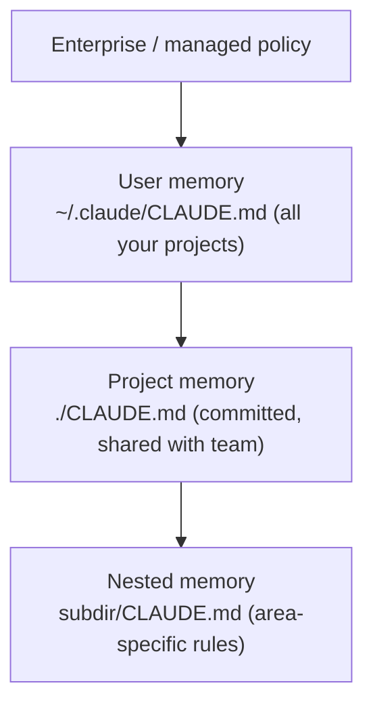

<LevelBadge level="beginner" />

<VerifyNote lastVerified="2026-06-20" source="https://code.claude.com/docs/en/memory">
Расположение файлов памяти и синтаксис импортов могут меняться — уточняйте детали в официальной документации по памяти Claude Code.
</VerifyNote>

Если вы сделаете **одну** вещь, чтобы улучшить [Claude Code](/docs/claude-code/what-is-claude-code), сделайте именно это. `CLAUDE.md` — это текстовый файл, который Claude читает в начале каждой сессии: постоянный брифинг по вашему проекту.

## Почему это настройка с максимальной отдачей

Без него вы заново объясняете свой проект каждую сессию («мы используем pnpm, тесты лежат в `__tests__`, не трогай `/generated`…»). С ним Claude уже всё знает. Хорошие инструкции здесь сразу улучшают *каждое* будущее взаимодействие.

## Иерархия памяти

Claude Code читает память из нескольких мест и объединяет их, примерно от наиболее глобального к наиболее специфичному:

- **Пользовательская память** — ваши личные предпочтения во всех проектах.
- **Память проекта** (`./CLAUDE.md`, закоммичена) — как устроен *этот* репозиторий. Общая с вашей командой.
- **Вложенная** — положите `CLAUDE.md` в подпапку для правил, которые действуют только там.

## Сгенерируйте отправную точку

Выполните `/init` в проекте, и Claude составит черновик `CLAUDE.md`, проанализировав код. Затем **сократите его** — черновик это отправная точка, а не финиш.

## Что в него класть

- Что представляет собой проект, в двух предложениях.
- Технологический стек и как его **запускать / тестировать / линтить**.
- Соглашения, которые Claude не может вывести сам (именование, структура, стиль коммитов).
- **Ограничители**: «прогоняй тесты, прежде чем объявлять работу завершённой», «никогда не редактируй `/vendor`», «никогда не коммить секреты».

Возьмите готовую заготовку в [Шаблонах CLAUDE.md](/docs/templates/claude-md).

## Что в него НЕ класть

:::warning Коротко и правдиво лучше, чем длинно и мечтательно
Claude следует `CLAUDE.md` *буквально*. Устаревшие, расплывчатые или желаемые-за-действительное инструкции активно вредят. Описывайте, как проект **на самом деле** работает сегодня, держите файл лаконичным и периодически его пересматривайте.
:::

Избегайте: огромных вставленных документов (вместо этого используйте `@imports` для ссылок на файлы), секретов и правил, которым вы на самом деле не следуете.

## Импорты

Подтягивайте существующие документы вместо их дублирования — например, ссылайтесь на ваш гайд по стилю через импорт `@path/to/file`, чтобы был единый источник истины. Точный синтаксис смотрите в [официальной документации по памяти](https://code.claude.com/docs/en/memory).

## Дальше

- [Режим планирования](/docs/claude-code/plan-mode) — безопасные первые изменения
- [Разрешения и режимы](/docs/claude-code/permissions) — что Claude может делать без присмотра
- [Пошаговое руководство: настройка Claude Code для реального репозитория](/docs/walkthroughs/customize-claude-code)
