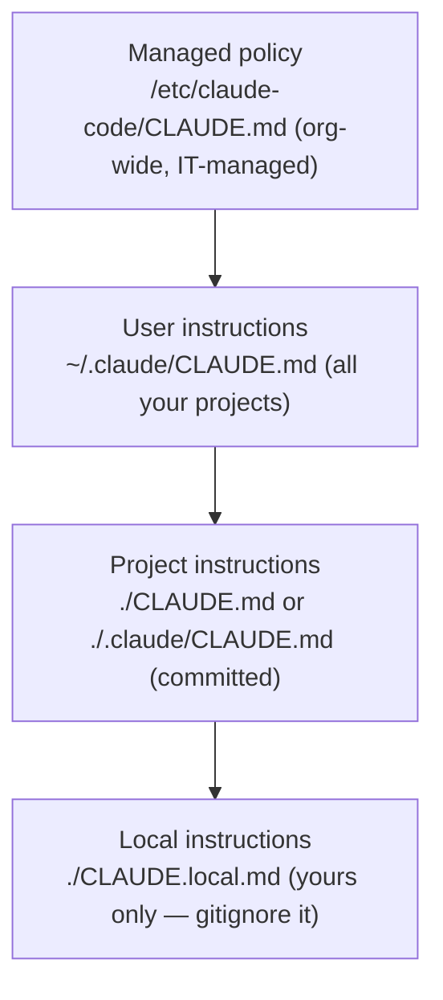

<LevelBadge level="beginner" />

<VerifyNote lastVerified="2026-10-06" source="https://code.claude.com/docs/en/memory">
Расположения, порядок загрузки и синтаксис импортов взяты из официальной документации по памяти («How Claude remembers your project»), которая теперь описывает **два** механизма: файлы CLAUDE.md, которые пишете вы, и **автопамять**, которую Claude пишет сам. Импорты разрешаются на глубину не более четырёх переходов. Уточняйте детали там — они меняются.
</VerifyNote>

Если вы сделаете **одну** вещь, чтобы улучшить [Claude Code](/docs/claude-code/what-is-claude-code), сделайте именно это. `CLAUDE.md` — это текстовый файл, который Claude читает в начале каждой сессии: постоянный брифинг по вашему проекту.

<Callout type="objectives" items={["Почему CLAUDE.md — единственная настройка Claude Code с максимальной отдачей", "Как загружается иерархия памяти: от управляемой политики организации до CLAUDE.local.md", "Чем автопамять отличается от CLAUDE.md, который пишете вы", "Как сгенерировать стартовый файл с помощью /init и сократить его", "Что должно быть в CLAUDE.md — и что туда не стоит включать", "Как @imports позволяют ссылаться на документы, не дублируя их"]} />

## Почему это настройка с максимальной отдачей

Без него вы заново объясняете свой проект каждую сессию («мы используем pnpm, тесты лежат в `__tests__`, не трогай `/generated`…»). С ним Claude уже всё знает. Хорошие инструкции здесь сразу улучшают *каждое* будущее взаимодействие.

## Иерархия памяти

Claude Code загружает память из нескольких мест и объединяет их в порядке загрузки, начиная с самой широкой области действия, — поэтому инструкция проекта попадает в контекст *после* пользовательской инструкции:

```mermaid
flowchart TD
  A["Managed policy<br/>/etc/claude-code/CLAUDE.md (org-wide, IT-managed)"] --> B["User instructions<br/>~/.claude/CLAUDE.md (all your projects)"]
  B --> C["Project instructions<br/>./CLAUDE.md or ./.claude/CLAUDE.md (committed)"]
  C --> D["Local instructions<br/>./CLAUDE.local.md (yours only — gitignore it)"]
```

- **Управляемая политика** — инструкции уровня организации, которые поставляет ваша команда IT/DevOps. Путь зависит от ОС: `/Library/Application Support/ClaudeCode/CLAUDE.md` на macOS, `/etc/claude-code/CLAUDE.md` на Linux и WSL, `C:\Program Files\ClaudeCode\CLAUDE.md` на Windows.
- **Пользовательские инструкции** (`~/.claude/CLAUDE.md`) — ваши личные предпочтения во всех проектах.
- **Инструкции проекта** (`./CLAUDE.md` *или* `./.claude/CLAUDE.md`, закоммичены) — как устроен *этот* репозиторий. Общие с вашей командой. Если в вашем репозитории используется [`AGENTS.md`](/docs/claude-code/agents-md), он может загружаться вместо этих файлов или вместе с ними.
- **Локальные инструкции** (`./CLAUDE.local.md`) — заметки по проекту только для вас, например URL песочницы. Добавьте файл в `.gitignore`.

Файлы в иерархии каталогов *выше* вашего рабочего каталога загружаются при запуске; файлы в **подкаталогах загружаются по требованию**, когда Claude обращается к чему-то в этой области.

<Callout type="tip" items={["Один файл стал тесен? Разнесите инструкции по .claude/rules/*.md — по одной теме на файл, они обнаруживаются рекурсивно. Правила без frontmatter paths загружаются при запуске с тем же приоритетом, что и .claude/CLAUDE.md; добавьте frontmatter paths, чтобы правило загружалось только тогда, когда Claude работает с подходящими файлами, — это экономит контекст."]} />

<Flashcards title="Изучите слои памяти" cards={[{front: "Управляемая политика", back: "CLAUDE.md уровня организации под управлением IT — самый широкий слой, загружается раньше пользовательских инструкций и инструкций проекта."}, {front: "Пользовательские инструкции", back: "~/.claude/CLAUDE.md — ваши личные предпочтения, которые действуют во всех проектах."}, {front: "Инструкции проекта", back: "./CLAUDE.md или ./.claude/CLAUDE.md — закоммичены и общие с командой; описывают, как устроен этот репозиторий."}, {front: "Локальные инструкции", back: "./CLAUDE.local.md — личные предпочтения, специфичные для проекта. Добавьте его в gitignore."}, {front: ".claude/rules/*.md", back: "Инструкции по одной теме на файл для более крупных проектов. С frontmatter paths они загружаются только для подходящих файлов."}, {front: "CLAUDE.md в подкаталоге", back: "Загружается по требованию — когда Claude работает в этой части дерева, — а не при запуске."}]} />

## Вторая половина: автопамять

CLAUDE.md — это та половина памяти, которую пишете *вы*. Claude Code также ведёт **автопамять** — заметки, которые Claude пишет сам на основе ваших правок и предпочтений; они хранятся отдельно для каждого репозитория и загружаются в каждую сессию вместе с вашими файлами CLAUDE.md.

| | Файлы CLAUDE.md | Автопамять |
| --- | --- | --- |
| **Кто пишет** | Вы | Claude |
| **Что содержит** | Инструкции и правила | Выводы и закономерности |
| **Область действия** | Проект, пользователь или организация | Отдельно для каждого репозитория, общая для всех worktree |

И то, и другое — *контекст*, а не принуждение: Claude относится к ним как к рекомендациям, которые можно взвесить, а не как к конфигурации, которой он обязан подчиняться. Чтобы жёстко заблокировать действие независимо от того, что решит Claude, используйте [хук PreToolUse](/docs/claude-code/hooks).

<Callout type="warning" items={["Автопамять загружает только первые 200 строк или 25 КБ — раздутый MEMORY.md молча обрезается. Полную разбивку стоимости запуска смотрите в Аудите бюджета контекста."]} />

## Сгенерируйте отправную точку

<Steps items={[{title: "Выполните /init в проекте", body: "Claude анализирует код и автоматически составляет для вас черновик CLAUDE.md."}, {title: "Сократите его", body: "Черновик — это отправная точка, а не финиш. Урежьте его до того, что верно и полезно."}, {title: "Возьмите шаблон", body: "Возьмите готовую заготовку со страницы шаблонов CLAUDE.md и адаптируйте её под свой репозиторий."}]} />

<PromptCard title="Сгенерировать черновик CLAUDE.md">{`/init`}</PromptCard>

Возьмите готовую заготовку в [Шаблонах CLAUDE.md](/docs/templates/claude-md).

## Что в него класть

- Что представляет собой проект, в двух предложениях.
- Технологический стек и как его **запускать / тестировать / линтить**.
- Соглашения, которые Claude не может вывести сам (именование, структура, стиль коммитов).
- **Ограничители**: «прогоняй тесты, прежде чем объявлять работу завершённой», «никогда не редактируй `/vendor`», «никогда не коммить секреты».

## Что в него НЕ класть

<Callout type="warning" items={["Claude следует CLAUDE.md буквально — устаревшие, расплывчатые или желаемые-за-действительное инструкции активно вредят.", "Описывайте, как проект на самом деле работает сегодня; короткое и правдивое лучше длинного и мечтательного.", "Избегайте огромных вставленных документов (вместо этого используйте @imports), секретов и правил, которым вы на самом деле не следуете.", "Периодически пересматривайте файл, чтобы он оставался точным по мере развития проекта."]} />

## Импорты

Подтягивайте существующие документы вместо их дублирования — например, ссылайтесь на ваш гайд по стилю через импорт `@path/to/file`, чтобы был единый источник истины. Работают и относительные, и абсолютные пути; относительные пути разрешаются относительно файла, в котором находится импорт, а **не** вашего рабочего каталога. Импортированные файлы могут импортировать другие — на глубину максимум **четыре перехода**.

Две ловушки синтаксиса, о которых стоит узнать до того, как они вас укусят:

- **Пробелы требуют обратных слэшей.** `@Design\ Docs/api-conventions.md` работает; без обратного слэша путь обрывается на первом пробеле. А если взять его в кавычки, файл не импортируется вовсе.
- **Обратные кавычки отключают импорт.** Разбор импортов пропускает code-спаны и огороженные блоки, поэтому `` `@README` `` остаётся обычным текстом, а `@README` сам по себе импортирует файл. Так можно *упомянуть* путь, не загружая его.

Полный справочник смотрите в [официальной документации по памяти](https://code.claude.com/docs/en/memory).

<Callout type="tip" items={["Единый источник истины: ссылайтесь на файл через @imports, а не вставляйте его содержимое в CLAUDE.md.", "Если документ уже существует, дайте на него ссылку — не копируйте его. Копии устаревают."]} />

## Проверьте себя

<Quiz title="Проверьте себя" questions={[{q: "Какой файл Claude Code читает в начале каждой сессии как постоянный брифинг по вашему проекту?", options: ["README.md", "CLAUDE.md", "package.json"], answer: 1, explain: "CLAUDE.md — это текстовый файл памяти, который Claude читает в начале каждой сессии."}, {q: "Что делает выполнение /init в проекте?", options: ["Коммитит CLAUDE.md в репозиторий вашей команды", "Составляет черновик CLAUDE.md, анализируя код, который вы затем сокращаете", "Удаляет устаревшие файлы памяти"], answer: 1, explain: "/init составляет стартовый CLAUDE.md на основе кода — черновик это отправная точка, поэтому после этого вы его сокращаете."}, {q: "Какой рекомендуемый способ включить большой существующий документ, например гайд по стилю?", options: ["Вставить весь документ в CLAUDE.md", "Сослаться на него через импорт @path/to/file", "Хранить его как секрет"], answer: 1, explain: "Используйте @imports, чтобы указать на файл, и тогда будет единый источник истины вместо дублированной, устаревающей копии."}, {q: "Куда помещать личные заметки по конкретному проекту — те, которые вы не хотите коммитить?", options: ["~/.claude/CLAUDE.md", "./CLAUDE.local.md", "./.claude/CLAUDE.md"], answer: 1, explain: "./CLAUDE.local.md — это локальный слой: специфичный для проекта, но только ваш. Добавьте его в gitignore. ~/.claude/CLAUDE.md действует во всех ваших проектах, а ./.claude/CLAUDE.md — это закоммиченные инструкции для команды."}, {q: "Кто пишет автопамять?", options: ["Вы, вручную", "Claude, на основе ваших правок и предпочтений", "Ваш IT-администратор"], answer: 1, explain: "Автопамять — это та половина, которую Claude пишет сам: выводы и закономерности, хранящиеся отдельно для каждого репозитория. CLAUDE.md — половина, которую пишете вы."}, {q: "Когда загружается CLAUDE.md, лежащий в подкаталоге?", options: ["При запуске, вместе со всеми остальными файлами памяти", "По требованию, когда Claude работает в этой части дерева", "Только если вы подключите его через @import"], answer: 1, explain: "Файлы выше вашего рабочего каталога загружаются при запуске; файлы в подкаталогах загружаются по требованию, когда Claude обращается к чему-то в этой области."}]} />

<Callout type="takeaways" items={["CLAUDE.md — настройка с максимальной отдачей: она сразу улучшает каждую будущую сессию.", "Память загружается от самого широкого слоя: управляемая политика, затем пользовательский (~/.claude/CLAUDE.md), проектный (./CLAUDE.md или ./.claude/CLAUDE.md), затем локальный (./CLAUDE.local.md). Файлы в подкаталогах загружаются по требованию.", "Автопамять — вторая половина: собственные заметки Claude, отдельно для каждого репозитория, загружаются в каждую сессию. И то, и другое — контекст, а не принуждение: чтобы жёстко что-то заблокировать, используйте хук.", "Один файл стал тесен? Разнесите его по .claude/rules/*.md и ограничьте область правил через frontmatter paths.", "Начните с /init, затем сократите черновик до того, что действительно верно.", "Держите его коротким и правдивым — используйте @imports (максимум четыре перехода) для больших документов и никогда не коммить секреты."]} />

## Дальше

- [AGENTS.md и кросс-инструментальная совместимость](/docs/claude-code/agents-md) — один файл инструкций для всех кодинг-агентов
- [Режим планирования](/docs/claude-code/plan-mode) — безопасные первые изменения
- [Разрешения и режимы](/docs/claude-code/permissions) — что Claude может делать без присмотра
- [Пошаговое руководство: настройка Claude Code для реального репозитория](/docs/walkthroughs/customize-claude-code)
