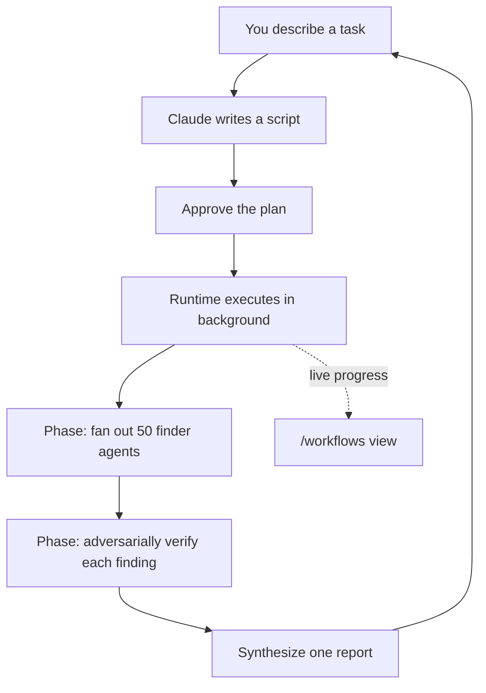

<LevelBadge level="advanced" />

<VerifyNote lastVerified="2026-06-28" source="https://code.claude.com/docs/en/workflows">
Динамические рабочие процессы — это быстро развивающаяся возможность: ключевое слово триггера, параметры подтверждения, ограничения на число агентов и доступность меняются от релиза к релизу Claude Code — уточняйте детали в официальной документации. Они требуют Claude Code v2.1.154+ и платного тарифа.
</VerifyNote>

<Callout type="objectives" items={["Отличить рабочий процесс от субагентов, навыков и команд агентов по тому, кто держит план", "Увидеть его за 30 секунд с помощью встроенной команды /deep-research", "Запустить свой тремя способами: ключевым словом ultracode, /effort ultracode или сохранённой командой", "Понять, от чего вас защищает запрос подтверждения, прежде чем нажать Да", "Держать под контролем стоимость и автономные запуски с помощью нарезки и списка разрешений"]} />

**Динамический рабочий процесс** — это JavaScript-скрипт, который оркеструет [субагентов](/docs/claude-code/subagents) в масштабе. Вы описываете задачу; Claude *пишет скрипт*; среда выполнения запускает его в фоне, пока ваша сессия остаётся отзывчивой. Если обычная многошаговая задача живёт ход за ходом в контекстном окне Claude, то рабочий процесс переносит **план в код** — цикл, ветвление и каждый промежуточный результат живут в переменных скрипта, поэтому ваш контекст хранит только итоговый ответ.

Именно этот сдвиг позволяет рабочим процессам масштабироваться до *десятков или сотен* агентов в одном запуске, тогда как обычное делегирование упирается в небольшое их число.

## Когда обращаться к рабочему процессу

Claude Code даёт вам четыре способа выполнять многошаговую работу. Главный вопрос — **кто держит план**:

| | [Субагенты](/docs/claude-code/subagents) | [Навыки](/docs/claude-code/skills) | Команды агентов | **Рабочие процессы** |
| :-- | :-- | :-- | :-- | :-- |
| Что это | Исполнитель, которого порождает Claude | Инструкции, которым следует Claude | Лидер, надзирающий за равноправными сессиями | Скрипт, который выполняет среда выполнения |
| Кто решает, что запускается дальше | Claude, ход за ходом | Claude, согласно промпту | Лидер, ход за ходом | **Скрипт** |
| Где живут результаты | Контекстное окно | Контекстное окно | Общий список задач | **Переменные скрипта** |
| Масштаб | Несколько за ход | Как у субагентов | Горстка равноправных | **Десятки и сотни** |
| При прерывании | Перезапускает ход | Перезапускает ход | Сотрудники продолжают работать | **Возобновляемо внутри сессии** |

Используйте рабочий процесс, когда задаче нужно **больше агентов, чем способна скоординировать одна беседа**, или когда вы хотите, чтобы оркестрация была **закодирована в виде скрипта, который можно прочитать и перезапустить**. Канонические случаи:

- **Поиск багов по всей кодовой базе** — разверните искатель по каждому модулю, а затем независимые агенты состязательно проверяют каждую находку, прежде чем о ней сообщить.
- **Миграция 500 файлов** — по одному агенту на файл, каждый в собственном worktree, с этапом проверки.
- **Исследовательский вопрос**, где источники нужно **перекрёстно сверить друг с другом**, а не просто резюмировать.
- **Сложный план**, который стоит набросать с нескольких независимых углов, а затем взвесить друг относительно друга, прежде чем вы примете решение.

Последний пункт недооценён: рабочий процесс может применить *повторяемый паттерн качества* (состязательное ревью, многоракурсное черновое составление, проверка большинством голосов), так что вы получаете более надёжный результат, чем за один проход — а не просто больше агентов.



## Самый быстрый способ увидеть его: /deep-research

В Claude Code встроен готовый рабочий процесс, чтобы попробовать модель без необходимости писать свой. Запустите его на любом вопросе:

<PromptCard title="Попробуйте рабочий процесс одной командой">{`/deep-research What changed in the Node.js permission model between v20 and v22?`}</PromptCard>

Он разворачивает веб-поиски по нескольким углам, получает и **перекрёстно сверяет** источники, голосует по каждому утверждению и возвращает **отчёт с цитированием, из которого отфильтрованы утверждения, не выдержавшие перекрёстной проверки**. Подтвердите по запросу, затем наблюдайте за работой через `/workflows`. (Требуется доступный инструмент WebSearch.)

## Три способа запустить свой

**1. Спросите одним промптом.** Включите ключевое слово `ultracode` или просто попросите обычными словами («use a workflow», «run a workflow»). Claude пишет скрипт для этой единственной задачи, не меняя уровень усилий вашей сессии:

<PromptCard title="Запустить одну задачу как рабочий процесс">{`ultracode: audit every API endpoint under src/routes/ for missing auth checks`}</PromptCard>

Ключевое слово подсвечивается в вашем вводе. Не имели его в виду? Нажмите `Option+W` (macOS) или `Alt+W` (Windows/Linux), чтобы убрать подсветку для этого промпта.

:::note История ключевого слова
До v2.1.160 буквальным словом-триггером было `workflow`; его переименовали в `ultracode`, чтобы обычное слово «workflow» не запускало процесс. Запросы на естественном языке («run a workflow») работают в **обеих** версиях.
:::

**2. Дайте решать Claude — усилие ultracode.** Установите сессию в ultracode, и Claude планирует рабочий процесс для *каждой* существенной задачи, сам решая, когда он оправдан:

<PromptCard title="Включить автоматическую оркестрацию для сессии">{`/effort ultracode`}</PromptCard>

Ultracode сочетает усилие на рассуждения `xhigh` ([reasoning effort](/docs/api/thinking-and-effort)) с автоматической оркестрацией. Один запрос может превратиться в несколько рабочих процессов подряд — один чтобы понять код, один чтобы внести изменение, один чтобы его проверить. Каждая задача тогда использует больше токенов и занимает больше времени, поэтому возвращайтесь к `/effort high` для рутинной работы. Это действует только в текущей сессии.

**3. Запустите сохранённую или встроенную команду.** `/deep-research` или любой сохранённый вами рабочий процесс (ниже) появляется в автодополнении `/` как любая слэш-команда.

## Подтвердите перед запуском

Рабочие процессы могут породить много агентов, поэтому CLI сначала показывает вам запланированные фазы и спрашивает:

- **Yes, run it** — начать запуск
- **Yes, and don't ask again for `[name]` in `[path]`** — начать и пропускать запрос для этого рабочего процесса в этом проекте
- **View raw script** (`Ctrl+G` открывает его в вашем редакторе) — прочитать перед решением
- **No** — отменить (`Tab` позволяет сначала подправить промпт)

Будет ли вам показан запрос, зависит от вашего [режима разрешений](/docs/claude-code/permissions): **Default / accept-edits** запрашивает на каждом запуске (если вы не отказались для этого рабочего процесса); **Auto** запрашивает только при первом запуске; **bypass / `claude -p` / Agent SDK** никогда не запрашивают — запуск начинается немедленно.

:::warning Субагенты не наследуют режим вашей сессии
Каким бы ни был режим разрешений вашей сессии, агенты, которых порождает рабочий процесс, всегда выполняются в **`acceptEdits`** и наследуют ваш [список разрешённых инструментов](/docs/claude-code/permissions) — правки файлов одобряются автоматически. Команды оболочки, веб-запросы и инструменты MCP, которых *нет* в вашем списке разрешений, всё ещё могут приостановить запуск, чтобы запросить вас. На долгом автономном запуске **добавьте нужные агентам команды в список разрешений перед стартом**, чтобы он не застрял в ожидании вас. См. [Усиление автономных запусков](/docs/security/hardening-autonomous-runs).
:::

## Как выполняется запуск

Среда выполнения запускает скрипт в **изолированном окружении**, отдельно от вашей беседы — промежуточные результаты остаются в переменных скрипта, никогда не касаясь контекста Claude. Сам скрипт **не имеет прямого доступа к файловой системе или оболочке**: *агенты* читают, пишут и выполняют команды; скрипт лишь координирует их.

Каждый запуск записывает свой скрипт в файл в каталоге вашей сессии в `~/.claude/projects/`, и Claude получает путь. Так что вы можете попросить у Claude скрипт, прочитать написанную им оркестрацию, сравнить её с предыдущим запуском или отредактировать и попросить Claude перезапустить с вашей отредактированной версии.

Среда выполнения навязывает несколько ограничений, чтобы плохой скрипт не вышел из-под контроля:

| Ограничение | Почему |
| :-- | :-- |
| Никакого пользовательского ввода в середине запуска (приостанавливают только запросы разрешений агентов) | Для согласования между этапами запускайте каждый этап как отдельный рабочий процесс |
| У скрипта нет прямого доступа к файловой системе/оболочке | Работу делают агенты; скрипт координирует |
| До **16 одновременных** агентов (меньше на машинах с малым числом ядер) | Ограничивает использование локальных ресурсов |
| **1000 агентов всего** на запуск | Предотвращает неконтролируемые циклы |

## Наблюдение и управление запусками

Запустите `/workflows`, чтобы вывести список выполняющихся и завершённых запусков, затем выберите один, чтобы открыть его представление прогресса — каждая фаза с числом её агентов, суммой токенов и затраченным временем. Углубитесь в фазу, затем в агента, чтобы прочитать его промпт, недавние вызовы инструментов и результат. Ключевые элементы управления:

| Клавиша | Действие |
| :-- | :-- |
| `↑` / `↓` | Выбрать фазу или агента |
| `Enter` / `→` | Углубиться; `Esc` возвращает назад |
| `f` | Фильтровать агентов по статусу (v2.1.186+) |
| `p` | Приостановить или возобновить запуск |
| `x` | Остановить выбранного агента — или весь запуск, когда фокус на нём |
| `r` | Перезапустить выбранного выполняющегося агента |
| `s` | **Сохранить** скрипт этого запуска как команду |

Однострочная сводка прогресса также появляется на панели задач под полем ввода; нажмите стрелку вниз, чтобы сфокусироваться на ней, и Enter, чтобы развернуть.

**Возобновление:** остановите запуск и возобновите его позже (`p`) — уже завершившиеся агенты возвращают кэшированные результаты, остальные выполняются вживую. Возобновление работает **в пределах той же сессии**; выйдите из Claude Code в середине запуска, и следующая сессия начнёт его заново.

## Сохраните рабочий процесс для повторного использования

Когда Claude пишет хорошую оркестрацию для чего-то, что вы будете повторять — ревью, которое вы запускаете на каждой ветке — нажмите `s` в `/workflows`, чтобы сохранить скрипт этого запуска. `Tab` переключает, куда:

- `.claude/workflows/` в вашем проекте — общий со всеми, кто клонирует репозиторий
- `~/.claude/workflows/` в вашей домашней папке — доступен везде, видите только вы

Затем он запускается как `/[name]` в будущих сессиях. Сохранённый рабочий процесс может принимать ввод через глобальную переменную `args`, так что вы параметризуете его в момент вызова вместо редактирования скрипта:

```text
> Run /triage-issues on issues 1024, 1025, and 1030
```

Claude передаёт список как структурированные данные, поэтому скрипт вызывает методы массивов/объектов на `args` напрямую.

## Помните о стоимости

Рабочий процесс порождает много агентов, поэтому один запуск может использовать **существенно больше токенов**, чем выполнение той же задачи в беседе, и он засчитывается в использование и лимиты частоты вашего тарифа. Две привычки помогут держать это в разумных рамках:

- **Сначала нарежьте.** Запустите сперва на одном каталоге (а не на всём репозитории) или на узком вопросе, чтобы оценить расход; `/workflows` показывает использование токенов по каждому агенту вживую, и вы можете остановиться в любой момент, не теряя завершённую работу.
- **Подберите модель по размеру.** Каждый агент использует модель вашей сессии, если только скрипт не направляет этап в другое место. Проверьте `/model` перед крупным запуском, и когда описываете задачу, попросите Claude использовать **модель поменьше для этапов, которым не нужна самая сильная**. См. [Стоимость и задержка](/docs/foundations/cost-and-latency) и [Выбор модели](/docs/api/choosing-a-model).

## Частые ошибки

- **Ожидание человека-в-цикле в середине запуска.** Ввода в середине запуска нет. Если задаче нужно ваше согласование между этапами, разбейте её на отдельные рабочие процессы.
- **Забывают про список разрешений на автономных запусках.** Долгий рабочий процесс застревает в тот момент, когда агент натыкается на команду оболочки, которой нет в списке разрешений. Заранее авторизуйте то, что нужно агентам.
- **Обращаются к рабочему процессу, когда хватило бы субагента.** Несколько делегированных задач за ход — это то, для чего предназначены [субагенты](/docs/claude-code/subagents). Рабочие процессы оправдывают свои накладные расходы на *флотном* масштабе или когда вы хотите сохранить оркестрацию как перезапускаемый скрипт.
- **Запуск усилия ultracode всю сессию ради рутинных правок.** Оно планирует рабочий процесс для всего — отлично для сложной работы, расточительно для однострочной правки. Снизьте до `/effort high`.

<Quiz title="Проверьте себя" questions={[{q: "В чём определяющее отличие рабочего процесса от субагентов, навыков или команд агентов?", options: ["Рабочий процесс может порождать агентов; остальные не могут", "План живёт в скрипте, который выполняет среда выполнения, а не ход за ходом в контексте Claude", "Рабочие процессы — единственные, кто работает в фоне"], answer: 1, explain: "Все четыре могут выполнять многошаговую работу. В рабочем процессе цикл, ветвление и промежуточные результаты живут в переменных скрипта — контекст Claude хранит только итоговый ответ — что и позволяет ему масштабироваться до десятков или сотен агентов."}, {q: "Вы запускаете долгий автономный рабочий процесс, и агентам нужна команда оболочки, которой нет в вашем списке разрешений. Что произойдёт?", options: ["Агенты автоматически одобрят её, потому что выполняются в acceptEdits", "Запуск застрянет в ожидании вашего одобрения", "Запуск пропустит эту команду и продолжит"], answer: 1, explain: "Агенты рабочего процесса выполняются в acceptEdits, поэтому правки файлов одобряются автоматически, но команды оболочки, веб-запросы и инструменты MCP, которых нет в вашем списке разрешений, всё ещё приостанавливают запуск, чтобы запросить вас. Заранее авторизуйте то, что нужно агентам, перед автономным запуском."}, {q: "Какой способ самый дешёвый, чтобы оценить, во что обойдётся крупный рабочий процесс, прежде чем решиться?", options: ["Сначала прочитать сохранённый скрипт", "Запустить его на узком срезе — одном каталоге или одном вопросе — и наблюдать токены по каждому агенту в /workflows", "Переключить всю сессию на модель поменьше"], answer: 1, explain: "Сначала нарежьте: запустите на одном каталоге или узком вопросе, наблюдайте использование токенов по каждому агенту вживую в /workflows и останавливайтесь в любой момент, не теряя завершённую работу."}]} />

<Callout type="takeaways" items={["Рабочий процесс переносит план в код — скрипт хранит цикл и промежуточные результаты, поэтому запуски масштабируются до десятков или сотен агентов.", "Попробуйте один мгновенно с /deep-research; запустите свой ключевым словом ultracode, /effort ultracode или сохранённой /command.", "Запрос подтверждения существует потому, что запуск может породить много агентов — Default и accept-edits запрашивают на каждом запуске; Auto запрашивает однократно; bypass и headless никогда не запрашивают.", "Порождённые агенты выполняются в acceptEdits с вашим списком разрешений, поэтому заранее авторизуйте нужные им команды перед автономным запуском.", "Рабочие процессы стоят существенно больше токенов — сначала нарежьте, подберите модель по размеру для каждого этапа и снижайте усилие ultracode обратно до /effort high для рутинных правок."]} />

## Отключение рабочих процессов

Выключите **Dynamic workflows** в `/config`, установите `"disableWorkflows": true` в `~/.claude/settings.json` или задайте переменную окружения `CLAUDE_CODE_DISABLE_WORKFLOWS=1`. Организации могут отключить их в [управляемых настройках](/docs/claude-code/settings). Когда отключено, встроенные команды рабочих процессов исчезают, а `ultracode` больше не запускает процесс и не появляется в меню `/effort`.

## Далее

- [Субагенты и параллельные агенты](/docs/claude-code/subagents) — примитив-исполнитель, которым оркеструют рабочие процессы
- [Спроектируйте мультисубагентный рабочий процесс (пошаговое руководство)](/docs/walkthroughs/multi-subagent-workflow)
- [Долгоживущие связки агентов](/docs/frontiers/long-running-agent-harnesses) — принципы проектирования, стоящие за устойчивыми мультиагентными запусками
- [Усиление автономных запусков](/docs/security/hardening-autonomous-runs)
