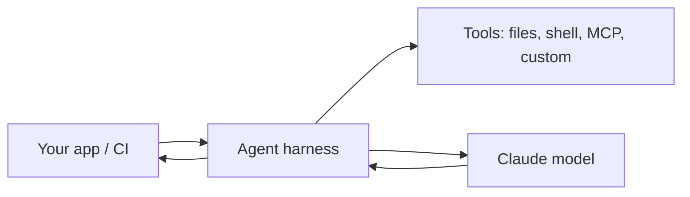

<LevelBadge level="advanced" />

<VerifyNote lastVerified="2026-06-20" source="https://docs.anthropic.com/en/docs/claude-code/sdk">
Имена SDK, имена пакетов и флаги headless-режима меняются — сверяйтесь с официальной документацией Claude Agent SDK / Claude Code.
</VerifyNote>

Claude Code не только интерактивен. Вы можете запускать его в **headless-режиме** (неинтерактивно, со скриптами) и создавать **собственных агентов** на той же базовой основе с помощью **Agent SDK**.

## Headless-режим

Запустите один запрос неинтерактивно и захватите вывод — идеально для скриптов, pre-commit-хуков и CI:

```bash
claude -p "Review the staged diff and list any bugs as a Markdown checklist"
```

Подайте ввод на вход, получите результат на выходе. Сочетайте с [разрешениями](/docs/claude-code/permissions), настроенными на безопасную, неинтерактивную позицию, чтобы он никогда не зависал в ожидании подтверждения — и **заблокируйте его**, чтобы автоматический запуск не мог тронуть секреты (см. [Усиление защиты автономных запусков](/docs/security/hardening-autonomous-runs)).

Классический сценарий использования: задача CI, в которой Claude проверяет каждый pull request — см. [пошаговое руководство по проверке PR](/docs/walkthroughs/pr-review-action).

## Agent SDK

**Claude Agent SDK** (Python и TypeScript) позволяет создавать production-агентов на том же цикле, который лежит в основе Claude Code — использование инструментов, доступ к файлам/оболочке, разрешения, управление контекстом — но встроенным в *ваше* приложение.



Обращайтесь к нему, когда вы переросли единичный вызов API или самописный цикл и хотите готовую к работе среду исполнения агента «из коробки». О всём спектре вариантов — единичный вызов → workflow → собственный агент → управляемый — см. [Создание агентов на API](/docs/api/building-agents).

## Headless/SDK против интерактивного режима

| Режим | Для чего |
|---|---|
| Интерактивный Claude Code | Повседневная разработка с человеком в цикле |
| Headless (`claude -p`) | Скрипты, pre-commit, разовые задачи CI |
| Agent SDK | Production-агенты, встроенные в ваше ПО |

## Дальше

- [GitHub Action, проверяющий каждый PR (пошаговое руководство)](/docs/walkthroughs/pr-review-action)
- [Создание агентов на API](/docs/api/building-agents)
- [Усиление защиты автономных запусков](/docs/security/hardening-autonomous-runs)
