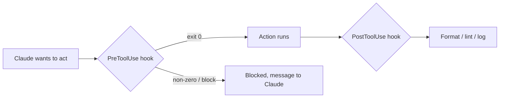

<LevelBadge level="advanced" />

<VerifyNote lastVerified="2026-06-23" source="https://code.claude.com/docs/en/hooks">
Точные имена событий хуков, полезная нагрузка stdin и протокол блокировки развиваются — сверяйтесь с официальной документацией по хукам, прежде чем полагаться на конкретное событие или поле.
</VerifyNote>

Хуки — это **shell-команды, которые Claude Code запускает автоматически** в определённых точках своего жизненного цикла. Там, где [разрешения](/docs/claude-code/permissions) решают, *разрешено* ли действие, хуки позволяют *вам* выполнять детерминированную логику вокруг него — форматирование, валидацию, логирование, проверки. Именно так вы делаете поведение гарантированным, а не «пожалуйста, не забудьте».

## Когда тянуться за хуком

- **Авто-форматирование / линтинг** после каждого редактирования файла (`PostToolUse`).
- **Блокировка** действия, нарушающего правило, до его выполнения (`PreToolUse`).
- **Уведомление или логирование**, когда сессия завершается или задача заканчивается (`Stop`).
- **Внедрение контекста** в начале сессии.

## Как они работают

Вы регистрируете хуки в [`settings.json`](/docs/claude-code/settings), сопоставляя **событие** (и часто матчер инструмента). Когда событие срабатывает, Claude запускает вашу команду, передавая **JSON-нагрузку на stdin** (имя инструмента, его входные данные, сессию). Код выхода и вывод вашей команды решают, что произойдёт дальше.

```json
{
  "hooks": {
    "PostToolUse": [
      {
        "matcher": "Edit|Write",
        "hooks": [
          { "type": "command", "command": "jq -r '.tool_input.file_path' | xargs npx prettier --write" }
        ]
      }
    ]
  }
}
```

Хук выше читает путь отредактированного файла из JSON на stdin (`.tool_input.file_path`) и форматирует его. Не предполагайте, что путь хранится в переменной окружения — **читайте его из stdin.** Полезные плейсхолдеры путей, такие как `${CLAUDE_PROJECT_DIR}`, *доступны* для нахождения скриптов.

## Как хук блокирует

Два способа, в зависимости от события:

- **Код выхода 2** — хук проваливает действие, и всё, что он записал в **stderr**, становится сообщением, которое видит Claude. Просто и работает для командных хуков.
- **JSON на stdout (выход 0)** — вернуть структурированное решение. Для `PreToolUse` это `permissionDecision` со значением `deny`; для `PostToolUse`/`Stop`/и т. д. это `{"decision": "block", "reason": "…"}`.

```bash
#!/usr/bin/env bash
# PreToolUse hook on the Bash tool: refuse to delete things.
command=$(jq -r '.tool_input.command' < /dev/stdin)
if [[ "$command" == rm\ * || "$command" == *"rm -rf"* ]]; then
  echo "Blocked: destructive 'rm' is not allowed by policy." >&2
  exit 2
fi
exit 0
```

## Ментальная модель



## Хорошие практики

- **Держите хуки быстрыми и идемпотентными** — они запускаются часто.
- **Шумите громко при настоящих проблемах**, но не блокируйте на косметических.
- **Относитесь к выводу хука как к обратной связи для Claude** — ясное сообщение помогает ему самостоятельно скорректироваться.
- Хуки запускаются с привилегиями вашего shell — проверяйте любой хук, который написали не вы ([Рецензирование стороннего кода](/docs/security/reviewing-third-party-code)).

## Частые ошибки

- **Чтение пути к файлу из переменной окружения.** Путь живёт в JSON на stdin (`.tool_input.file_path`), а не в `$CLAUDE_FILE_PATH`. Пропускайте stdin через `jq`.
- **Тихие блокировки.** Если хук `PreToolUse` выходит с кодом 2 без ничего в stderr, Claude заблокирован, но не знает, *почему*, и не может адаптироваться. Всегда пишите ясную причину.
- **Медленные хуки.** Хук `PostToolUse` запускается после *каждого* подходящего редактирования. Линтер на 3 секунды делает всю сессию вялой — держите хуки быстрыми и, в идеале, действуйте только на том, что изменилось.
- **Слишком широкие матчеры.** `matcher: ".*"` срабатывает на каждом инструменте. Сужайте точным именем, списком `Edit|Write` или полем `if` на уровне обработчика (например, `"if": "Bash(git push *)"`).
- **Доверие хукам, которые написали не вы.** Хук запускает произвольный shell с вашими привилегиями. Сначала проверяйте любой хук из плагина или шаблона — см. [Рецензирование стороннего кода](/docs/security/reviewing-third-party-code).

Готовые к копированию заготовки — в [Рецептах хуков и settings.json](/docs/templates/hooks-settings).

## Далее

- [settings.json](/docs/claude-code/settings) · [Разрешения](/docs/claude-code/permissions)
- [Навыки](/docs/claude-code/skills) — экспертиза против автоматизации
- [Усиление автономных запусков](/docs/security/hardening-autonomous-runs)
