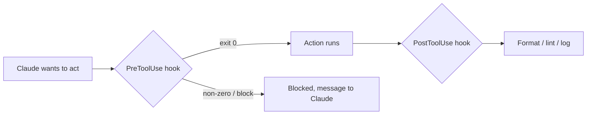

<LevelBadge level="advanced" />

<VerifyNote lastVerified="2026-06-20" source="https://code.claude.com/docs/en/hooks">
Точные имена событий хуков и схема конфигурации развиваются — сверяйтесь с официальной документацией по хукам, прежде чем полагаться на конкретное событие.
</VerifyNote>

Хуки — это **команды оболочки, которые Claude Code запускает автоматически** в определённых точках своего жизненного цикла. Там, где [разрешения](/docs/claude-code/permissions) решают, *разрешено ли* действие, хуки позволяют *вам* выполнять детерминированную логику вокруг него — форматирование, валидацию, логирование, проверки. Именно так вы делаете поведение гарантированным вместо «пожалуйста, не забудь».

## Когда стоит обратиться к хуку

- **Авто-форматирование / линтинг** после каждой правки файла (`PostToolUse`).
- **Блокировка** действия, нарушающего правило, до его выполнения (`PreToolUse`).
- **Уведомление или логирование**, когда сессия заканчивается или задача завершается (`Stop`).
- **Внедрение контекста** в начале сессии.

## Как они работают

Вы регистрируете хуки в [`settings.json`](/docs/claude-code/settings), сопоставляя их с **событием** (и часто с матчером инструмента). Когда событие срабатывает, Claude запускает вашу команду и читает её результат — ненулевой код выхода или определённый вывод могут **заблокировать** действие и передать сообщение обратно Claude.

```json
{
  "hooks": {
    "PostToolUse": [
      {
        "matcher": "Edit|Write",
        "hooks": [
          { "type": "command", "command": "npx prettier --write \"$CLAUDE_FILE_PATH\"" }
        ]
      }
    ]
  }
}
```

Хук получает контекст (например, путь к файлу, имя инструмента) через окружение/stdin — точный формат полезной нагрузки, который варьируется в зависимости от события, смотрите в документации.

## Ментальная модель



## Хорошие практики

- **Держите хуки быстрыми и идемпотентными** — они запускаются часто.
- **Громко сообщайте о реальных проблемах**, но не блокируйте из-за косметических мелочей.
- **Относитесь к выводу хука как к обратной связи для Claude** — понятное сообщение помогает ему самокорректироваться.
- Хуки запускаются с привилегиями вашей оболочки — проверяйте любой хук, который написали не вы ([Проверка стороннего кода](/docs/security/reviewing-third-party-code)).

Готовые к копированию заготовки есть в [Рецептах для хуков и settings.json](/docs/templates/hooks-settings).

## Дальше

- [settings.json](/docs/claude-code/settings) · [Разрешения](/docs/claude-code/permissions)
- [Навыки](/docs/claude-code/skills) — экспертиза против автоматизации
- [Усиление защиты автономных запусков](/docs/security/hardening-autonomous-runs)
