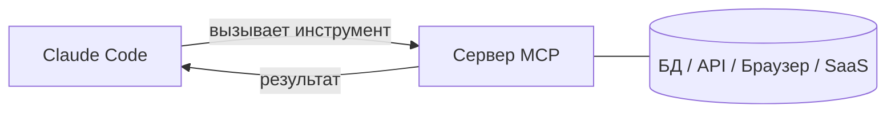

<LevelBadge level="advanced" />

<VerifyNote lastVerified="2026-06-23" source="https://code.claude.com/docs/en/mcp">
Команды `claude mcp`, области конфигурации и транспорты развиваются — сверяйтесь с официальной документацией Claude Code по MCP и на modelcontextprotocol.io.
</VerifyNote>

**Model Context Protocol (MCP)** — это открытый стандарт для подключения ИИ к внешним инструментам и данным. **MCP-сервер** предоставляет возможности (запросить базу данных, открыть PR на GitHub, управлять браузером); Claude Code подключается к нему и может **вызывать эти инструменты** во время сессии. Именно так вы расширяете Claude за пределы вашей файловой системы и оболочки.

## Как это устроено



Вы объявляете серверы, которые Claude может использовать; каждый сервер публикует набор инструментов со схемами; Claude выбирает и вызывает их, как любой другой инструмент.

## Транспорты

- **stdio** — локальный процесс, который запускает Claude (отлично для локальных инструментов/CLI).
- **Удалённый (HTTP/SSE)** — размещённый сервер, часто с OAuth.

## Конфигурирование серверов

Самый быстрый путь — команда `claude mcp add`, она пишет конфигурацию за вас:

```bash
# A local stdio server (everything after -- is the launch command)
claude mcp add github -- npx -y @modelcontextprotocol/server-github

# A remote HTTP server, shared with everyone on the project
claude mcp add --transport http --scope project linear https://mcp.linear.app/mcp
```

Под капотом это просто JSON. Сервер с областью **project** попадает в `.mcp.json` в корне репозитория — закоммитьте его, и вся ваша команда получит одни и те же инструменты:

```json
{
  "mcpServers": {
    "github": { "command": "npx", "args": ["-y", "@modelcontextprotocol/server-github"] }
  }
}
```

**Область решает, кто видит сервер:**

| Область | Где находится | Для чего использовать |
|---|---|---|
| `local` (по умолчанию) | ваши пользовательские настройки, только этот проект | личные эксперименты, секреты |
| `project` | `.mcp.json` в репозитории (закоммичен) | инструменты, которыми должна пользоваться вся команда |
| `user` | ваши пользовательские настройки, все проекты | серверы, которые нужны вам везде |

Запустите `claude mcp list`, чтобы увидеть, что подключено, и `/mcp` внутри сессии, чтобы осмотреть инструменты и аутентифицироваться на удалённых серверах. См. [Конфигурация MCP и каркасы серверов](/docs/templates/mcp-config) для готовых к копированию заготовок.

## Разобранный пример: дайте Claude вашу базу данных

Допустим, вы хотите, чтобы Claude отвечал на вопросы по локальному Postgres, а не вы вставляли результаты запросов. Добавьте сервер (область project, чтобы коллеги его унаследовали):

```bash
claude mcp add --scope project db -- npx -y @modelcontextprotocol/server-postgres "postgresql://localhost/app"
```

Теперь в сессии вы можете спросить: *«Сколько пользователей зарегистрировалось на прошлой неделе? Проверь БД.»* Claude вызывает инструмент `query` сервера, получает строки назад и отвечает — без цикла копирования-вставки. Поскольку область — project, коллега, который подтянет репозиторий, получит ту же возможность в тот момент, когда откроет Claude Code. Держите строку подключения доступной только для чтения, если вам нужны только чтения.

## Доверие и безопасность

:::warning Относитесь к MCP-серверам как к установке ПО
MCP-сервер выполняет код и может читать данные и предпринимать действия. Подключайте только те серверы, которым доверяете, давайте им **наименьшие привилегии**, которые нужны, и помните, что любой внешний контент, который они возвращают, может нести [инъекцию промпта](/docs/security/prompt-injection). Сначала проверяйте сторонние серверы — см. [Рецензирование стороннего кода](/docs/security/reviewing-third-party-code).
:::

## MCP в приложениях тоже

MCP также обеспечивает работу **Connectors** в приложениях Claude — тот же стандарт, другая поверхность. См. [Connectors (MCP) в приложениях](/docs/claude-app/connectors) и, для API, [MCP и подключение к инструментам](/docs/api/mcp).

## Частые ошибки

- **Неправильная область.** Сервер, добавленный с областью `local`, не появится у коллег; тот, который вы хотели только для себя, не должен коммититься с областью `project`. Выбирайте осознанно.
- **Слишком много серверов, слишком много инструментов.** Каждый подключённый сервер добавляет свои схемы инструментов в контекст. Подключайте то, что нужно задаче, а не весь свой каталог.
- **Сверхпривилегированные подключения.** Дайте серверу базы данных роль только на чтение, если только Claude действительно не нужно писать. MCP делает возможности реальными — ограничивайте их.
- **Забывание о риске инъекции.** Всё, что возвращает сервер (веб-страница, тело issue, строка), — это недоверенный текст, который может нести [инъекцию промпта](/docs/security/prompt-injection). Не подключайте мощный сервер с возможностью записи рядом с недоверенным сервером с возможностью чтения, не обдумав это.

## Далее

- [Соберите и подключите ваш первый MCP-сервер (разбор)](/docs/walkthroughs/first-mcp-server)
- [Конфигурация MCP и каркасы серверов](/docs/templates/mcp-config)
- [Защита агентов и инструментов](/docs/security/securing-agents)
