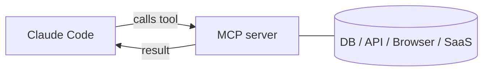

<LevelBadge level="advanced" />

<VerifyNote lastVerified="2026-06-20" source="https://code.claude.com/docs/en/mcp">
Синтаксис конфигурации MCP, области видимости и транспорты развиваются — сверяйтесь с официальной документацией Claude Code по MCP и на modelcontextprotocol.io.
</VerifyNote>

**Model Context Protocol (MCP)** — это открытый стандарт для подключения ИИ к внешним инструментам и данным. **Сервер MCP** предоставляет возможности (запросить базу данных, открыть PR на GitHub, управлять браузером); Claude Code подключается к нему и может **вызывать эти инструменты** во время сессии. Именно так вы расширяете Claude за пределы вашей файловой системы и оболочки.

## Как это выглядит



Вы объявляете серверы, которые Claude может использовать; каждый сервер публикует набор инструментов со схемами; Claude выбирает и вызывает их, как любой другой инструмент.

## Транспорты

- **stdio** — локальный процесс, который запускает Claude (отлично подходит для локальных инструментов/CLI).
- **Удалённый (HTTP/SSE)** — размещённый сервер, часто с OAuth.

## Настройка серверов

Серверы настраиваются (обычно в `.mcp.json` и/или через настройки) с указанием команды/URL и любой аутентификации. Области видимости контролируют, где сервер доступен (только вам или совместно с проектом). Готовые к копированию заготовки смотрите в [Конфигурации MCP и каркасах серверов](/docs/templates/mcp-config).

```json
{
  "mcpServers": {
    "github": { "command": "npx", "args": ["-y", "@modelcontextprotocol/server-github"] }
  }
}
```

## Доверие и безопасность

:::warning Относитесь к серверам MCP как к установке ПО
Сервер MCP выполняет код и может читать данные и совершать действия. Подключайте только те серверы, которым доверяете, давайте им **наименьшие привилегии**, необходимые для работы, и помните, что любой внешний контент, который они возвращают, может нести [внедрение в запрос (prompt injection)](/docs/security/prompt-injection). Сначала проверяйте сторонние серверы — см. [Проверка стороннего кода](/docs/security/reviewing-third-party-code).
:::

## MCP и в приложениях тоже

MCP также лежит в основе **коннекторов** в приложениях Claude — тот же стандарт, другой интерфейс. См. [Коннекторы (MCP) в приложениях](/docs/claude-app/connectors), а для API — [MCP и подключение к инструментам](/docs/api/mcp).

## Дальше

- [Создайте и подключите свой первый сервер MCP (пошаговое руководство)](/docs/walkthroughs/first-mcp-server)
- [Конфигурация MCP и каркасы серверов](/docs/templates/mcp-config)
- [Защита агентов и инструментов](/docs/security/securing-agents)
