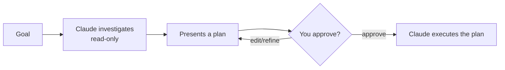

<LevelBadge level="beginner" />

<VerifyNote lastVerified="2026-06-20" source="https://code.claude.com/docs/en">
Способ входа в режим планирования (сочетание клавиш/флаг) может меняться от релиза к релизу — сверяйтесь с официальной документацией Claude Code.
</VerifyNote>

**Режим планирования** делает Claude Code **только для чтения**: он может исследовать вашу кодовую базу, выполнять поиск и рассуждать — но он **не будет редактировать файлы или выполнять команды, изменяющие состояние**. Вместо этого он создаёт план и ждёт вашего одобрения.

## Почему это самый безопасный способ начать

Для всего крупного, рискованного или незнакомого вы хотите увидеть, *что* Claude намеревается сделать, прежде чем он тронет ваш репозиторий. Режим планирования разделяет **мышление** и **действие**:

Вы ловите неверные предположения *до* того, как они станут неверным кодом.

## Когда его использовать

- **Всегда** для крупных или многофайловых изменений, миграций или рефакторингов.
- Когда работаете в кодовой базе, которую ещё не полностью знаете.
- Когда вам нужен пригодный для проверки план, чтобы поделиться с коллегой.

Для крошечных, очевидных правок его можно пропустить — но при сомнении сначала планируйте.

## Как это работает на практике

1. Войдите в режим планирования и сформулируйте свою цель.
2. Claude читает релевантные файлы и задаёт уточняющие вопросы.
3. Он возвращает пошаговый план: какие файлы менять, подход и как проверить.
4. Вы одобряете (или уточняете). Только после этого он переключается на внесение изменений.

:::tip Сочетайте с CLAUDE.md
Хороший [CLAUDE.md](/docs/claude-code/claude-md) делает планы точнее — Claude планирует, уже учитывая ваши соглашения и ограничители.
:::

## Режим планирования против разрешений

Они решают разные задачи и работают вместе:

- **Режим планирования** = «исследуй и предлагай, пока не действуй». (Эта страница.)
- **[Разрешения](/docs/claude-code/permissions)** = когда уже действуешь, *какие* действия разрешены без запроса.

## Дальше

- [Разрешения и режимы разрешений](/docs/claude-code/permissions)
- [Управление контекстом](/docs/claude-code/context-management) — поддерживайте эффективность длинных сессий
- [Пошаговое руководство: настройка Claude Code для реального репозитория](/docs/walkthroughs/customize-claude-code)
