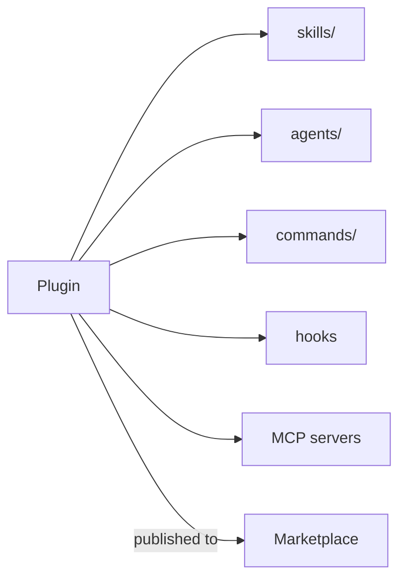

<LevelBadge level="advanced" />

<VerifyNote lastVerified="2026-06-20" source="https://docs.anthropic.com/en/docs/claude-code">
Структура плагинов и механика маркетплейсов быстро развиваются — уточняйте детали в официальной документации Claude Code.
</VerifyNote>

**Плагин** объединяет несколько кастомизаций — [навыки](/docs/claude-code/skills), [субагентов](/docs/claude-code/subagents), [слэш-команды](/docs/claude-code/slash-commands), [хуки](/docs/claude-code/hooks) и [серверы MCP](/docs/claude-code/mcp) — в единую, версионированную, устанавливаемую единицу. **Маркетплейс** — это каталог плагинов, которые люди могут находить и устанавливать.

## Почему плагины важны

- **Поставьте командный набор инструментов одним шагом.** Вместо того чтобы просить всех скопировать пять файлов, опубликуйте плагин; коллеги устанавливают его и получают те же команды, хуки, агентов и подключения MCP.
- **Версионирование.** Обновляете плагин — все подтягивают новую версию.
- **Распространение.** Маркетплейс делает ваш набор инструментов (или чужой) находимым.

## Что обычно внутри

Плагин — это структурированная папка (манифест плюс компоненты, которые он поставляет). Минимально он может нести только навыки; максимально — весь набор выше. Держите каждый плагин **связным** — плагин «соглашений команды», плагин «набор инструментов Python» — а не сборную солянку.

## Доверие перед установкой

:::warning Плагины могут поставлять исполняемый код
Хуки и серверы MCP в плагине запускаются с вашими привилегиями. Устанавливайте из источников, которым доверяете, и сначала проверяйте, что делает плагин — см. [Проверка стороннего кода](/docs/security/reviewing-third-party-code).
:::

## Путь к масштабированию вашей настройки

Естественная прогрессия: `CLAUDE.md` → несколько [навыков](/docs/claude-code/skills) и [команд](/docs/claude-code/slash-commands) → объединить их в плагин → опубликовать на маркетплейсе для вашей команды или сообщества. Этот последний шаг — часть того, как AILmanac хочет помочь экосистеме расти.

## Дальше

- [Навыки](/docs/claude-code/skills) · [Субагенты](/docs/claude-code/subagents) · [MCP](/docs/claude-code/mcp)
- [Проверка стороннего кода](/docs/security/reviewing-third-party-code)
- [Наборы навыков](/docs/templates/skills) AILmanac
