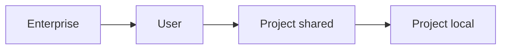

<LevelBadge level="intermediate" />

<VerifyNote lastVerified="2026-06-20" source="https://code.claude.com/docs/en/settings">
Точные ключи и расположение файлов лучше всего уточнять в официальной документации Claude Code по настройкам.
</VerifyNote>

`settings.json` — это место, где живёт конфигурация Claude Code: [разрешения](/docs/claude-code/permissions), [хуки](/docs/claude-code/hooks), переменные окружения, значения модели по умолчанию и многое другое. Понимание **уровней** — это ключ.

## Уровни (от наиболее глобального → к наиболее специфичному)

Более поздние (более специфичные) уровни переопределяют более ранние:

1. **Enterprise / managed** — политика, заданная администратором организации. Побеждает всё.
2. **User** — `~/.claude/settings.json`. Ваши значения по умолчанию для всех проектов.
3. **Project (shared)** — `.claude/settings.json`, закоммичен в репозиторий. Общекомандный.
4. **Project (personal)** — `.claude/settings.local.json`, в git-ignore. Ваши переопределения для этого репозитория.

:::tip Коммитьте общий файл, игнорируйте локальный
Помещайте командные соглашения в `.claude/settings.json` (закоммичен). Помещайте личные настройки и машинно-специфичные пути в `.claude/settings.local.json` (в git-ignore). Это сохраняет согласованность команды, не навязывая ваши предпочтения другим.
:::

## Что вы будете задавать чаще всего

- **`permissions`** — правила allow/ask/deny. См. [Разрешения](/docs/claude-code/permissions).
- **`hooks`** — команды, выполняемые на событиях жизненного цикла. См. [Хуки](/docs/claude-code/hooks).
- **`env`** — переменные окружения для сессии.
- **Значения модели / поведения по умолчанию** — например, предпочтительная модель.

## Безопасное редактирование

- Сохраняйте валидный JSON (висячая запятая его сломает).
- Предпочитайте **узкие** правила разрешений широким.
- Никогда не помещайте секреты в закоммиченный файл — используйте ссылки в `env` или менеджер секретов.

Готовые к копированию стартовые файлы есть в [Рецептах для хуков и settings.json](/docs/templates/hooks-settings).

## Дальше

- [Разрешения и режимы разрешений](/docs/claude-code/permissions)
- [Хуки: детерминированная автоматизация](/docs/claude-code/hooks)
- [Пользовательские слэш-команды](/docs/claude-code/slash-commands)
