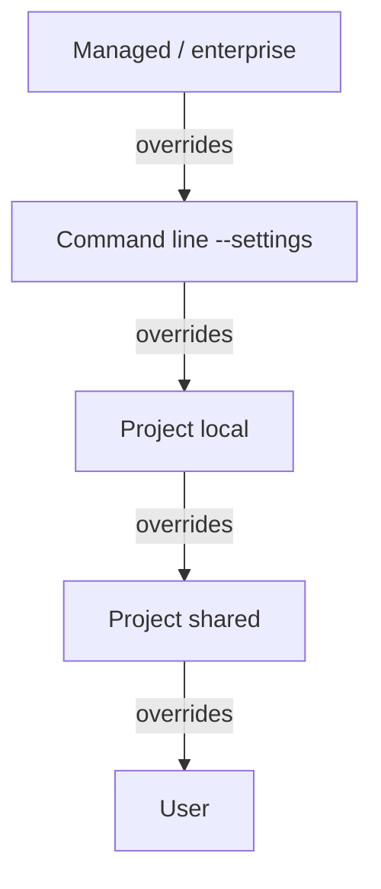

<LevelBadge level="intermediate" />

<VerifyNote lastVerified="2026-09-23" source="https://code.claude.com/docs/en/settings">
Пятиуровневый стек приоритета (управляемые → командная строка → локальный проект → общий проект → пользователь) и правило «переменные окружения не являются уровнем» с официальной страницы [Settings files and precedence](https://code.claude.com/docs/en/settings). Переопределения для отдельных ключей перечислены в [справочнике настроек](https://code.claude.com/docs/en/settings-reference).
</VerifyNote>

`settings.json` — это место, где живёт конфигурация Claude Code: [разрешения](/docs/claude-code/permissions), [хуки](/docs/claude-code/hooks), переменные окружения, значения модели по умолчанию и многое другое. Понимание **уровней** — это ключ.

## Уровни (сначала с наивысшим приоритетом)

Когда один и тот же ключ задан в нескольких местах, Claude Code берёт значение с самого высокого уровня, где он задан:

1. **Управляемые / enterprise** — `managed-settings.json`, политика MDM или управляемые сервером настройки из консоли claude.ai. Ничто из того, что вы зададите, их не переопределяет (кроме нескольких исключений, важных для безопасности).
2. **Командная строка** — `claude --settings '<json-or-path>'`, только на одну сессию. Стоит выше любого файла, кроме управляемого, и ни в какой файл не пишет.
3. **Проект (личный)** — `.claude/settings.local.json`, игнорируется git. Ваши переопределения для этого репозитория.
4. **Проект (общий)** — `.claude/settings.json`, под контролем версий в репозитории. Для всей команды.
5. **Пользователь** — `~/.claude/settings.json`. Ваши значения по умолчанию во всех проектах.

```mermaid
flowchart TB
  M[Managed / enterprise] -->|overrides| C[Command line --settings]
  C -->|overrides| L[Project local]
  L -->|overrides| P[Project shared]
  P -->|overrides| U[User]
```

:::note Переменные окружения не являются уровнем
Они находятся вне этого стека и разрешаются для каждого ключа отдельно. Например, `ANTHROPIC_MODEL` имеет приоритет над ключом `model` из любого файла, а `ANTHROPIC_DEFAULT_MODEL` применяется только если ни один файл не задаёт `model`.
:::

:::tip Коммитьте общий файл, игнорируйте локальный
Помещайте командные соглашения в `.claude/settings.json` (закоммичен). Помещайте личные настройки и машинно-специфичные пути в `.claude/settings.local.json` (в git-ignore). Это сохраняет согласованность команды, не навязывая ваши предпочтения другим.
:::

## Что вы будете задавать чаще всего

- **`permissions`** — правила allow/ask/deny. См. [Разрешения](/docs/claude-code/permissions).
- **`hooks`** — команды, выполняемые на событиях жизненного цикла. См. [Хуки](/docs/claude-code/hooks).
- **`env`** — переменные окружения для сессии.
- **Значения модели / поведения по умолчанию** — например, предпочтительная модель.

## Безопасное редактирование

- Сохраняйте валидный JSON (висячая запятая его сломает).
- Предпочитайте **узкие** правила разрешений широким.
- Никогда не помещайте секреты в закоммиченный файл — используйте ссылки в `env` или менеджер секретов.

Готовые к копированию стартовые файлы есть в [Рецептах для хуков и settings.json](/docs/templates/hooks-settings).

## Дальше

- [Разрешения и режимы разрешений](/docs/claude-code/permissions)
- [Хуки: детерминированная автоматизация](/docs/claude-code/hooks)
- [Пользовательские слэш-команды](/docs/claude-code/slash-commands)
