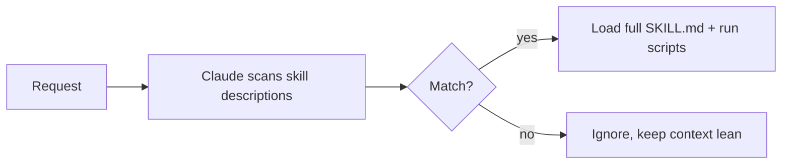

<LevelBadge level="advanced" />

<VerifyNote lastVerified="2026-06-20" source="https://code.claude.com/docs/en/skills">
Структура файлов навыков и места их выполнения (Claude Code, Claude.ai, Cowork) развиваются — сверяйтесь с официальной документацией по навыкам.
</VerifyNote>

**Навык** упаковывает экспертизу — инструкции плюс опциональные скрипты и ресурсы — которую Claude загружает **только когда это уместно**. Вместо того чтобы запихивать всё в [CLAUDE.md](/docs/claude-code/claude-md), вы даёте Claude библиотеку возможностей, которые он подтягивает по требованию.

## Анатомия

Навык — это папка с `SKILL.md`: YAML-фронтматтер + инструкции.

```markdown
---
name: pdf-forms
description: Use when the user needs to fill, read, or generate PDF forms.
---

# PDF Forms
Steps and rules for working with PDF forms…
(optionally reference scripts/ or resources/ in this folder)
```

**`description` — это триггер**: Claude читает его, чтобы решить, *когда* активировать навык. Пишите его как «Use when…», достаточно конкретно, чтобы он загружался в нужный момент и не в другое время.

## Прогрессивное раскрытие (почему навыки масштабируются)

Claude не загружает полное тело каждого навыка заранее — он видит лёгкие `name` + `description` и подтягивает полные инструкции (и запускает скрипты) только тогда, когда запрос совпадает. Это держит контекст компактным даже при множестве установленных навыков.



## Где они живут

- Личные: `~/.claude/skills/<name>/SKILL.md`
- Проектные (общие): `.claude/skills/<name>/SKILL.md`
- Упакованные в [плагин](/docs/claude-code/plugins-marketplaces) для распространения по команде.

AILmanac поставляет [7 готовых наборов навыков](/docs/templates/skills) — скопируйте один, чтобы попробовать.

## Навык против команды против субагента против MCP

| Инструмент | Что это | Кто инициирует: вы или Claude |
|---|---|---|
| [Слэш-команда](/docs/claude-code/slash-commands) | Сохранённый запрос | **Вы** вызываете её |
| **Навык** | Экспертиза по запросу + скрипты | **Claude** загружает его, когда уместно |
| [Субагент](/docs/claude-code/subagents) | Делегированный агент с собственным контекстом | Claude делегирует |
| [MCP](/docs/claude-code/mcp) | Подключение к внешним инструментам/данным | Предоставляет инструменты для вызова |

## Дальше

- [Напишите свой первый навык (пошаговое руководство)](/docs/walkthroughs/first-skill)
- [Шаблоны SKILL.md](/docs/templates/skills)
- [Плагины и маркетплейсы](/docs/claude-code/plugins-marketplaces)
