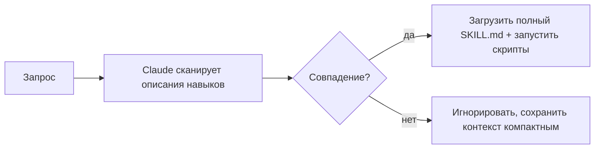

<LevelBadge level="advanced" />

<VerifyNote lastVerified="2026-06-23" source="https://code.claude.com/docs/en/skills">
Структура файла навыка, прогрессивное раскрытие и то, где навыки выполняются (Claude Code, Claude.ai, Cowork), продолжают развиваться — сверяйтесь с официальной документацией по Skills.
</VerifyNote>

**Навык** (Skill) упаковывает экспертизу — инструкции плюс необязательные скрипты и ресурсы, — которую Claude загружает **только когда это уместно**. Вместо того чтобы запихивать всё в [CLAUDE.md](/docs/claude-code/claude-md), вы даёте Claude библиотеку возможностей, которые он подключает по запросу.

## Анатомия

Навык — это папка с файлом `SKILL.md`: YAML-фронтматтер плюс инструкции.

```markdown
---
name: pdf-forms
description: Use when the user needs to fill, read, or generate PDF forms.
---

# PDF Forms
Steps and rules for working with PDF forms…
(optionally reference scripts/ or resources/ in this folder)
```

**`description` — это триггер**: Claude читает его, чтобы решить, *когда* активировать навык. Пишите его как «Use when…», достаточно конкретно, чтобы он загружался в нужный момент и не загружался в остальных случаях.

## Прогрессивное раскрытие (почему навыки масштабируются)

Claude не загружает полное тело каждого навыка заранее — он видит лёгкие `name` + `description` и подтягивает полные инструкции (и запускает скрипты) только тогда, когда запрос совпадает. Это поддерживает контекст компактным даже при множестве установленных навыков.



## Где они находятся

- Личные: `~/.claude/skills/<name>/SKILL.md`
- Проектные (доступные для совместного использования): `.claude/skills/<name>/SKILL.md`
- В составе [плагина](/docs/claude-code/plugins-marketplaces) для распространения внутри команды.

AILmanac поставляется с [7 готовыми наборами навыков](/docs/templates/skills) — скопируйте один к себе, чтобы попробовать.

## Разобранный пример: навык, который запускает сам себя

Создайте `~/.claude/skills/release-notes/SKILL.md`:

```markdown
---
name: release-notes
description: Use when the user asks to write release notes or a changelog from git history.
---

# Release Notes
1. Run `git log <last-tag>..HEAD --oneline` to get the commits.
2. Group them into Features / Fixes / Breaking changes.
3. Write user-facing notes — what changed for *users*, not commit messages.
4. Output Markdown ready to paste into a GitHub release.
```

Позже вы вводите: *«Составь release notes начиная с v1.4.»* У Claude никогда не было этих шагов в контексте — но запрос совпадает с `description`, поэтому он подтягивает полный `SKILL.md`, запускает `git log` и выдаёт сгруппированные заметки. Вы ничего не вызывали по имени; **маршрутизацию выполнило описание**. Добавьте файл `scripts/` в ту же папку, и навык сможет запустить его как часть шага 1.

## Навык против команды, субагента и MCP

| Инструмент | Что это | Кто запускает: вы или Claude |
|---|---|---|
| [Слэш-команда](/docs/claude-code/slash-commands) | Сохранённый промпт | **Вы** вызываете её |
| **Навык** | Экспертиза по запросу + скрипты | **Claude** загружает его, когда это уместно |
| [Субагент](/docs/claude-code/subagents) | Делегированный агент с собственным контекстом | Claude делегирует |
| [MCP](/docs/claude-code/mcp) | Подключение к внешним инструментам/данным | Предоставляет инструменты для вызова |

Правило большого пальца: **вы** хотите запускать это по запросу → слэш-команда. **Claude** должен знать процедуру и применять её, когда это уместно → навык. Работа должна происходить в отдельном контексте → субагент. Вам нужно обратиться к внешней системе → MCP.

## Частые ошибки

- **Описание, которое не срабатывает.** «Helps with PDFs» слишком расплывчато; «Use when the user needs to fill, read, or generate PDF forms» точно говорит Claude, когда его загружать. Описание — это весь механизм активации, пишите его для сопоставления, а не для людей.
- **Засовывание всего в CLAUDE.md.** [CLAUDE.md](/docs/claude-code/claude-md) загружается в *каждой* сессии и всегда расходует контекст; навык загружается *только когда уместно*. Перенесите ситуативные процедуры в навыки, а в CLAUDE.md оставьте всегда верные правила проекта.
- **Один гигантский навык.** Множество небольших, чётко описанных навыков маршрутизируются лучше, чем один универсальный — прогрессивное раскрытие помогает только если каждое описание конкретно.
- **Забывание, что им можно делиться.** Проектный навык в `.claude/skills/`, закоммиченный в git, даёт возможность всей команде; личный в `~/.claude/skills/` остаётся только вашим.

## Дальше

- [Напишите свой первый навык (пошаговое руководство)](/docs/walkthroughs/first-skill)
- [Шаблоны SKILL.md](/docs/templates/skills)
- [Плагины и маркетплейсы](/docs/claude-code/plugins-marketplaces)
