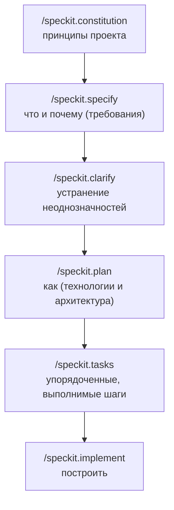

<LevelBadge level="intermediate" />

# Разработка на основе спецификаций со Spec Kit

Вайб-кодинг — «собери мне дашборд», принимаешь всё, что вернулось, — отлично работает, пока фича не становится большой. Тогда агент начинает дрейфовать: он забывает раннее решение, заново изобретает функцию или выдаёт что-то, что технически запускается, но не является тем, что вы имели в виду. **Разработка на основе спецификаций (Spec-Driven Development, SDD)** — это решение, которое в 2026 году прижилось у всего сообщества агентного кодинга: вместо того чтобы относиться к промпту как к одноразовому, вы делаете **письменную, проверяемую спецификацию источником истины** и поручаете агенту генерировать код *из* неё.

Открытый **[Spec Kit](https://github.com/github/spec-kit)** от GitHub превращает эту идею в конкретный рабочий процесс, который вы можете запустить прямо внутри Claude Code уже сегодня.

<Callout type="objectives" items={["Понять, что такое разработка на основе спецификаций и какую проблему она решает", "Пройти фазы Spec Kit: constitution → specify → plan → tasks → implement", "Установить Specify CLI и подключить его к Claude Code", "Знать опциональные контрольные точки качества (clarify, analyze, checklist)", "Решить, когда SDD стоит затраченных усилий, а когда от неё лучше отказаться"]} />

<VerifyNote lastVerified="2026-06-28" source="https://github.com/github/spec-kit">
Spec Kit развивается стремительно (~116k★, лицензия MIT). Имена команд, флаг выбора агента у `specify init` и поддерживаемые инструменты меняются от релиза к релизу — перед тем как полагаться на точный синтаксис, сверьтесь с актуальным quickstart в README репозитория. Имена слэш-команд ниже используют пространство имён `/speckit.*`, появившееся в недавних релизах.
</VerifyNote>

## Почему спецификации, а не просто промпты

Промпт исчезает в тот момент, когда ход завершается. **Спецификация — это артефакт**: её можно прочитать, проверить в PR, исправить и перезапустить. Один этот сдвиг устраняет три способа, которыми большие агентные сборки идут не так:

- **Дрейф** — агент противоречит раннему решению, потому что нигде его не записал. Спецификация — это память.
- **Неоднозначность** — «сделай красиво» означает десять разных вещей. Принуждение оформить требования в прозу выявляет пробелы *до* того, как появится код, где их дёшево исправить.
- **Непроверяемые диффы** — сгенерированный PR на 2000 строк трудно оценить. Проверенная спецификация + план делают дифф *ожидаемым*, а не неожиданным.

Ментальная модель: **намерение — это ценная, долговечная вещь; код — это нижестоящий, регенерируемый артефакт.** SDD — это дисциплинированный родственник собственного [Plan Mode](/docs/claude-code/plan-mode) у Claude Code — сначала планируй, потом строй — масштабированный до целой фичи и сохранённый в файлы вашего репозитория.

## Рабочий процесс Spec Kit

Spec Kit структурирует фичу как короткий конвейер слэш-команд. Каждая из них записывает Markdown-артефакты в ваш репозиторий (в каталог `.specify/`), так что каждая фаза поддаётся проверке и контролю версий.

<Steps items={[{title: "Constitution", body: "Запустите /speckit.constitution один раз на проект. Эта команда записывает управляющие принципы — стиль кода, планку тестирования, архитектурные непреложности — в .specify/memory/constitution.md. Каждая последующая фаза сверяется с ними, так что это ваш долговечный страховочный барьер (воспринимайте его как CLAUDE.md, сфокусированный на принципах)."}, {title: "Specify", body: "Запустите /speckit.specify и опишите, ЧТО вы строите и ПОЧЕМУ — пользовательские истории, требования, критерии успеха. Намеренно НЕ технологический стек. Агент создаёт структурированную спецификацию, которую вы читаете и исправляете, прежде чем двигаться дальше."}, {title: "Plan", body: "Запустите /speckit.plan со своими техническими решениями — фреймворк, хранилище данных, ограничения. Теперь записывается КАК: архитектура, компоненты и то, как они удовлетворяют спецификации. Технические решения живут здесь, а не в спецификации, поэтому спецификация остаётся независимой от реализации."}, {title: "Tasks", body: "Запустите /speckit.tasks, чтобы разбить план на пронумерованный, упорядоченный список небольших, по отдельности проверяемых шагов. Именно это делает сборку поддающейся аудиту — вы видите последовательность ещё до того, как написана хоть строка кода."}, {title: "Implement", body: "Запустите /speckit.implement, и агент выполнит список задач, строя фичу в соответствии с планом и конституцией. Поскольку каждая предыдущая фаза была проверена, итоговый дифф ожидаем, а не является сюрпризом."}]} />

### Опциональные контрольные точки качества

Ещё три команды затягивают цикл, когда фича имеет высокую цену ошибки:

- **`/speckit.clarify`** — допрашивает спецификацию на предмет недоопределённых областей и задаёт вам целевые вопросы *до* планирования. Лучше всего запускать сразу после `specify`.
- **`/speckit.analyze`** — перекрёстно проверяет спецификацию, план и задачи на согласованность и пробелы в покрытии.
- **`/speckit.checklist`** — генерирует чек-лист валидации, чтобы «готово» было определено и поддавалось проверке.

<Callout type="tip" items={["Запускайте /speckit.clarify перед /speckit.plan — устранять неоднозначность дешевле всего до того, как зафиксирована архитектура.", "Относитесь к каждому сгенерированному артефакту как к PR: прочитайте его, исправьте и только потом переходите к следующей фазе.", "Коммитьте артефакты .specify/ — это проверяемая запись намерения, стоящего за кодом."]} />

## Запуск с Claude Code

Spec Kit поставляется с CLI под названием **Specify**, который встраивает слэш-команды в ваш проект. Он поддерживает более 30 кодинг-агентов, в том числе Claude Code.

<Steps items={[{title: "Установите Specify CLI", body: "Используйте uv, чтобы установить его из репозитория. (Нужны Python + uv.)"}, {title: "Инициализируйте проект", body: "Создайте структуру .specify/ и команды агента. Запустите init в новом или существующем репозитории; когда появится запрос, выберите Claude Code в качестве агента (или передайте актуальный флаг интеграции из README)."}, {title: "Откройте Claude Code и проверьте команды", body: "Запустите claude в папке проекта. Вы поймёте, что всё подключено, когда /speckit.constitution, /speckit.specify, /speckit.plan, /speckit.tasks и /speckit.implement появятся как слэш-команды."}]} />

<PromptCard title="Install the Specify CLI (uv)">{`uv tool install specify-cli --from git+https://github.com/github/spec-kit.git`}</PromptCard>

<PromptCard title="Scaffold spec-driven workflow into a project">{`# new project
specify init my-feature

# or in the current repo
specify init --here`}</PromptCard>

<PromptCard title="Then, inside Claude Code, run the pipeline">{`/speckit.constitution Establish principles: TypeScript strict, tests for every public function, no secrets in code.
/speckit.specify Build a CSV export for the reports page: users pick a date range and download a CSV of matching rows.
/speckit.clarify
/speckit.plan Next.js App Router, server action for the query, stream the CSV; no new dependencies.
/speckit.tasks
/speckit.implement`}</PromptCard>

<Callout type="warning" items={["Точный флаг выбора агента для specify init меняется от релиза к релизу — сверьтесь с quickstart в README, а не копируйте флаг вслепую.", "SDD не отменяет необходимость проверять: прочитайте сгенерированный код и запустите его. Спецификация делает дифф проверяемым, но не автоматически правильным.", "Никогда не помещайте секреты или учётные данные в спецификацию, план или конституцию — они коммитятся как любой другой файл."]} />

## Когда её использовать (и когда нет)

SDD меняет начальную церемонию на контроль. Этот обмен оправдан, когда работа большая, неоднозначная или должна проверяться другими, — и является чистыми накладными расходами, когда это не так.

<Callout type="info" items={["Берите SDD для: фич с нуля, многофайловых сборок, всего, что должен проверить коллега, или работы, которую вы передадите флоту субагентов.", "Пропускайте SDD для: одноразовых скриптов, крошечных правок, исследовательского одноразового кода — обычный промпт или Plan Mode быстрее.", "Brownfield тоже работает: направьте /speckit.specify на улучшение существующей кодовой базы, а не только на новые проекты."]} />

<Flashcards title="SDD at a glance" cards={[{front: "Что является источником истины в SDD?", back: "Письменная спецификация. Код — это регенерируемый артефакт, нижестоящий по отношению к ней."}, {front: "Что делает /speckit.constitution?", back: "Записывает долговечные принципы проекта (стиль, планка тестирования, правила архитектуры), с которыми сверяется каждая последующая фаза."}, {front: "Где должны жить решения о технологическом стеке?", back: "В /speckit.plan — не в спецификации. Спецификация остаётся независимой от реализации (что и почему); план — это как."}, {front: "Что делает сборку Spec Kit поддающейся аудиту?", back: "/speckit.tasks создаёт упорядоченный, проверяемый список задач до того, как написан хоть какой-то код, и каждая фаза записывает поддающиеся проверке Markdown-артефакты."}, {front: "Когда НЕ стоит использовать SDD?", back: "Одноразовые скрипты, крошечные правки или одноразовое исследование — церемония обходится дороже, чем экономит."}]} />

## Проверь себя

<Quiz title="Check yourself" questions={[{q: "В чём основная идея разработки на основе спецификаций?", options: ["Писать более подробные одноразовые промпты", "Сделать проверяемую спецификацию источником истины и генерировать код из неё", "Пропустить планирование и позволить агенту импровизировать"], answer: 1, explain: "SDD рассматривает намерение как долговечный, ценный артефакт, а код — как нижестоящий, регенерируемый результат — противоположность вайб-кодингу на одноразовых промптах."}, {q: "Какая фаза Spec Kit должна фиксировать технологический стек и архитектуру?", options: ["/speckit.specify", "/speckit.plan", "/speckit.constitution"], answer: 1, explain: "specify описывает ЧТО и ПОЧЕМУ (независимо от реализации); plan — это место, где решается КАК — фреймворк, хранилище данных, архитектура."}, {q: "Когда разработка на основе спецификаций не стоит накладных расходов?", options: ["Многофайловая фича с нуля, которую должен проверить коллега", "Одноразовый однострочный скрипт или крошечная правка", "Любая работа, которую вы передадите субагентам"], answer: 1, explain: "Начальная церемония SDD окупается на большой, неоднозначной или проверяемой работе. Для тривиальной правки обычный промпт или Plan Mode быстрее."}]} />

<Callout type="takeaways" items={["Разработка на основе спецификаций делает источником истины проверяемую спецификацию, а не промпт, убивая дрейф, неоднозначность и непроверяемые диффы.", "Spec Kit от GitHub (Specify CLI) приносит SDD в Claude Code в виде слэш-команд /speckit.*.", "Конвейер таков: constitution → specify → (clarify) → plan → (analyze) → tasks → (checklist) → implement, и каждая фаза записывает поддающиеся проверке артефакты.", "Держите ЧТО/ПОЧЕМУ в спецификации, а КАК — в плане; проверяйте каждый артефакт как PR, прежде чем двигаться дальше.", "Используйте её для больших, неоднозначных или проверяемых фич; пропускайте для одноразовой работы — и всегда всё равно проверяйте сгенерированный код."]} />

## Далее

- [Plan Mode](/docs/claude-code/plan-mode) — встроенный, более лёгкий цикл «планируй, прежде чем строить»
- [Slash Commands](/docs/claude-code/slash-commands) — как команды /speckit.* вписываются в систему команд Claude Code
- [CLAUDE.md & Memory Files](/docs/claude-code/claude-md) — идея «принципы как память», стоящая за конституцией
- [Subagents](/docs/claude-code/subagents) — передайте проверенный список задач флоту агентов
- [Coding & Software Development](/docs/playbooks/coding) — мышление «проверяй всё», от которого зависит SDD

## Источники и дополнительное чтение

- [github/spec-kit — Toolkit for Spec-Driven Development](https://github.com/github/spec-kit) (MIT)
- [Spec Kit README & quickstart](https://github.com/github/spec-kit/blob/main/README.md)
- [Anthropic — Plan Mode in Claude Code](https://code.claude.com/docs/en/interactive-mode)
