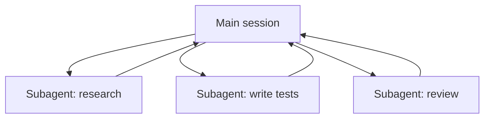

<LevelBadge level="advanced" />

<VerifyNote lastVerified="2026-06-23" source="https://code.claude.com/docs/en/sub-agents">
Поля frontmatter субагента, набор встроенных агентов и интерфейс `/agents` со временем меняются — сверяйтесь с официальной документацией.
</VerifyNote>

**Субагент** — это отдельный экземпляр Claude с **собственным окном контекста** и **ограниченным набором инструментов**, которому ваша основная сессия делегирует часть работы. Он возвращает результат, а не весь свой транскрипт — так что основная сессия остаётся сфокусированной и незахламлённой.

## Зачем делегировать

- **Защитите основной контекст.** Глубокое исследование или масштабный обход файлов могут сжечь тысячи токенов; сделайте это в субагенте, и вернётся только вывод.
- **Специализируйте.** Дайте субагенту индивидуальный системный промпт и только те инструменты, которые ему нужны (например, рецензент только на чтение).
- **Распараллеливайте.** Запускайте независимые подзадачи одновременно — например, исследуйте три модуля параллельно.



## Встроенные агенты, которые у вас уже есть

Прежде чем определять собственные, знайте, что Claude Code поставляется с субагентами, которым он делегирует автоматически:

- **Explore** — быстрый агент только на чтение (работает на более дешёвой модели) для поиска и понимания кодовой базы без её изменения.
- **Plan** — собирает контекст в режиме плана, чтобы исследование не попадало в основной разговор, доступный только для чтения.
- **General-purpose** — агент с полным набором инструментов для сложной многошаговой работы, сочетающей исследование и изменения.

Вы редко вызываете их по имени; Claude обращается к ним, когда задача подходит. Пользовательские субагенты — для тех работников, которых *вы* постоянно пересоздаёте с одними и теми же инструкциями.

## Определение собственных

Субагент — это файл Markdown с YAML-frontmatter (тело становится его системным промптом). Обязательны только `name` и `description`; всё остальное опционально. Храните его для проекта в `.claude/agents/` (закоммитьте в git, чтобы команда им пользовалась) или для пользователя в `~/.claude/agents/`. Создайте его командой `/agents` или вручную:

```markdown
---
name: code-reviewer
description: Expert code reviewer. Use proactively after code changes.
tools: Read, Glob, Grep
model: sonnet
---

You are a senior reviewer. Read the changed files, then report only
high-confidence issues: correctness bugs, security risks, and missing
tests. For each, show the file:line, the problem, and a concrete fix.
Do not restate what the code does. Never edit files.
```

Хорошим субагента делают две вещи:

- **`description` — это сигнал маршрутизации.** Claude читает его, чтобы решить, *когда* делегировать, поэтому пишите его как триггер — «Use proactively after code changes» подтягивает его автоматически; расплывчатое «helps with code» — нет. Это самая высокорычажная строка в файле.
- **Жёстко ограничивайте инструменты.** Поле `tools` — это белый список (или используйте `disallowedTools` как чёрный список). Рецензент, который может только `Read, Glob, Grep`, *не сможет* случайно отредактировать ваш код — ограничение является гарантией, а не подсказкой. Опустите `tools`, и субагент унаследует всё, что есть у основной сессии.

## Разобранный пример: параллельный веер рецензий

Вы закончили фичу, затронувшую три модуля, и хотите быструю независимую проверку каждого. В основной сессии:

> «Review the changes in `auth/`, `billing/`, and `api/` — use the code-reviewer subagent on each, in parallel.»

Claude порождает три экземпляра `code-reviewer` одновременно. Каждый читает только свой модуль, тратит собственный контекст на содержимое файлов и возвращает короткий список находок. Ваша основная сессия никогда не видит сырых диффов — только три аккуратных отчёта — и всё завершается примерно за время самой медленной отдельной рецензии, а не за сумму всех трёх. Поскольку рецензент работает только на чтение, три агента, работающие одновременно, не могут столкнуться на записи.

## Когда НЕ распараллеливать

:::warning Параллельность не бесплатна
- **Зависимые шаги** должны быть последовательными — не разворачивайте веером работу, где шаг B нуждается в выводе шага A.
- **Совместная запись в файлы** может конфликтовать; изолируйте её (см. [рабочие деревья Git](/docs/claude-code/worktrees)) или сериализуйте.
- **Накладные расходы на координацию** могут превысить выгоду для небольших задач. Делегируйте, когда подзадача весома и независима.
:::

## Субагент против «агентов» API/SDK

Эта страница — про встроенное делегирование Claude Code. Создание *собственных* агентов программно — это [Создание агентов на API](/docs/api/building-agents). Ментальная модель — цель, цикл инструментов, изолированный контекст — та же самая.

## Частые ошибки

- **Расплывчатый `description`.** Если он не говорит, *когда* использовать субагента, Claude не делегирует в нужный момент (или вовсе не делегирует). Начинайте с «Use when…» / «Use proactively after…».
- **Оставление инструментов нараспашку.** Субагент, предназначенный для рецензирования, не должен иметь возможности записывать. Белый список превращает намерение в гарантию.
- **Ожидание общей памяти.** Субагент получает свой `description`, свой системный промпт и задачу, которую вы ему вручаете — но не ваш основной разговор. Передавайте нужный контекст в делегировании.
- **Веерное распределение зависимой работы.** Параллелизм помогает только для *независимых* подзадач; если B нуждается в выводе A, запускайте их последовательно.

## Далее

- [Спроектируйте мульти-субагентный рабочий процесс (разбор)](/docs/walkthroughs/multi-subagent-workflow)
- [Управление контекстом](/docs/claude-code/context-management)
- [Рабочие деревья Git](/docs/claude-code/worktrees)
