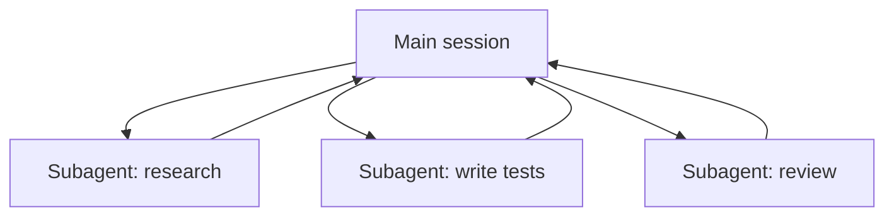

<LevelBadge level="advanced" />

<VerifyNote lastVerified="2026-06-20" source="https://code.claude.com/docs/en/sub-agents">
Конфигурация субагентов и интерфейс `/agents` со временем меняются — сверяйтесь с официальной документацией.
</VerifyNote>

**Субагент** — это отдельный экземпляр Claude с **собственным контекстным окном** и **ограниченным набором инструментов**, которому ваша основная сессия делегирует часть работы. Он сообщает обратно результат, а не весь свой транскрипт — так что основная сессия остаётся сфокусированной и незагромождённой.

## Зачем делегировать

- **Защитить основной контекст.** Глубокое исследование или большой проход по файлам могут сжечь тысячи токенов; сделайте это в субагенте, и вернётся только вывод.
- **Специализировать.** Дайте субагенту индивидуальный системный промпт и только те инструменты, которые ему нужны (например, ревьюер только для чтения).
- **Распараллелить.** Запускайте независимые подзадачи одновременно — например, исследуйте три модуля параллельно.

## Как их определять

Субагенты настраиваются как Markdown-файлы с фронтматтером (имя, описание, разрешённые инструменты, иногда модель), управляются через интерфейс `/agents`. `description` сообщает основному агенту, *когда* делегировать ему. Ограничивайте инструменты строго — ревьюеру редко нужен доступ на запись.

## Когда НЕ распараллеливать

:::warning Параллелизм не бесплатен
- **Зависимые шаги** должны быть последовательными — не разветвляйте работу там, где шаг B нуждается в выводе шага A.
- **Совместная запись файлов** может конфликтовать; изолируйте её (см. [Git Worktrees](/docs/claude-code/worktrees)) или сериализуйте.
- **Накладные расходы на координацию** могут превысить выгоду для мелких задач. Делегируйте, когда подзадача крупная и независимая.
:::

## Субагент против «агентов» из API/SDK

Эта страница о встроенном делегировании Claude Code. Создание *собственных* агентов программно — это [Создание агентов на API](/docs/api/building-agents). Ментальная модель — цель, цикл инструментов, изолированный контекст — та же.

## Дальше

- [Спроектируйте рабочий процесс из нескольких субагентов (пошаговое руководство)](/docs/walkthroughs/multi-subagent-workflow)
- [Управление контекстом](/docs/claude-code/context-management)
- [Git Worktrees](/docs/claude-code/worktrees)
