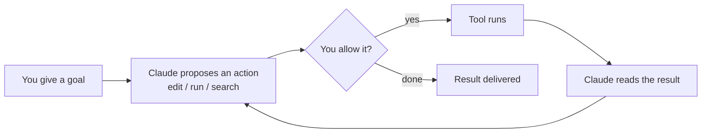

<LevelBadge level="beginner" />

<VerifyNote lastVerified="2026-06-20" source="https://docs.anthropic.com/en/docs/claude-code/overview">
Команды установки и точный набор возможностей часто меняются. Считайте официальную документацию Claude Code источником истины для настройки.
</VerifyNote>

**Claude Code** — это *агентный* инструмент Anthropic для написания кода. В отличие от окна чата, он действительно может **делать что-то в вашем проекте**: читать и редактировать файлы, выполнять команды оболочки, искать по кодовой базе и вызывать внешние инструменты — и всё это с вашего разрешения.

## Ментальная модель: агентный цикл

Это одна идея, которая делает понятным всё остальное:

Вы формулируете цель обычным языком («добавь тесты для модуля авторизации и исправь то, что падает»). Claude **планирует, действует, наблюдает за результатом и повторяет** до тех пор, пока цель не будет достигнута. Вы сохраняете контроль через [разрешения](/docs/claude-code) и [режим планирования](/docs/claude-code).

## Где его можно запускать

- **Терминал (CLI)** — исходный интерфейс; работает в любой оболочке.
- **Расширения для IDE** — VS Code и JetBrains, со встроенными diff'ами.
- **Десктоп и веб** — и он использует общие настройки, хуки и разрешения между всеми интерфейсами.

## Что вы будете настраивать (примерно в порядке убывания отдачи)

1. **[CLAUDE.md](/docs/claude-code)** — постоянные инструкции для проекта. Максимальный эффект при минимальных усилиях.
2. **[Режим планирования](/docs/claude-code)** — исследуй и предлагай *до* того, как будут выполнены какие-либо правки.
3. **[Разрешения](/docs/claude-code)** — что Claude может делать, не спрашивая.
4. **[settings.json](/docs/claude-code)** — полная система конфигурации.
5. **[Слэш-команды](/docs/claude-code)**, **[хуки](/docs/claude-code)**, **[навыки](/docs/claude-code)**, **[субагенты](/docs/claude-code)**, **[серверы MCP](/docs/claude-code)** — продвинутые возможности, добавляемые по мере необходимости.

## Ваша первая сессия (как это выглядит)

1. Установите и пройдите аутентификацию (актуальные команды смотрите в [официальной документации](https://docs.anthropic.com/en/docs/claude-code/overview)).
2. Перейдите (`cd`) в проект и запустите Claude Code.
3. Выполните `/init`, чтобы сгенерировать стартовый **CLAUDE.md**.
4. Попросите что-нибудь небольшое и конкретное: *«Объясни, как работает маршрутизация в этом приложении.»*
5. Затем попробуйте внести изменение сначала в **режиме планирования**, просмотрите план и дайте ему выполниться.

:::tip Начинайте в режиме только для чтения
Для первой реальной задачи используйте [режим планирования](/docs/claude-code) — Claude исследует и показывает вам план, не трогая файлы. Это самый безопасный способ выстроить доверие.
:::

## Дальше

- Настройка с максимальной отдачей → [CLAUDE.md и файлы памяти](/docs/claude-code)
- Сделать всё от начала до конца → [Пошаговое руководство: настройка Claude Code для реального репозитория](/docs/walkthroughs)
- Создайте собственные автоматизации → [Шаблоны и рецепты](/docs/templates)
