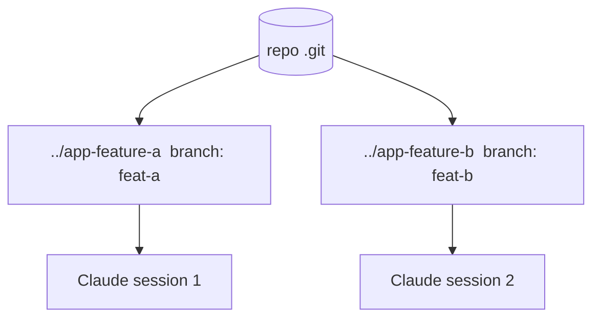

<LevelBadge level="advanced" />

**Git worktree** позволяет одному репозиторию иметь **несколько рабочих каталогов**, каждый из которых переключён на свою ветку. Сочетайте это с Claude Code — и вы сможете запускать **несколько сессий параллельно** на одном проекте, каждая редактирует свои файлы, без столкновений.

## Какую проблему он решает

Если две сессии Claude редактируют один и тот же рабочий каталог одновременно, они спотыкаются об изменения друг друга. Worktrees дают каждой сессии её **собственный каталог и ветку**, так что параллельная работа остаётся изолированной до момента слияния.



## Основы

```bash
# from your repo
git worktree add ../app-feature-a -b feat-a   # new dir + new branch
git worktree add ../app-fix-123 -b fix-123
git worktree list
# when done with one:
git worktree remove ../app-feature-a
```

Откройте сессию Claude Code в каждом каталоге worktree и дайте им работать независимо.

## Когда это того стоит

- **Параллельные фичи/исправления**, которые вы хотите продвигать одновременно.
- **Долгая задача, выполняющаяся** в одном worktree, пока вы продолжаете работать в другом.
- **Рискованные эксперименты**, изолированные от вашего основного checkout.

## Подводные камни

:::warning Следите за обратным слиянием
- Ветки в итоге **сольются** — конфликты всплывут тогда, а не во время работы. Держите worktrees сфокусированными и краткосрочными.
- Не запускайте **сохраняющие состояние, общие ресурсы** (одну dev-БД, один порт) из двух worktrees, не разделив их.
- Убирайте за собой с помощью `git worktree remove`, чтобы устаревшие каталоги не накапливались.
:::

## Worktrees против субагентов

- **[Субагенты](/docs/claude-code/subagents)** = параллелизм *внутри* одной сессии (делегирование, изолированный контекст).
- **Worktrees** = параллелизм *между* сессиями на диске (изолированные ветки/файлы). Они хорошо сочетаются: сессия в worktree может сама порождать субагентов.

## Дальше

- [Субагенты и параллельные агенты](/docs/claude-code/subagents)
- [Headless-режим и Agent SDK](/docs/claude-code/headless-and-agent-sdk)
- [Управление контекстом](/docs/claude-code/context-management)
