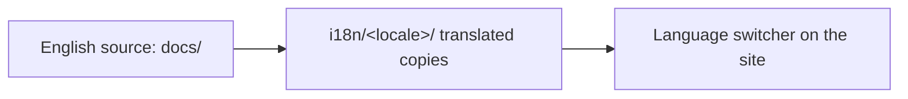

<LevelBadge level="intermediate" />

AILmanac в первую очередь англоязычный, но **создан для перевода** — именно так он достигает "всех в мире". Если вы хотите принести его на свой язык, вот ваш путь.

## Как здесь работает i18n

Сайт использует встроенную интернационализацию Docusaurus. **Английский — каноничный источник.** Локаль — это параллельный набор переведённых файлов; Docusaurus показывает переключатель языков, как только локаль включена.

## Золотое правило: возьмите на себя, прежде чем мы это выпустим

:::warning Никаких полупереводов в продакшене
Локаль **включается в продакшене только тогда, когда кто-то берёт на себя её поддержку.** Локаль, переведённая на 30% и устаревшая на месяцы, вредит доверию больше, чем отсутствие перевода. Лучше хорошо перевести *целый раздел*, чем разбрасывать частичные страницы.
:::

## Как внести перевод

1. **Откройте задачу** (используйте шаблон *translation*), указав, какой язык и какой раздел вы возьмёте.
2. **Сначала переведите цельный кусок** — например, весь раздел *Start Here* — а не случайные страницы.
3. **Оставляйте код, команды и источники `VerifyNote` без изменений**; переводите прозу, заголовки и текст выносок.
4. **Не переводите ID моделей или ссылки**; сохраняйте пути `/docs/...` как есть.
5. **Откройте PR.** Мейнтейнер проверяет его, и как только у локали появляется владелец и завершённый первый раздел, мы её включаем.

## Советы

- **Используйте Claude для черновика**, затем носитель языка с хорошим владением проверяет — ИИ-перевод отлично подходит для первого прохода, но не как окончательный авторитет ([Галлюцинации](/docs/foundations/hallucinations) применимы и к переводу).
- **Соответствуйте уровню/тону** английской страницы.
- **Отмечайте непереводимые термины** (сохраняйте "prompt", "token" и т. п. там, где это норма в техническом сообществе вашего языка).

## Далее

- [Внести вклад за 10 минут](/docs/contribute/contribute-in-10-minutes)
- [Руководство по стилю контента](/docs/contribute/style-guide)
- [Кодекс поведения и управление проектом](/docs/contribute/governance)
