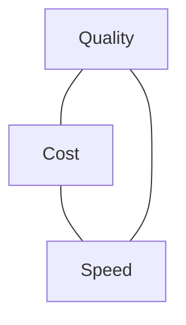

<LevelBadge level="intermediate" />

Качество, стоимость и скорость тянут в разные стороны. Нельзя максимизировать все три сразу — но *можно* тратить каждый ресурс там, где он важен, и экономить везде остальном.

## Треугольник

Более крупная модель умнее, но медленнее и дороже; меньшая — быстрая и дешёвая, но менее способная. Хорошая инженерия — это **направление каждой задачи в правильную точку** этого треугольника.

## Самые большие рычаги (примерно по порядку)

1. **Подбирайте размер модели под задачу.** Не запускайте Opus для классификации. Начните с Sonnet, опуститесь до Haiku для простых/высокообъёмных шагов, приберегите Opus для сложных частей — [Выбор модели](/docs/api/choosing-a-model).
2. **Уровни/каскады моделей.** Сначала используйте дешёвую модель; эскалируйте к более сильной только когда нужно (например, в случаях с низкой уверенностью).
3. **[Кэширование промптов](/docs/api/prompt-caching).** Переиспользуйте стабильный префикс промпта между вызовами — большая экономия для повторяющихся системных промптов, контекста RAG или каталогов инструментов агента.
4. **Урезайте входные токены.** Отправляйте только то, что важно; [RAG](/docs/foundations/rag) лучше, чем впихивать всю базу знаний. Более короткие входные данные = дешевле *и* часто лучше.
5. **Ограничивайте вывод** разумным `max_tokens` и строгими инструкциями по формату.
6. **Объединяйте в пакеты** офлайн-работу там, где задержка не имеет значения.

## Победы конкретно по задержке

- **Стримьте** ответы, чтобы пользователи сразу видели вывод — огромный выигрыш в *воспринимаемой* скорости, даже когда общее время не меняется ([Стриминг](/docs/api/streaming)).
- **Распараллеливайте** независимые подвызовы.
- **Кэшируйте** повторяющуюся работу; предвычисляйте там, где можете.
- Выбирайте **меньшую модель** для интерактивного пути; тяжёлую работу делайте асинхронно.

## Не оптимизируйте вслепую

Сначала измеряйте: куда на самом деле уходят токены и секунды? Затем оптимизируйте самую крупную статью. И перепроверяйте качество с помощью [оценок](/docs/foundations/evals) после любого сокращения затрат — более дешёвая конфигурация, которая ошибается, не дешевле.

## Дальше

- [Выбор модели Claude](/docs/api/choosing-a-model)
- [Кэширование промптов и оптимизация стоимости](/docs/api/prompt-caching)
- [Токены, контекст и цены](/docs/api/tokens-and-pricing)
